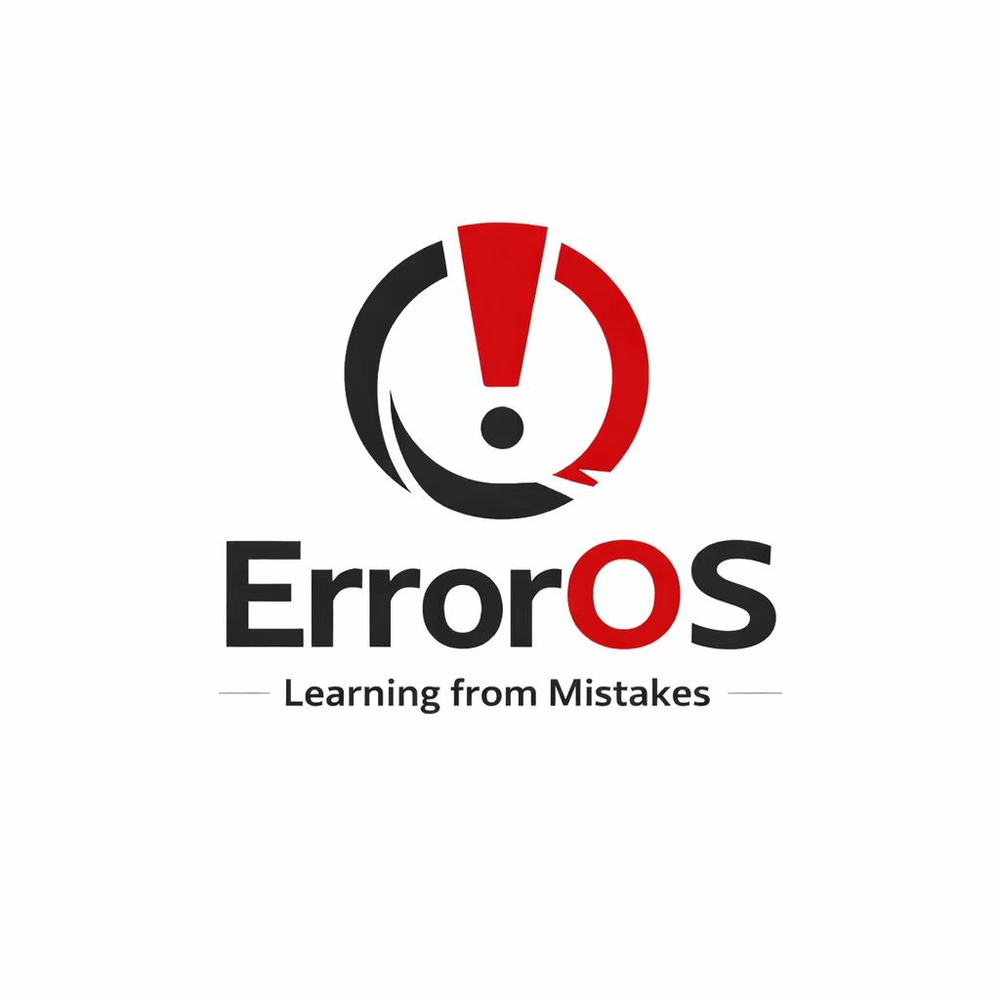

# ErrorOS 实验指导书

<div align="center">



**用 Rust 语言在 RISC-V 架构上从零构建操作系统**

[开始阅读](前言.md) | [快速开始](#快速开始) | [参与讨论](https://github.com/2085233418/lab-guide/discussions)

</div>

---

## 项目简介

**ErrorOS 实验指导书**是一套完整的操作系统开发教程，采用**手把手教学**的方式，带领你从零开始构建一个基于 **RISC-V 架构**的操作系统。

### 为什么选择 ErrorOS？

- **现代化语言**：使用 Rust 编写，享受内存安全和零成本抽象
- **循序渐进**：从环境配置到文件系统，8个章节57个小节，逐步深入
- **理论实践结合**：不仅教你写代码，更重要的是理解背后的原理
- **图文并茂**：69张技术图示，直观展示复杂概念
- **RISC-V 架构**：学习开源开放的新兴指令集架构

### 适合谁？

- 正在学习操作系统课程的学生
- 对底层系统编程感兴趣的开发者
- 想要学习 Rust 系统编程的工程师
- 希望深入理解计算机工作原理的学习者

---

## 学习目标

通过本指导书的学习，你将：

- 掌握 **RISC-V 架构**的核心知识
- 理解操作系统的**核心机制**（内存管理、进程调度、文件系统）
- 学会使用 **Rust 进行系统编程**
- 具备**独立实现操作系统**的能力
- 培养**底层系统思维**和**调试能力**

---

## 内容目录

本指导书共分为 **8 章**，涵盖从环境搭建到文件系统的完整实现：

### [第 0 章：环境配置](chapters/ch0-overview.md)

搭建完整的开发环境，安装 Rust 工具链、QEMU 模拟器，初始化项目结构。

### [第 1 章：最小内核](chapters/ch1-overview.md)

实现能够在 QEMU 上运行的最小内核，掌握裸机编程，实现 UART 串口输出。

### [第 2 章：异常与中断](chapters/ch2-overview.md)

深入 RISC-V 特权级架构，实现完整的异常处理框架，为系统调用打下基础。

### [第 3 章：物理内存管理](chapters/ch3-overview.md)

实现物理页帧分配器和堆分配器，让内核能够使用动态数据结构。

### [第 4 章：虚拟内存管理](chapters/ch4-overview.md)

实现 RISC-V Sv39 页表机制，建立虚拟地址到物理地址的映射。

### [第 5 章：系统调用](chapters/ch5-overview.md)

学习系统调用原理，实现用户态到内核态的切换机制。

### [第 6 章：进程管理](chapters/ch6-overview.md)

实现完整的进程管理系统，包括进程调度和 fork/exec/wait 系统调用。

### [第 7 章：文件系统](chapters/ch7-overview.md)

实现 VFS 抽象和内存文件系统，学习"一切皆文件"的设计理念。

---

## 快速开始

### 1. 克隆仓库

```bash
git clone https://github.com/2085233418/lab-guide.git
cd lab-guide
```

### 2. 阅读指导书

**在线阅读**: https://2085233418.github.io/lab-guide/

或者本地运行：

```bash
# 安装 docsify-cli
npm i docsify-cli -g

# 启动本地服务器
docsify serve .

# 访问 http://localhost:3000
```

### 3. 开始学习

推荐学习路径：

1. 阅读[前言](前言.md)，了解项目背景
2. 从[第 0 章](chapters/ch0-overview.md)开始，逐章学习
3. 动手实践每一个代码示例
4. 遇到问题时，先尝试调试，再查阅资料

---

## 技术栈

| 类别 | 技术 |
|------|------|
| **开发语言** | Rust (nightly) |
| **目标架构** | RISC-V 64 (riscv64imac-unknown-none-elf) |
| **模拟器** | QEMU (qemu-system-riscv64) |
| **固件** | OpenSBI |
| **关键依赖** | uart_16550, spin, linked_list_allocator, riscv |

---

## 参与贡献

我们欢迎任何形式的贡献！

### 如何贡献？

1. **报告问题**：在 [Issues](https://github.com/2085233418/lab-guide/issues) 中提交bug或建议
2. **改进文档**：修正错别字、优化表述、补充说明
3. **分享经验**：在 [Discussions](https://github.com/2085233418/lab-guide/discussions) 中分享学习心得
4. **代码贡献**：提交 Pull Request

### 贡献指南

```bash
# Fork 本仓库
# 创建新分支
git checkout -b feature/your-feature

# 提交更改
git commit -m "描述你的更改"

# 推送到你的 Fork
git push origin feature/your-feature

# 创建 Pull Request
```

---

## 开源许可

本项目采用 MIT 许可证。详见 [LICENSE](LICENSE) 文件。

---

## 致谢

本指导书的编写受到了众多优秀开源项目的启发：

- [rCore-Tutorial](https://github.com/rcore-os/rCore-Tutorial-Book-v3) - 清华大学的 RISC-V 操作系统教程
- [Blog OS](https://os.phil-opp.com/) - Philipp Oppermann 的 x86_64 操作系统教程
- [xv6-riscv](https://github.com/mit-pdos/xv6-riscv) - MIT 6.S081 课程的教学操作系统

感谢 Rust 社区和 RISC-V 社区的无私贡献！

---

## 联系方式

- **GitHub Issues**: [提交问题](https://github.com/2085233418/lab-guide/issues)
- **GitHub Discussions**: [参与讨论](https://github.com/2085233418/lab-guide/discussions)

---

<div align="center">

### 准备好开始你的操作系统之旅了吗？

[立即开始学习](前言.md)

</div>
