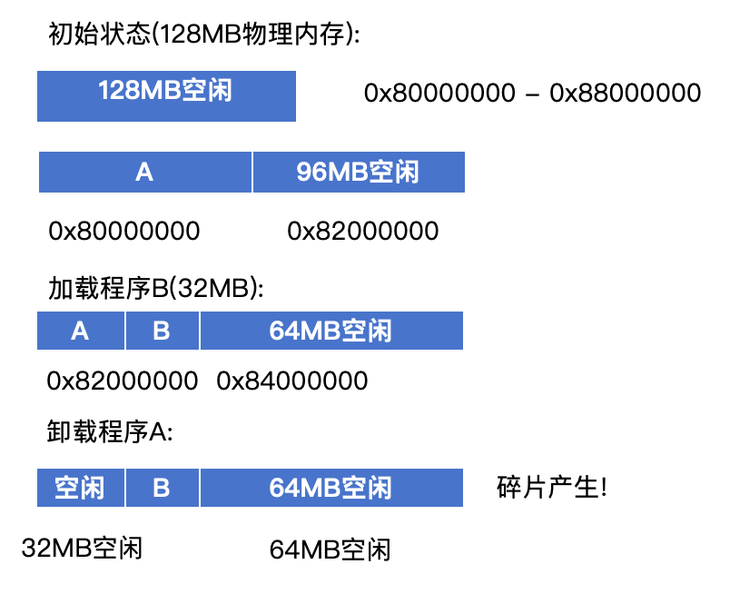
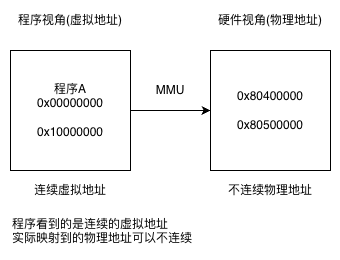
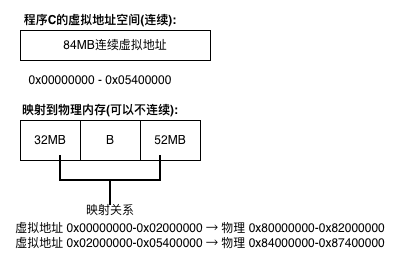
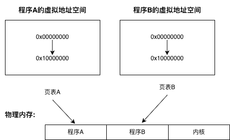

# 4.1 为什么需要虚拟内存

## 本节新增文件

本节为理论讲解,不涉及代码实现。

```
本章节实验环境内有系统运行效果演示动画，请在OS路径下运行以下指令运行：
当前路径：../os
终端输入：
$ cd ..
$ ./start.sh
（需要确保有python3环境）
```


---

## 当前的内存管理方式

在之前的内核实现中,我们采用的是**直接物理内存管理**的方式:内核代码、应用程序以及各种数据结构都直接放置在同一个物理地址空间中。

**当前的内存布局**:


这种简单的内存管理方式虽然直观,但存在**四个根本性问题**。

---

## 问题1:内存碎片化

### 1.1 碎片产生的过程

随着程序的加载和卸载,物理内存会变得支离破碎:



```text
尝试加载程序C(84MB):
总空闲: 32MB + 64MB = 96MB
需求: 84MB
结果: 失败! 空间不连续,无法分配
```

### 1.2 碎片化的后果

| 时间 | 碎片率 | 后果 |
|------|--------|------|
| 启动后1小时 | 10% | 可用空间充足 |
| 启动后10小时 | 50% | 大块分配开始失败 |
| 启动后24小时 | 70% | 虽有空闲但无法使用 |

**问题本质**:可用内存总量足够,但被分割成多个不连续的小块,无法满足大块连续分配需求。

---

## 问题2:进程隔离困难

### 2.1 缺乏隔离的危险

程序A和程序B同时运行在物理内存中:


程序A的恶意代码:

```rust
// 程序A可以直接访问程序B的内存
let b_data = 0x82000000 as *mut u32;  // 程序B的起始地址
unsafe {
    *b_data = 0xDEADBEEF;  // 破坏程序B的数据!
}
```

### 2.2 安全威胁

| 攻击类型 | 操作 | 后果 |
|---------|------|------|
| **数据窃取** | 读取其他程序内存 | 密码、密钥泄露 |
| **数据破坏** | 写入其他程序内存 | 程序崩溃、数据损坏 |
| **内核攻击** | 修改内核代码 | 获取系统最高权限 |

**问题本质**:

- 任何程序都可以访问任意物理地址
- 一个程序的bug会破坏其他程序
- 恶意程序可以窃取数据或破坏系统

---

## 问题3:地址冲突

### 3.1 冲突产生的场景

两个独立开发的程序:

```c
// 程序A(由团队A开发)
void* data = (void*)0x80200000;  // 使用这个地址

// 程序B(由团队B开发)
void* data = (void*)0x80200000;  // 也想使用这个地址
```

尝试同时加载:


### 3.2 解决方法(使用物理内存时)

1. 所有程序开发者必须协商分配地址
2. 编译时必须指定加载地址
3. 无法动态加载程序

**问题本质**:程序无法独立开发,必须全局协调地址分配。

---

## 问题4:内存利用率低

### 4.1 必须一次性加载


### 4.2 大程序无法运行

| 场景 | 物理内存 | 程序大小 | 结果 |
|------|---------|---------|------|
| 小型设备 | 128MB | 200MB程序 | 无法运行 |
| 多程序运行 | 128MB | 3个50MB程序 | 只能运行2个 |

**问题本质**:

- 必须一次性加载整个程序
- 即使只使用一小部分,也要占用全部内存
- 大型程序无法在小内存系统上运行

---

## 解决方案:虚拟内存

虚拟内存通过在**虚拟地址**和**物理地址**之间建立映射,优雅地解决了所有上述问题。

### 核心思想



**关键组件**:
- **MMU(Memory Management Unit)**:硬件地址转换单元
- **页表(Page Table)**:存储虚拟地址到物理地址的映射关系

---

## 虚拟内存如何解决四大问题

### 解决碎片化



**效果**:
- 程序看到连续的84MB空间
- 实际使用不连续的物理内存块
- 碎片对程序透明

### 解决隔离问题



**效果**:
- 每个程序有独立的页表
- 相同的虚拟地址映射到不同的物理地址
- 程序无法访问其他程序的内存

### 解决地址冲突

```text
程序A和程序B都使用虚拟地址0x00001000

程序A:
虚拟0x00001000 → 物理0x80200000

程序B:
虚拟0x00001000 → 物理0x80400000

不冲突!各自映射到不同的物理地址
```

**效果**:
- 所有程序都可以从同一虚拟地址开始
- 编译时无需指定加载地址
- 支持位置无关代码(PIC)

### 解决利用率问题


```text
按需分配:
- 程序启动时只分配必需的10MB
- 访问其他部分时再动态分配
- 长期不用的部分可换出到磁盘
```

**效果**:
- 支持按需分页(Demand Paging)
- 物理内存只分配实际使用的部分
- 大程序可在小内存系统上运行

---

## 下一步

在明白了为什么需要虚拟内存之后,我们将开始实现虚拟内存管理。但在建立虚拟内存到物理内存的映射之前,我们需要先实现**物理帧分配器**,用于管理4KB为单位的物理内存页帧。

下一节(4.2)将实现物理帧分配器。

---

## 知识点总结

### 物理内存的四大问题

| 问题 | 表现 | 后果 |
|------|------|------|
| **内存碎片** | 空间不连续 | 总量足够但无法分配 |
| **缺乏隔离** | 可访问任意地址 | 安全漏洞 |
| **地址冲突** | 地址需全局协调 | 无法独立开发 |
| **利用率低** | 必须全部加载 | 内存浪费 |

### 虚拟内存的解决方案

| 问题 | 解决方式 |
|------|---------|
| **碎片化** | 虚拟地址连续,物理地址可不连续 |
| **隔离性** | 每个进程独立页表 |
| **冲突** | 相同虚拟地址映射到不同物理地址 |
| **利用率** | 按需分页,只分配实际使用的内存 |
