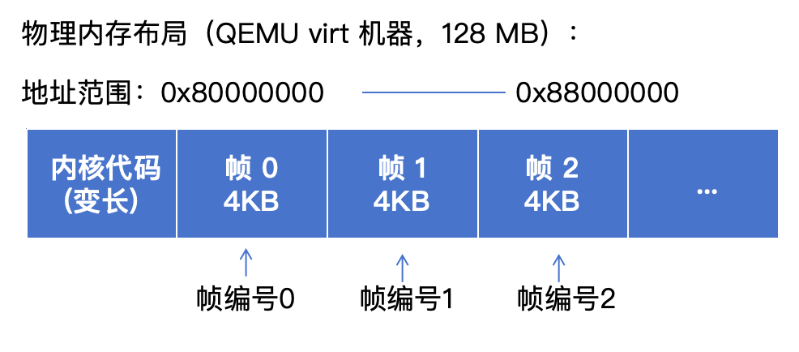
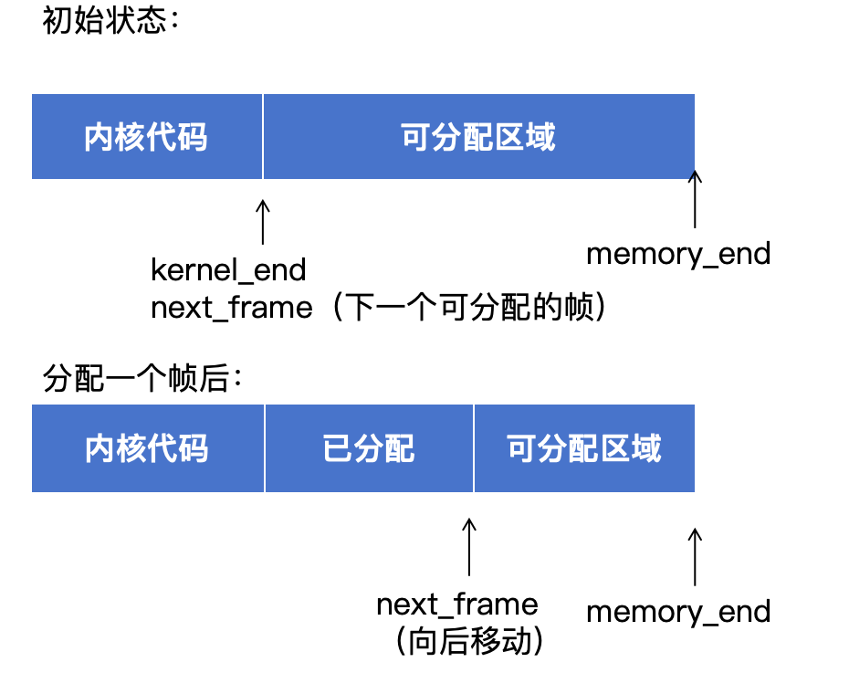

# 4.2.1：物理帧分配器实现

## 本节新增文件

```
src/
└── memory/
    └── mod.rs          # 新建：内存管理模块
```

---

## 为什么需要物理帧分配器？

在前面的章节中，我们使用 `init_heap_simple` 直接在物理内存上初始化堆。这个函数的实现非常简单：

```rust
// src/allocator.rs

pub fn init_heap_simple(kernel_end_addr: usize) -> Result<(), &'static str> {
    let heap_start = align_up(kernel_end_addr, 4096);
    unsafe {
        ALLOCATOR.lock().init(heap_start, HEAP_SIZE);
    }
    Ok(())
}
```

它直接从 `kernel_end` 后面的物理内存初始化堆，完全没有任何内存管理机制。

这种方式在简单场景下可以工作，但当我们要实现虚拟内存时，会遇到严重的问题：

### 问题1：无法追踪内存使用

没有记录哪些物理内存已经被使用。假设内核结束地址是 `0x80400000`，堆占用了 1MB（到 `0x80500000`），但系统完全不知道这段内存已经被占用。如果后续代码试图使用这段内存，就会发生冲突。

### 问题2：无法动态分配

堆的大小在初始化时就固定了（`HEAP_SIZE`），无法按需分配更多内存。如果堆空间不够，程序只能 panic；如果堆空间太大，又会浪费宝贵的物理内存。

### 问题3：无法支持虚拟内存

虚拟内存需要动态分配物理页帧来建立页表。例如，要创建一个三级页表，至少需要分配一个物理帧存放根页表。但当前的方案无法提供 "分配一个4KB物理帧" 这样的功能。

### 解决方案：物理帧分配器

我们需要实现一个**物理帧分配器**（Frame Allocator），它能够：

1. 按需分配 4KB 大小的物理帧
2. 记录哪些物理帧已被分配
3. 为页表、堆、进程等提供物理内存

---

## 知识补充：物理内存的组织方式

### 什么是物理帧？

在 RISC-V 架构中，物理内存以**页（Page）**为单位进行管理。每个页的大小是 **4 KB（4096 字节）**，我们称一个 4KB 大小的物理内存块为**物理帧（Physical Frame）**。

物理内存可以看作是一个由物理帧组成的数组：



每个物理帧都有一个**帧编号**（从 0 开始），通过帧编号可以计算出帧的物理地址：

```
帧地址 = 帧编号 × 4096
```

例如：
- 帧 0 的地址：0 × 4096 = 0x00000000（在我们的系统中是 0x80000000）
- 帧 1 的地址：1 × 4096 = 0x00001000
- 帧 525313 的地址：525313 × 4096 = 0x80401000

### 地址对齐

物理帧的起始地址必须是 **4KB 对齐**的，也就是说地址的低 12 位必须为 0。

为什么是低 12 位？因为 4096 = 2^12，所以 4KB 对齐意味着地址必须是 4096 的整数倍，其二进制表示的低 12 位为 0。

对齐的地址示例：
- `0x80000000` - 低 12 位 = `0x000`，对齐
- `0x80001000` - 低 12 位 = `0x000`，对齐
- `0x80002000` - 低 12 位 = `0x000`，对齐

非对齐的地址示例：
- `0x80000100` - 低 12 位 = `0x100`，不对齐
- `0x80001234` - 低 12 位 = `0x234`，不对齐

在代码中，我们可以用位运算实现地址对齐：
- **向下对齐**（清除低 12 位）：`addr & !0xFFF`
- **向上对齐**：`(addr + 0xFFF) & !0xFFF`

---

## 步骤1：创建 memory 模块

### 1.1 创建文件结构

在 `src` 目录下创建 `memory` 文件夹和 `mod.rs` 文件：

```
src/
├── memory/
│   └── mod.rs    # 新建
├── allocator.rs
└── main.rs
```

### 1.2 定义页大小常量

在 `src/memory/mod.rs` 中，首先定义页大小常量：

```rust
// src/memory/mod.rs

/// 页大小（4KB）
pub const PAGE_SIZE: usize = 4096;
```

这个常量将在整个内存管理模块中使用。

---

## 步骤2：实现物理地址抽象

### 2.1 为什么需要类型安全的地址？

在操作系统中，我们会频繁处理物理地址和虚拟地址。如果都用 `usize` 表示，很容易混淆：

```rust
// 不好的做法：容易混淆
let phys_addr: usize = 0x80000000;
let virt_addr: usize = 0x80000000;
// 编译器无法帮我们检查是否用错了地址类型
```

通过定义专门的类型，可以让编译器帮我们检查类型错误：

```rust
// 好的做法：类型安全
let phys_addr: PhysAddr = PhysAddr::new(0x80000000);
let virt_addr: VirtAddr = VirtAddr::new(0x80000000);
// 如果把物理地址传给期望虚拟地址的函数，编译器会报错
```

### 2.2 定义 PhysAddr 类型

在 `src/memory/mod.rs` 中添加物理地址类型：

```rust
// src/memory/mod.rs

/// RISC-V 物理地址
#[derive(Debug, Clone, Copy, PartialEq, Eq, PartialOrd, Ord)]
#[repr(transparent)]
pub struct PhysAddr(usize);

impl PhysAddr {
    /// 创建新的物理地址
    pub const fn new(addr: usize) -> Self {
        PhysAddr(addr)
    }

    /// 获取地址值
    pub const fn as_usize(self) -> usize {
        self.0
    }
}
```

代码说明：
- `#[repr(transparent)]` - 保证 `PhysAddr` 和 `usize` 的内存布局完全相同，避免额外开销
- `derive(Clone, Copy)` - 物理地址是简单的值类型，可以按值复制
- `derive(PartialEq, Eq)` - 可以比较两个物理地址是否相等
- `const fn` - 可以在编译期创建物理地址常量

### 2.3 定义 PhysFrame 类型

物理帧是 4KB 对齐的物理内存块，我们用 `PhysFrame` 类型表示：

```rust
// src/memory/mod.rs

/// 物理帧（4KB 对齐的物理内存块）
#[derive(Debug, Clone, Copy, PartialEq, Eq)]
pub struct PhysFrame {
    start_address: PhysAddr,
}

impl PhysFrame {
    /// 获取包含给定物理地址的帧
    pub fn containing_address(addr: PhysAddr) -> Self {
        PhysFrame {
            start_address: PhysAddr::new(addr.as_usize() & !0xFFF),
        }
    }

    /// 获取帧的起始地址
    pub fn start_address(self) -> PhysAddr {
        self.start_address
    }
}
```

这里的关键是 `containing_address` 方法。它接受任意物理地址，返回包含该地址的物理帧。

**地址对齐操作解析**：

`addr.as_usize() & !0xFFF` 这个操作的作用是将地址向下对齐到 4KB 边界。

分步说明：
1. `0xFFF` 的二进制是 `0000...0000111111111111`（低 12 位全为 1）
2. `!0xFFF` 取反得到 `1111...1111000000000000`（低 12 位全为 0）
3. `addr & !0xFFF` 保留地址的高位，清除低 12 位

示例：
```
原始地址：0x80001234
二进制：  1000 0000 0000 0001 0010 0011 0100

!0xFFF：  1111 1111 1111 1111 0000 0000 0000

结果：    1000 0000 0000 0001 0000 0000 0000
         = 0x80001000
```

所以地址 `0x80001234` 所在的帧起始地址是 `0x80001000`。

---

## 步骤3：实现物理帧分配器

### 3.1 分配策略设计

我们采用最简单的**线性分配策略**（也叫 Bump Allocator）：

分配过程：



这个策略非常简单：
1. 维护一个指针 `next_frame`，指向下一个可分配的帧
2. 每次分配时，返回 `next_frame` 指向的帧，然后 `next_frame` 加 1
3. 如果 `next_frame` 超过 `memory_end`，说明内存耗尽

优点：
- 实现简单，代码量少
- 分配速度快，O(1) 时间复杂度
- 无内存碎片，所有帧连续分配

缺点：
- 不支持释放（可以扩展实现）

对于我们当前的教学系统，线性分配已经足够了。

### 3.2 定义分配器结构

在 `src/memory/mod.rs` 中添加分配器结构：

```rust
// src/memory/mod.rs

/// 简单的物理帧分配器
pub struct SimpleFrameAllocator {
    next_frame: usize,    // 下一个可分配的帧编号
    end_frame: usize,     // 最后一个可用的帧编号
}
```

注意这里存储的是**帧编号**，不是物理地址。帧编号更紧凑，占用空间小。

### 学生任务：实现构造函数

> **Task 4-1：实现地址与帧编号的转换关系**
>
> 轮到你动手了，请打开`os/src/memory/mod.rs`文件，实现`SimpleFrameAllocator::new`中的帧编号转换

构造函数框架如下

```rust
// src/memory/mod.rs

impl SimpleFrameAllocator {
    pub fn new(kernel_end: usize, memory_end: usize) -> Self {
        // TODO: 请补全以下代码，计算下一个可分配的帧编号
        // 提示：将kernel_end转换为帧编号（注意如果内核结束地址不是4KB对齐的，我们必须从下一个完整的帧开始分配，所以要向上取整。）
        let next_frame = 
        // TODO: 请补全以下代码，计算内存结束位置对应的帧编号
        // 提示：将memory_end转换为帧编号（向下取整）
        let end_frame = 

        crate::serial_println!(
            "[MEMORY] Frame allocator initialized: {:#x} - {:#x}",
            next_frame * PAGE_SIZE,
            end_frame * PAGE_SIZE
        );
        SimpleFrameAllocator { next_frame, end_frame }
    }
}
```


### 学生任务：实现物理帧分配方法

> **Task 4-2：实现线性分配器的核心逻辑**
>
> 依旧还是`os/src/memory/mod.rs`文件，请你找到`SimpleFrameAllocator::allocate`方法并且完成填空

```rust
// src/memory/mod.rs

impl SimpleFrameAllocator {
    pub fn allocate(&mut self) -> Option<PhysFrame> {
        //TODO: 检查是否有可用帧
        if  {
            return None;  // 内存耗尽
        }
        //TODO: 计算物理地址
        //提示：用帧编号转物理地址
        let frame = PhysFrame::containing_address(
            PhysAddr::new()
        );
        //TODO: 更新帧编号
        
        Some(frame)
    }
}
```


---

## 步骤4：封装内存管理器

### 4.1 为什么需要 MemoryManager？

虽然我们现在只有一个 `SimpleFrameAllocator`，但在完整的内存管理系统中，还会有其他组件：
- 页表管理器
- 地址空间管理器
- 共享内存管理器

我们用 `MemoryManager` 作为顶层接口，统一管理所有内存相关的组件。

### 4.2 定义 MemoryManager

在 `src/memory/mod.rs` 中添加：

```rust
// src/memory/mod.rs

/// 内存管理器
pub struct MemoryManager {
    pub frame_allocator: SimpleFrameAllocator,
}

impl MemoryManager {
    pub fn new(kernel_end: usize, memory_end: usize) -> Self {
        MemoryManager {
            frame_allocator: SimpleFrameAllocator::new(kernel_end, memory_end),
        }
    }
}
```

### 4.3 实现初始化函数

提供一个便捷的初始化函数，硬编码 QEMU virt 机器的内存布局：

```rust
// src/memory/mod.rs

pub fn init(kernel_end: usize) -> MemoryManager {
    const MEMORY_START: usize = 0x8000_0000;
    const MEMORY_SIZE: usize = 128 * 1024 * 1024; // 128 MB
    let memory_end = MEMORY_START + MEMORY_SIZE;

    crate::serial_println!("[MEMORY] Initializing memory management");
    crate::serial_println!("[MEMORY] Kernel end: {:#x}", kernel_end);
    crate::serial_println!("[MEMORY] Memory range: {:#x} - {:#x}",
                          MEMORY_START, memory_end);

    MemoryManager::new(kernel_end, memory_end)
}
```

QEMU virt 机器的物理内存布局：
- 起始地址：`0x80000000`
- 大小：128 MB（默认配置）
- 结束地址：`0x88000000`

---

## 知识点总结

本节我们实现了物理帧分配器，这是虚拟内存管理的基础。

核心概念：
- **物理帧**：4 KB 对齐的物理内存块
- **帧编号**：物理帧的索引，从 0 开始
- **线性分配**：顺序分配物理帧，O(1) 时间复杂度
- **类型安全**：用 `PhysAddr` 和 `PhysFrame` 避免地址混淆

实现的功能：
- `PhysAddr` 和 `PhysFrame` 类型
- `SimpleFrameAllocator` 物理帧分配器
- `MemoryManager` 内存管理器
- 地址对齐操作

---

## 附录：完整代码

### src/memory/mod.rs

```rust
// src/memory/mod.rs

pub const PAGE_SIZE: usize = 4096;

#[derive(Debug, Clone, Copy, PartialEq, Eq, PartialOrd, Ord)]
#[repr(transparent)]
pub struct PhysAddr(usize);

impl PhysAddr {
    pub const fn new(addr: usize) -> Self {
        PhysAddr(addr)
    }

    pub const fn as_usize(self) -> usize {
        self.0
    }
}

#[derive(Debug, Clone, Copy, PartialEq, Eq)]
pub struct PhysFrame {
    start_address: PhysAddr,
}

impl PhysFrame {
    pub fn containing_address(addr: PhysAddr) -> Self {
        PhysFrame {
            start_address: PhysAddr::new(addr.as_usize() & !0xFFF),
        }
    }

    pub fn start_address(self) -> PhysAddr {
        self.start_address
    }
}

pub struct SimpleFrameAllocator {
    next_frame: usize,
    end_frame: usize,
}
///
impl SimpleFrameAllocator {
    pub fn new(kernel_end: usize, memory_end: usize) -> Self {
        // TODO: 请补全以下代码，计算下一个可分配的帧编号
        // 提示：将kernel_end转换为帧编号（注意如果内核结束地址不是4KB对齐的，我们必须从下一个完整的帧开始分配，所以要向上取整。）
        let next_frame = 
        // TODO: 请补全以下代码，计算内存结束位置对应的帧编号
        // 提示：将memory_end转换为帧编号（向下取整）
        let end_frame = 

        crate::serial_println!(
            "[MEMORY] Frame allocator initialized: {:#x} - {:#x}",
            next_frame * PAGE_SIZE,
            end_frame * PAGE_SIZE
        );
        SimpleFrameAllocator { next_frame, end_frame }
    }

    pub fn allocate(&mut self) -> Option<PhysFrame> {
        //TODO: 检查是否有可用帧
        if  {
            return None;  // 内存耗尽
        }
        //TODO: 计算物理地址
        //提示：用帧编号转物理地址
        let frame = PhysFrame::containing_address(
            PhysAddr::new()
        );
        //TODO: 更新帧编号
        
        Some(frame)
    }
}

pub struct MemoryManager {
    pub frame_allocator: SimpleFrameAllocator,
}

impl MemoryManager {
    pub fn new(kernel_end: usize, memory_end: usize) -> Self {
        MemoryManager {
            frame_allocator: SimpleFrameAllocator::new(kernel_end, memory_end),
        }
    }
}

pub fn init(kernel_end: usize) -> MemoryManager {
    const MEMORY_START: usize = 0x8000_0000;
    const MEMORY_SIZE: usize = 128 * 1024 * 1024;
    let memory_end = MEMORY_START + MEMORY_SIZE;

    crate::serial_println!("[MEMORY] Initializing memory management");
    crate::serial_println!("[MEMORY] Kernel end: {:#x}", kernel_end);
    crate::serial_println!("[MEMORY] Memory range: {:#x} - {:#x}",
                          MEMORY_START, memory_end);

    MemoryManager::new(kernel_end, memory_end)
}
```
