# 4.3：建立虚拟内存到物理内存的映射

在4.1中，我们明白了建立虚拟内存到物理内存映射的好处。但该如何实现这个映射呢？

## 1. 最简单的方案：线性映射（一维数组）

最简单也最容易想到的方案就是建立一一配对的键值对：通过建立一维数组的方式，将数组下标作为索引，元素内容存储物理地址。

### 1.1 线性映射的基本思想

**线性映射表（一维数组）：**

| 索引（虚拟地址） | 映射 | 元素（物理地址） |
|-----------------|------|-----------------|
| 0 | → | 0x80000000 |
| 1 | → | 0x80001000 |
| 2 | → | 0x80002000 |
| 3 | → | 0x80003000 |
| ... | → | ... |
| 134,217,727 | → | 物理地址 |

**虚拟地址转换过程：**

1. 获取虚拟地址（如虚拟地址 5）
2. 使用虚拟地址作为数组索引访问映射表（访问数组[5]）
3. 得到对应的物理地址

**示例：**

```
虚拟地址 100 → 数组[100] → 物理地址 0x80064000
```

这种方式非常直观：将虚拟地址作为索引查找数组，就能得到对应的物理地址。

## 2. 线性映射的致命缺陷：占用过多内存

但是这种简单的方式有一个致命的问题：**占用的内存太大了！**

### 2.1 内存占用计算

在 RISC-V Sv39 架构中：
- 虚拟地址空间：39 位 = 2³⁹ = 512 GB
- 页大小：4 KB = 2¹² 字节
- 需要的数组元素数量：512 GB / 4 KB = 2²⁷ = 134,217,728 个

```
线性映射表需要的内存：
= 数组元素数量 × 每个元素大小
= 134,217,728 × 8 字节（一个物理地址需要 8 字节存储）
= 1,073,741,824 字节
= 1 GB

结论：每个进程需要 1 GB 内存来存储映射表！
```

### 2.2 实际场景的荒谬性

假设系统运行 10 个进程：

| 进程 | 实际使用 | 映射表大小 | 备注 |
|------|----------|-----------|------|
| 浏览器 | 500 MB | 1 GB | 映射表比数据还大！ |
| 编辑器 | 200 MB | 1 GB | |
| 终端 | 50 MB | 1 GB | |
| 系统服务 | 100 MB | 1 GB | |
| ... | ... | ... | |

**10 个进程的情况：**
- 实际使用内存：约 2 GB
- 映射表占用：10 GB  ← 完全不可接受！

**问题总结：**

- 映射表占用的内存远超程序实际使用的内存
- 99% 以上的映射表项从未被使用，完全浪费
- 128 MB 物理内存的机器根本装不下这些映射表

## 3. 更好的方案：图书馆找书的启示

为了解决线性映射的内存浪费问题，我们需要一种**按需分配**的方式。让我们从图书馆找书的例子中获得启发。

### 3.1 图书馆找书的过程

想象你在一个巨大的图书馆里找一本书，你会怎么做？

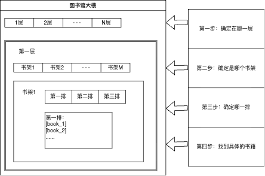

```
找书的四个步骤：
1. 查一级索引（楼层目录）：书在第几层
2. 查二级索引（书架目录）：书在这层的第几个书架
3. 查三级索引（排目录）：  书在这个书架的第几排
4. 在这一排中定位：         书在这排的第几个位置
```

**关键优势**：图书馆不需要为每本可能的书都预留位置，只需要为实际存放的书分配书架和排！如果某一层没有书，就不需要在那一层放书架。

### 3.2 从图书馆到虚拟内存

现在让我们把图书馆找书的过程映射到虚拟内存：

| 图书馆概念 | 虚拟内存概念 | 索引位数 |
|-----------|-------------|---------|
| 楼层索引 | VPN[2]（一级索引） | 9 位 (0-511) |
| 书架索引 | VPN[1]（二级索引） | 9 位 (0-511) |
| 排索引 | VPN[0]（三级索引） | 9 位 (0-511) |
| 排中的具体位置 | 页内偏移（Offset） | 12 位 (0-4095) |

**总计：9 + 9 + 9 + 12 = 39 位**

这就是 **Sv39** 的由来：**S**upervisor **V**irtual address with **39** bits（39 位监督者虚拟地址）

### 3.3 虚拟地址的结构

通过图书馆的例子，我们自然地推导出了 39 位虚拟地址的结构：

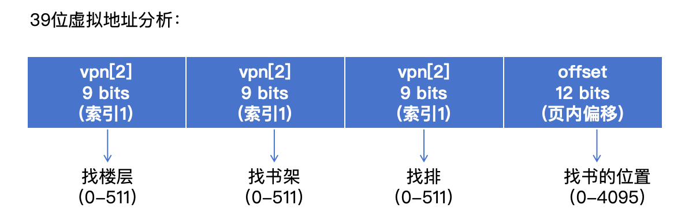

```
示例：虚拟地址 0x0012_3456

二进制表示：
0000 0000 0001 0010 0011 0100 0101 0110
     └────┬────┘└───┬───┘└───┬───┘└─────┬─────┘
       VPN[2]     VPN[1]    VPN[0]    Offset
         0         0x91      0x123      0x456
        (0)       (145)      (291)     (1110)

意思是：
- 在第 0 层（VPN[2]=0）
- 第 145 个书架（VPN[1]=145）
- 第 291 排（VPN[0]=291）
- 排中第 1110 字节的位置（Offset=1110）
```

## 4. 抽象成页表：从书架到内存

在图书馆的例子中，"楼层目录"、"书架目录"、"排目录" 在虚拟内存中对应的概念就是**页表（Page Table）**。

### 4.1 什么是页表？

**页表**就像图书馆的目录，是一个数组，用于指引我们找到下一级的位置。

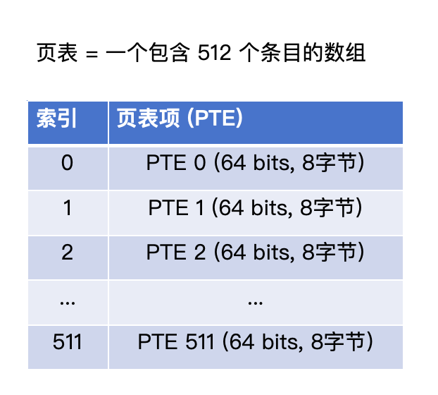

```
页表大小计算：
= 512 个条目 × 8 字节/条目
= 4096 字节
= 4 KB
= 正好是一个物理页帧的大小！
```

**关键点**：
- **512 个条目**：对应 9 位索引（2⁹ = 512）
- **每个条目 8 字节**：存储页表项（PTE）
- **总大小 4 KB**：正好是一个物理页帧的大小
- **分配页表只需要分配一个物理页帧即可**

### 4.2 页表项（PTE）的构成

每个页表项（Page Table Entry，PTE）是 64 位，包含了指向下一级的信息：

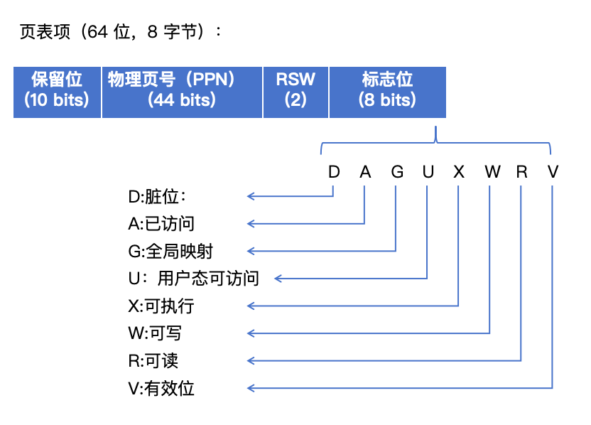

```
三个重要组成部分：
1. 44 位物理页号（PPN）：关键！指向下一级页表或最终物理页帧的位置
2. 8 位标志位：控制访问权限（读、写、执行等）
3. 2 位 RSW：软件保留，可自由使用
```

### 4.3 物理页号如何转换成物理地址

**物理地址的结构**

在 Sv39 分页机制中，物理地址使用低 56 位来表示（RISC-V 64位架构中，高位保留）：

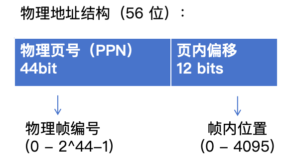

**为什么是 44 位物理页号？**

还记得我们在第一章提到的吗？操作系统通过**物理页帧**来管理内存：
- 每个物理页帧有一个编号（物理页号，PPN）
- 每个物理页帧的大小：4 KB = 4096 字节 = 2¹²

因此：
- **物理页号（44 位）**：用于索引到具体的物理帧（相当于帧的编号）
- **页内偏移（12 位）**：用于在 4 KB 的物理帧内定位具体字节

**转换过程**

物理页号（PPN）到物理地址的转换非常简单：

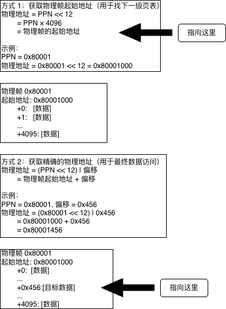

**两种用途**

在三级页表查询中，物理页号有两种用途：

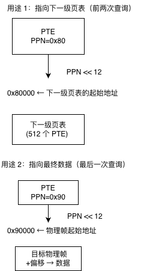

**关键点总结**

- **物理页号（44 位）= 物理帧的编号**
- **左移 12 位（×4096）= 转换成物理帧起始地址**
- **不加偏移**：用于找到页表（中间步骤）
- **加上偏移**：用于找到最终数据（最后一步）

## 5. 三级页表查询的完整过程

现在我们可以完整地描述三级页表的查询过程了。

### 5.1 虚拟地址分解

首先，将 39 位虚拟地址分解为四个部分：

```
虚拟地址示例：0x0012_3456(高位补0至39位)
```

| 索引 1VPN[2]9 bits | 索引 2VPN[1]9 bits | 索引 3VPN[0]9 bits | 页内偏移Offset12 bits |
| ------------------ | ------------------ | ------------------ | --------------------- |
| 0(十进制: 0)       | 0x91(十进制: 145)  | 0x123(十进制: 291) | 0x456(十进制: 1110)   |

### 5.2 查询过程详解

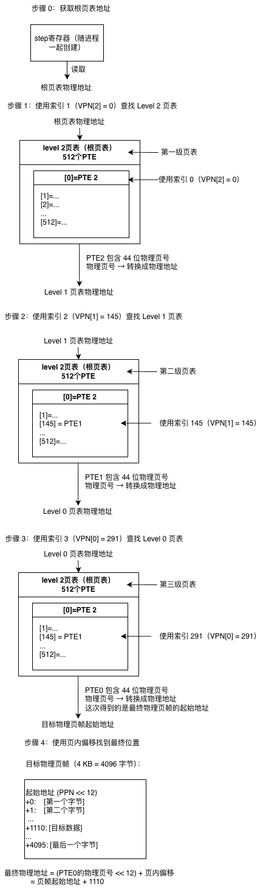

### 5.3 查询过程总结

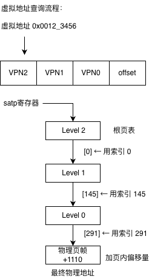

### 5.4 关键点理解

1. **三级查询**：
   - 每一级都是一个 512 条目的数组（页表）
   - 使用 9 位索引（VPN[2]/VPN[1]/VPN[0]）在页表中查找
   - 每次查找得到下一级页表的位置

2. **物理页号的作用**：
   - 前两次（Level 2 → Level 1 → Level 0）：指向下一级页表
   - 最后一次（Level 0 → 物理页帧）：指向最终的目标物理页帧

3. **页内偏移的作用**：
   - 物理页帧大小是 4 KB（4096 字节）
   - 页内偏移（12 位）可以表示 0-4095
   - 用于在 4 KB 页帧内定位具体字节

4. **satp 寄存器**：
   - 存储根页表的物理地址
   - 每个进程有自己的根页表，切换进程时更新 satp
   - 是整个地址转换的起点

## 6. 按需分配的优势

三级页表的最大优势在于**按需分配**。

### 6.1 对比线性映射

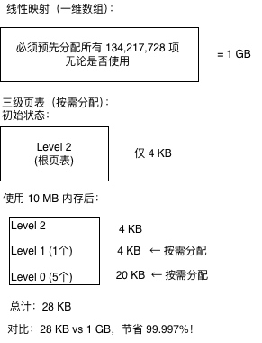

### 6.2 实际程序的内存占用

**典型程序使用 120 MB 内存的对比：**

| 方案 | 页表大小 | 实际占用 |
|------|----------|----------|
| 线性映射 | 1 GB | 120MB + 1GB = 1.12 GB |
| 三级页表 | ~84 KB | 120MB + 84KB = 120.08 MB |

**内存效率提升：约 10 倍！**

## 7. 总结

### 7.1 从线性映射到三级页表的演进

```
线性映射（一维数组）：
✓ 简单直观
✓ 查找快速（O(1)）
- 占用 1 GB 内存（每个进程）
- 99% 以上的空间浪费

三级页表（分层查询）：
✓ 按需分配（只需 ~100 KB）
✓ 空间效率高（节省 99.99%）
✓ 支持稀疏的虚拟地址空间
✓ 可扩展（支持大量进程）
- 查找稍慢（3 次内存访问）
  （但可以通过 TLB 缓存优化）
```

### 7.2 虚拟地址结构总结

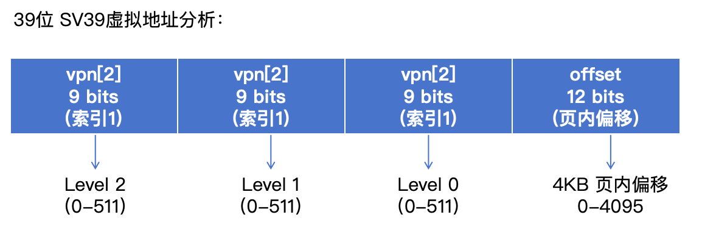

### 7.3 三级页表查询核心流程

```
1. 从 satp 寄存器获取根页表地址
2. VPN[2] → 在 Level 2 页表中查找 → 得到 Level 1 页表地址
3. VPN[1] → 在 Level 1 页表中查找 → 得到 Level 0 页表地址
4. VPN[0] → 在 Level 0 页表中查找 → 得到物理页帧起始地址
5. 物理页帧起始地址 + 页内偏移 → 最终物理地址
```

---

## 8. TLB：加速地址转换

### 8.1 三级页表的性能问题

虽然三级页表解决了空间浪费的问题，但带来了一个新的问题：**每次地址转换需要访问 3 次内存**！

```
地址转换的开销：

访问一次数据 = 1 次内存访问（理想情况）
              ↓
使用三级页表 = 3 次页表查询 + 1 次数据访问
              = 4 次内存访问！

性能损失：访问速度降低 4 倍！
```

**实际程序的访存模式**：
- 程序通常会**重复访问**相同的内存区域（局部性原理）
- 代码段：循环执行同一段代码
- 数据段：频繁访问同一个数组
- 栈：函数调用时反复访问栈帧

**关键观察**：如果程序反复访问虚拟地址 0x1000，我们每次都要做三级页表查询，但查询结果总是相同的！

### 8.2 什么是 TLB？

**TLB（Translation Lookaside Buffer，快表/旁路转换缓冲）**是 CPU 内置的一个**高速缓存**，专门用于存储**最近使用的虚拟地址到物理地址的转换结果**。

```
没有 TLB 的地址转换：
虚拟地址
   ↓
查 Level 2 (内存访问 1)
   ↓
查 Level 1 (内存访问 2)
   ↓
查 Level 0 (内存访问 3)
   ↓
物理地址
   ↓
访问数据 (内存访问 4)

总计：4 次内存访问

═══════════════════════════════════════

有 TLB 的地址转换：
虚拟地址
   ↓
查 TLB (命中！) ← 在 CPU 内部，极快
   ↓
物理地址
   ↓
访问数据 (内存访问 1)

总计：1 次内存访问
性能提升：4 倍！
```

### 8.3 TLB 的工作原理

TLB 本质上是一个**键值对缓存**：

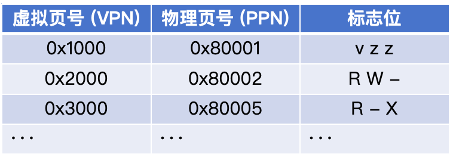

```
特点：
- 容量小（通常 32-128 项）
- 速度极快（CPU 内部硬件）
- 采用关联查找（并行搜索）
```

**地址转换流程（带 TLB）**：

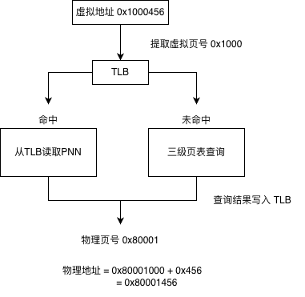

### 8.4 TLB 何时需要刷新？

TLB 缓存的转换可能会**失效**，需要刷新。在我们的代码中，有以下情况需要刷新 TLB：

#### 情况 1：建立新的页面映射

```rust
// src/memory/paging.rs

// 在 map_page 函数中建立新映射后
pub fn map_page(...) -> Result<(), &'static str> {
    // ... 设置页表项 ...
    pte0.set(paddr.as_usize() >> 12, flags | PageTableFlags::Valid as usize);

    // ⚠️ 必须刷新 TLB！
    // 原因：TLB 可能缓存了"该虚拟地址未映射"的结果
    unsafe {
        core::arch::asm!(
            "sfence.vma {0}, zero",
            in(reg) vaddr.as_usize(),
        );
    }

    Ok(())
}
```

**为什么需要刷新？**
- TLB 可能之前查询过这个虚拟地址，发现未映射
- 现在我们建立了新映射，但 TLB 还保留着旧的"未映射"信息
- 如果不刷新，CPU 会使用 TLB 中的旧信息，导致访问失败

#### 情况 2：切换地址空间（进程切换）

```rust
// src/memory/address_space.rs

// 激活新的地址空间时
pub fn activate(&self) {
    use riscv::register::satp;

    let ppn = self.page_table_paddr.as_usize() >> 12;

    unsafe {
        // 切换到新的页表
        satp::set(satp::Mode::Sv39, 0, ppn);

        // ⚠️ 必须刷新整个 TLB！
        // 原因：新进程的虚拟地址映射完全不同
        core::arch::asm!("sfence.vma");  // 不带参数 = 刷新所有项
    }
}
```

**为什么需要刷新？**
- 不同进程使用不同的页表（不同的虚拟地址空间）
- 虚拟地址 0x1000 在进程 A 和进程 B 中映射到**不同的物理地址**
- 如果不刷新，进程 B 可能访问到进程 A 的数据（安全漏洞！）

#### RISC-V 的 sfence.vma 指令

```
sfence.vma 指令格式：

sfence.vma rs1, rs2

参数：
- rs1 = 虚拟地址（可选）：只刷新该地址的 TLB 项
- rs2 = ASID（可选）：地址空间标识符（本章未使用）

示例：
sfence.vma x10, zero  # 刷新 x10 寄存器指向的虚拟地址
sfence.vma zero, zero # 刷新所有 TLB 项
```

### 8.5 TLB 的性能影响

**TLB 命中率的重要性**：

```
假设：
- TLB 访问时间：1 纳秒（CPU 内部）
- 内存访问时间：100 纳秒
- TLB 命中率：95%

平均访问时间计算：
= TLB 命中时间 × 命中率 + (TLB + 三级页表 + 数据) × 未命中率
= 1ns × 95% + (1ns + 300ns + 100ns) × 5%
= 0.95ns + 20.05ns
= 21ns

如果没有 TLB：
= 300ns (三级页表) + 100ns (数据)
= 400ns

性能提升：400 / 21 ≈ 19 倍！
```

**关键点**：

- TLB 命中率越高，性能越好
- 程序的局部性越好（重复访问相同区域），TLB 命中率越高
- 使用**大页**可以显著提升 TLB 命中率

---

## 9. 大页机制：更高效的内存映射

### 9.1 什么是大页？

到目前为止，我们讨论的都是 **4 KB 页**，需要**三级查询**才能完成地址转换。但 RISC-V Sv39 还支持**大页**，可以在**中间级别**就停止查询。

**标准页 vs 大页**：

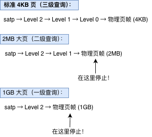

### 9.2 大页的判断条件

**如何判断一个 PTE 是否指向大页？**

回顾 PTE 的结构：

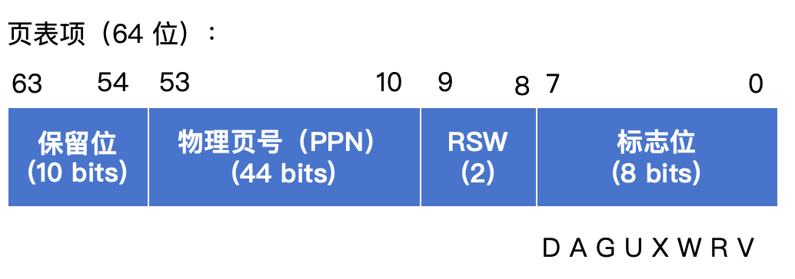

**判断规则**：

```rust
if PTE.V == 1 && (PTE.R == 1 || PTE.W == 1 || PTE.X == 1) {
    // 这是一个叶子节点（大页或标准页）
    // 从当前 PTE 直接取出物理页号，完成地址转换
} else if PTE.V == 1 {
    // 这是一个指针节点
    // PTE 指向下一级页表，继续查询
} else {
    // 无效页表项
    return None;
}
```

**关键点**：
- **V = 1 且 R/W/X 不全为 0**：这是**叶子节点**，直接映射到物理页帧
- **V = 1 且 R/W/X 全为 0**：这是**指针节点**，指向下一级页表
- **V = 0**：无效页表项

### 9.3 大页的地址转换

**核心思想**：将物理页号和页内偏移"接起来"。

#### 物理地址 = 物理页号 << 12 + 页内偏移

但在大页中，"页内偏移"的位数不同：

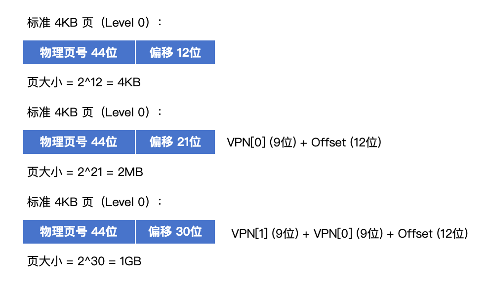

**关键理解**：
- 在**中途停止**时，**未使用的 VPN 部分**会和**原始页内偏移**一起，形成更大的"大页页内偏移"
- 物理地址 = (物理页号 << 12) + 大页页内偏移

### 9.4 大页地址转换的具体例子

#### 例子 1：2MB 大页

假设我们要访问虚拟地址 `0x0040_1234`，并且 Level 1 页表项是一个大页。

**步骤 1：分解虚拟地址**

```
虚拟地址：0x0040_1234

二进制：
  0000 0000 0100 0000 0001 0010 0011 0100
  └───┬───┘└───┬───┘└───┬───┘└─────┬─────┘
   VPN[2]   VPN[1]   VPN[0]    Offset
     0        2       0x9       0x234
    (0)      (2)      (9)       (564)
```

**步骤 2：查询 Level 2 页表**

```
从 satp 获取根页表地址
   ↓
使用 VPN[2] = 0 查询
   ↓
得到 Level 1 页表地址
```

**步骤 3：查询 Level 1 页表（发现大页）**

```
使用 VPN[1] = 2 查询 Level 1 页表
   ↓
得到 PTE1：
  V = 1, R = 1, W = 1, X = 0  ← R/W/X 不全为 0
  PPN = 0x80100
   ↓
判断：这是一个叶子节点（2MB 大页）！
```

**步骤 4：计算大页页内偏移**

```
2MB 大页的页内偏移 = VPN[0] + Offset
                   = 9 位 + 12 位 = 21 位

具体计算：
VPN[0] = 0x9 (二进制: 000001001)
Offset = 0x234 (二进制: 001000110100)

拼接：
000001001 001000110100
└── 9 ──┘└──── 12 ────┘
= 0b000001001001000110100
= 0x9234
= 37,428 字节
```

**步骤 5：计算最终物理地址**

```
物理地址 = (PPN << 12) + 大页页内偏移
         = (0x80100 << 12) + 0x9234
         = 0x80100000 + 0x9234
         = 0x80109234
```

**完整过程可视化**：

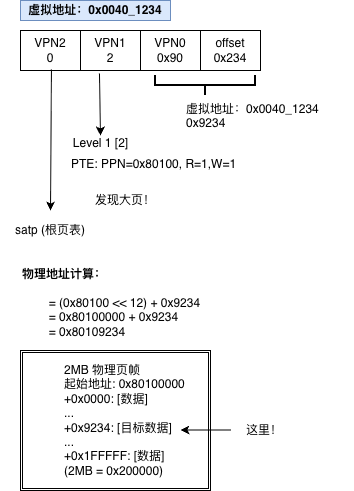

#### 例子 2：1GB 大页

假设访问虚拟地址 `0x8020_0400`，Level 2 页表项是 1GB 大页。

**步骤 1：分解虚拟地址**

```
虚拟地址：0x8020_0400

二进制：
  1000 0000 0010 0000 0000 0100 0000 0000
  └───┬───┘└───┬───┘└───┬───┘└─────┬─────┘
   VPN[2]   VPN[1]   VPN[0]    Offset
     4       0x10       0       0x400
    (4)      (16)      (0)      (1024)
```

**步骤 2：查询 Level 2 页表（发现大页）**

```
从 satp 获取根页表地址
   ↓
使用 VPN[2] = 4 查询
   ↓
得到 PTE2：
  V = 1, R = 1, W = 1, X = 1  ← R/W/X 不全为 0
  PPN = 0x80000
   ↓
判断：这是一个叶子节点（1GB 大页）！
```

**步骤 3：计算大页页内偏移**

```
1GB 大页的页内偏移 = VPN[1] + VPN[0] + Offset
                   = 9 位 + 9 位 + 12 位 = 30 位

具体计算：
VPN[1] = 0x10  (二进制: 000010000)
VPN[0] = 0x0   (二进制: 000000000)
Offset = 0x400 (二进制: 010000000000)

拼接：
000010000 000000000 010000000000
└── 9 ──┘└── 9 ──┘└──── 12 ────┘
= 0b000010000000000000010000000000
= 0x2000400
= 33,555,456 字节
```

**步骤 4：计算最终物理地址**

```
物理地址 = (PPN << 12) + 大页页内偏移
         = (0x80000 << 12) + 0x2000400
         = 0x80000000 + 0x2000400
         = 0x82000400
```

### 9.5 大页的优势

**1. 减少页表层级，节省内存访问**

```
标准 4KB 页：3 次页表查询
2MB 大页：   2 次页表查询（减少 33%）
1GB 大页：   1 次页表查询（减少 66%）
```

**2. 减少页表项数量，节省内存**

```
映射 1GB 内存需要的页表项：

使用 4KB 页：
= 1GB / 4KB = 262,144 个页表项

使用 2MB 大页：
= 1GB / 2MB = 512 个页表项（减少 512 倍！）

使用 1GB 大页：
= 1GB / 1GB = 1 个页表项（减少 262,144 倍！）
```

**3. 显著提升 TLB 命中率**

```
TLB 容量：64 项

使用 4KB 页：
64 项 × 4KB = 256 KB 覆盖范围

使用 2MB 大页：
64 项 × 2MB = 128 MB 覆盖范围（提升 512 倍！）

使用 1GB 大页：
64 项 × 1GB = 64 GB 覆盖范围（提升 262,144 倍！）
```

**实际场景**：
- **内核代码段**：几 MB 到几十 MB，权限相同（RX），适合用 2MB 大页
- **大型数据库缓存**：几 GB，权限相同（RW），适合用 1GB 大页
- **应用程序堆栈**：权限频繁变化，适合用 4KB 标准页

### 9.6 大页的代码体现

在我们的 `walk_page_table` 函数中，已经实现了大页的支持：

```rust
// src/memory/paging.rs

pub fn walk_page_table(root_paddr: PhysAddr, vaddr: VirtAddr) -> Option<PhysAddr> {
    let root_table = unsafe { &*(root_paddr.as_usize() as *const PageTable) };

    // Level 2 查找
    let vpn2 = vaddr.vpn2();
    let pte2 = root_table.get_entry(vpn2);

    if !pte2.is_valid() {
        return None;
    }

    // 检查是否为 1GB 大页
    if pte2.is_leaf() {  // R/W/X 不全为 0
        // 1GB 大页：偏移 = VPN[1] (9位) + VPN[0] (9位) + Offset (12位) = 30位
        let offset = vaddr.as_usize() & 0x3FFF_FFFF;  // 30位掩码
        return Some(PhysAddr::new(pte2.phys_addr().as_usize() + offset));
    }

    // Level 1 查找
    let table1 = unsafe { &*(pte2.phys_addr().as_usize() as *const PageTable) };
    let vpn1 = vaddr.vpn1();
    let pte1 = table1.get_entry(vpn1);

    if !pte1.is_valid() {
        return None;
    }

    // ⚠️ 检查是否为 2MB 大页
    if pte1.is_leaf() {  // R/W/X 不全为 0
        // 2MB 大页：偏移 = VPN[0] (9位) + Offset (12位) = 21位
        let offset = vaddr.as_usize() & 0x1F_FFFF;  // 21位掩码
        return Some(PhysAddr::new(pte1.phys_addr().as_usize() + offset));
    }

    // Level 0 查找（标准 4KB 页）
    let table0 = unsafe { &*(pte1.phys_addr().as_usize() as *const PageTable) };
    let vpn0 = vaddr.vpn0();
    let pte0 = table0.get_entry(vpn0);

    if !pte0.is_valid() {
        return None;
    }

    // 4KB 页：偏移 = Offset (12位)
    let offset = vaddr.page_offset();  // 12位
    Some(PhysAddr::new(pte0.phys_addr().as_usize() + offset))
}
```

### 9.7 大页机制总结

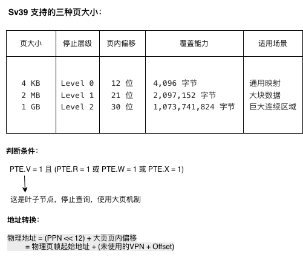

```
核心优势：
✓ 减少页表层级（1-2 次内存访问）
✓ 减少页表项数量（节省内存）
✓ 提升 TLB 命中率（覆盖更大范围）
✓ 整体提升访存性能
```

---

## 10. 完整的地址转换总结

### 10.1 标准地址转换（4KB 页）

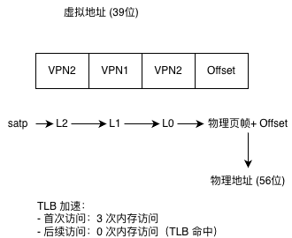

### 10.2 大页地址转换（2MB/1GB）

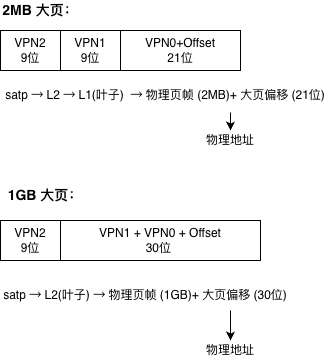

### 10.3 完整的性能优化策略

```
第一层优化：三级页表
✓ 解决空间浪费（1GB → ~100KB）
✗ 引入性能开销（3 次内存访问）

第二层优化：TLB
✓ 缓存最近转换（4 次 → 1 次访问）
✓ 利用程序局部性
✗ 容量有限（32-128 项）

第三层优化：大页
✓ 减少页表层级（3次 → 1-2次）
✓ 提升 TLB 覆盖率（256KB → 128MB）
✓ 节省页表内存（262144项 → 512项）
✗ 需要大块连续内存

综合效果：
相比线性映射（1GB）+ 直接访问（1次）：
- 空间开销：降低 99.99%（1GB → 100KB）
- 时间开销：接近零（TLB 命中率 >95%）
```

恭喜你完成了虚拟内存映射机制的完整学习！你现在理解了：
- 三级页表如何工作
- TLB 如何加速地址转换
- 大页如何进一步提升性能
- 完整的 RISC-V Sv39 分页机制

