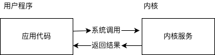
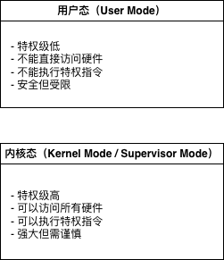
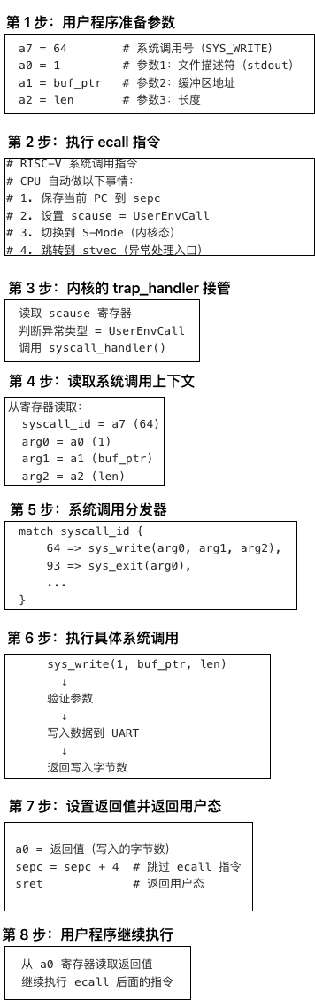
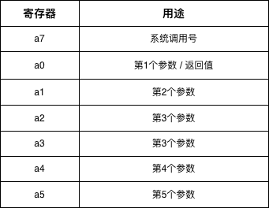

# 第五章：系统调用

## 引言
操作系统的核心职责是"管理硬件资源和软件资源"（如内存、CPU、文件、网络端口），而系统调用是用户程序申请资源、释放资源」的唯一合法入口：




## 5.1 什么是系统调用

### 5.1.1 用户态与内核态

现代处理器提供两种特权级别：



### 5.1.2 为什么需要系统调用？

**问题场景**：用户程序想要打印 "Hello World"

**方案1：直接访问硬件**

```rust
// 用户程序直接写 UART 寄存器
let uart = 0x1000_0000 as *mut u8;
unsafe { uart.write_volatile(b'H'); }
```

**问题**：

- 不安全：恶意程序可能破坏硬件
- 不可移植：不同硬件地址不同
- 难以管理：多个程序竞争硬件

**方案2：使用系统调用**

```rust
// 通过系统调用请求内核打印
syscall(SYS_WRITE, 1, "Hello World", 11);
```

**优势**：

- **安全**：内核验证参数，防止恶意访问
- **抽象**：用户程序不需要知道硬件细节
- **统一**：所有程序使用同一接口

### 5.1.3 系统调用的本质

系统调用是**用户态到内核态的受控转换**：

```
用户态程序：
    ecall                    # 1. 执行 ecall 指令
      ↓
    [陷入内核]                # 2. CPU 切换到内核态
      ↓
内核态：
    trap_handler()           # 3. 内核处理异常
      ↓
    syscall_handler()        # 4. 分发系统调用
      ↓
    sys_write()              # 5. 执行具体服务
      ↓
    [返回用户态]              # 6. 切换回用户态
      ↓
用户态程序：
    继续执行                  # 7. 从 ecall 后继续
```

### 5.1.4 系统调用的执行流程（详细）



### 5.1.5 RISC-V 的 ecall 指令

**ecall** 是 RISC-V 的**环境调用指令**，用于触发系统调用。

**指令格式**：
```assembly
ecall                # 无操作数，32 位指令（4 字节）
```

**ecall 的自动操作**：
1. 保存当前 PC 到 `sepc` 寄存器
2. 设置 `scause = 8`（UserEnvCall）
3. 切换特权级：U-Mode → S-Mode
4. 跳转到 `stvec` 指向的异常处理入口

**寄存器约定**：


