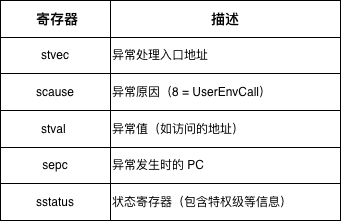
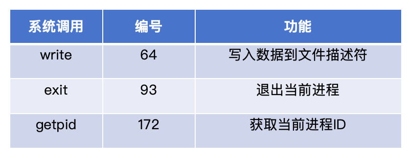

## 5.2 系统调用的工作原理（理论）

### 5.2.1 异常处理机制

**异常**（Exception）是 CPU 在执行指令时遇到的特殊情况，需要内核介入处理。

**RISC-V 的关键控制寄存器**：



**异常类型（scause 寄存器）**：
```rust
scause = 0  // 指令地址未对齐
scause = 1  // 指令访问错误
scause = 2  // 非法指令
...
scause = 8  // 来自 U-Mode 的 ecall（系统调用）
scause = 9  // 来自 S-Mode 的 ecall
...
scause = 13 // 加载页错误
scause = 15 // 存储页错误
```

**系统调用对应的异常**：
- `ecall` 指令触发 `Exception::UserEnvCall`
- `scause` 寄存器值为 8（U-Mode）

### 5.2.2 系统调用号

每个系统调用都有一个唯一的编号，内核通过这个编号来识别用户程序想要调用的服务。

**本章实现的系统调用**：



**系统调用号的来源**：这些编号遵循 **Linux 系统调用约定**（针对 RISC-V 架构）。

### 5.2.3 参数传递机制

**寄存器传参**：
- RISC-V 通过 **a0-a5 寄存器**传递最多 6 个参数
- 如果参数超过 6 个，需要通过栈传递（本章不涉及）

**sys_write 的参数示例**：
```rust
syscall_id = 64     // a7：系统调用号
fd = 1              // a0：文件描述符（1 = stdout）
buf = 0x80200000    // a1：缓冲区地址
len = 13            // a2：数据长度
```

**对应汇编**：
```assembly
li a7, 64           # 设置系统调用号
li a0, 1            # fd = 1
la a1, message      # buf = message 地址
li a2, 13           # len = 13
ecall               # 触发系统调用
```

### 5.2.4 返回值机制

**返回值约定**：
- 系统调用的返回值通过 **a0 寄存器**返回
- 成功时返回非负数（如写入的字节数）
- 失败时返回负数（错误码）

**常见错误码**：
```rust
-1  // EPERM (操作不允许)
-2  // ENOENT (文件不存在)
-9  // EBADF (错误的文件描述符)
-14 // EFAULT (错误的地址)
-38 // ENOSYS (系统调用不存在)
```

**示例**：
```rust
// sys_write 成功
返回值 = 13  // 写入了 13 字节

// sys_write 失败
返回值 = -9  // EBADF，文件描述符无效
```

### 5.2.5 指令跳过

**重要细节**：系统调用返回时需要**跳过 ecall 指令**。

**为什么？**
- `sepc` 寄存器保存的是 `ecall` 指令的地址
- 如果直接返回，会再次执行 `ecall`，陷入死循环

**解决方法**：
```rust
// ecall 是 4 字节指令
sepc = sepc + 4;
```

**执行流程**：
```
地址         指令           说明
0x80000100   li a7, 64     # 设置系统调用号
0x80000104   ecall         # 触发系统调用，sepc = 0x80000104
             [进入内核]
             [执行系统调用]
             sepc += 4     # sepc = 0x80000108
             [返回用户态]
0x80000108   mv s0, a0     # 从这里继续执行
```
