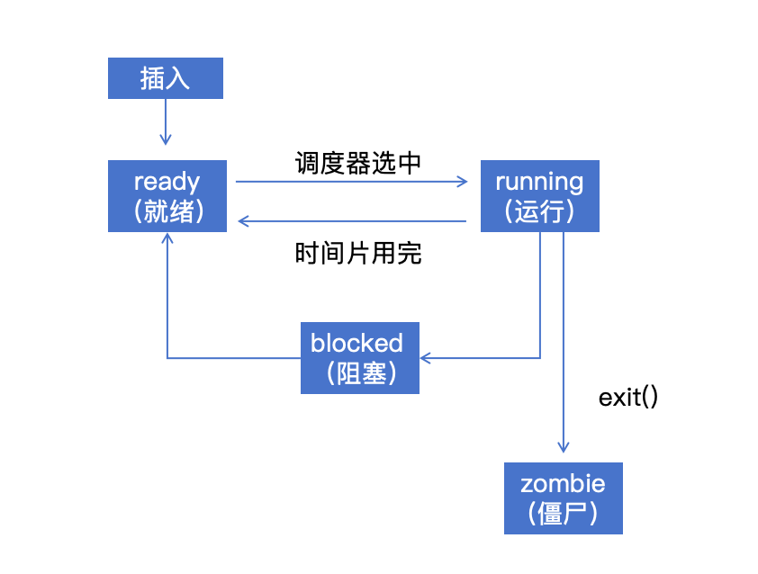

# 6.1.1 进程概念与PCB模块设计

## 本节目标

- 理解进程的基本概念
- 了解进程控制块（PCB）的作用
- 设计符合ERROR OS的PCB结构框架

---

## 什么是进程？

​	在理论课学习进程这一章节的过程中，我们引入了“进程实体”这一概念，由此我们可以将进程这一概念定义为：“进程是进程实体的运行过程，是系统进行资源分配和调度的基本单位”

**进程（Process）** = 程序（Program）+ 执行状态

### 类比：图书馆借书

| 概念 | 图书馆类比 | 操作系统 |
|------|-----------|---------|
| 程序 | 书架上的书 | 存储在磁盘上的可执行文件 |
| 进程 | 你正在阅读的书 | 正在执行的程序实例 |
| 进程状态 | 阅读进度书签 | 寄存器、内存、PC指针 |

**关键区别**：
- 一本书（程序）可以被多人同时阅读（多个进程）
- 每个人有自己的书签（各自的执行状态）

---

## 进程的四种状态


```
创建
```



### 状态说明

1. **Ready（就绪）**
   - 进程已准备好运行，只须等待cpu分配
   - 在就绪队列中等待CPU

2. **Running（运行）**
   - 进程正在CPU上执行
   - 同一时刻，一个CPU核心只有一个进程Running

3. **Blocked（阻塞）**
   - 进程等待某个事件（如I/O完成）
   - 即使有空闲CPU也不会被调度

4. **Zombie（僵尸）**
   - 进程已执行完毕
   - PCB仍保留，存储退出码
   - 等待父进程回收

---

## 进程控制块（PCB）

### 什么是PCB？

**进程控制块（Process Control Block）** 是操作系统管理进程的核心数据结构。

用一个容易理解的比喻来解释的话，PCB就像学生的档案袋，里面包含学号、成绩单、家长信息等。

### PCB需要存储什么？

#### 1. 身份信息
- PID：进程唯一标识符
- 名称：进程名称

#### 2. 状态信息
- 进程状态：Ready/Running/Blocked/Zombie
- 退出码：进程退出时的返回值

#### 3. 关系信息
- 父进程PID：谁创建了这个进程
- 子进程列表：这个进程创建了哪些子进程

#### 4. 执行上下文
- 寄存器状态：32个通用寄存器 + CSR寄存器
- 程序计数器PC：下一条要执行的指令地址

#### 5. 内存管理
- 地址空间：虚拟内存页表
- 堆指针、栈指针

#### 6. 调度信息
- 时间片：还剩多少时间片
- 优先级：进程调度优先级

---

## PCB结构设计为代码

为了梳理接下来的代码编写流程，我们先来浏览PCB模块的大致设计流程

```rust
pub struct ProcessControlBlock {
    // 身份信息
    pid: ProcessId,              // 将在6.1.2实现
    name: &'static str,

    // 状态信息
    state: ProcessState,         // 将在6.1.3实现
    exit_code: Option<i32>,

    // 关系信息
    parent_pid: Option<ProcessId>,
    children: Vec<ProcessId>,

    // 执行上下文
    context: ProcessContext,     // 将在6.1.4实现

    // 内存管理
    address_space: Option<AddressSpace>,
    heap_bottom: usize,
    heap_top: usize,

    // 调度信息
    time_slice: usize,
    priority: usize,
}
```

**注意**：这只是设计草图，具体实现会在后续小节逐步完成。

---

## 为什么用Option？

```rust
parent_pid: Option<ProcessId>        // init进程没有父进程
exit_code: Option<i32>                // 运行中的进程还没有退出码
address_space: Option<AddressSpace>  // 内核线程可能没有地址空间
```

---

## 为什么用Arc<Mutex<>>？

最终我们会用这样的类型：

```rust
pub type ProcessHandle = Arc<Mutex<ProcessControlBlock>>;
```

**原因**：

- **Arc**：多个地方可能持有同一个进程的引用
- **Mutex**：多个CPU核心可能同时访问同一个PCB

---

## 知识点总结

| 概念 | 定义 |
|------|------|
| 进程 | 程序的一次执行实例 |
| PCB | 操作系统管理进程的数据结构 |
| 进程状态 | Ready/Running/Blocked/Zombie |

---

## 下一步

- 6.1.2 - 实现PID分配器
