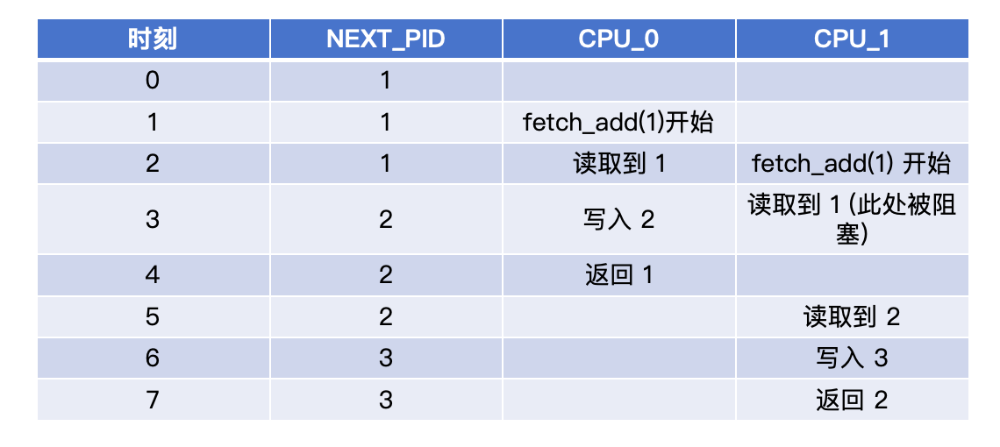

# 6.1.2 PID分配器实现

## 本节新增文件

```
os/src/process/
├── mod.rs          # 进程管理模块入口（新建）
└── pid.rs          # PID分配器实现（新建）
```

---

## 为什么需要PID分配器？

在单进程时代，操作系统只运行一个程序，无需区分 “哪个进程”—— 所有资源、状态都归这一个程序所有，也就无需对进程进行复杂的标记。但多任务操作系统出现后，立刻面临一个问题：**同一程序可启动多个进程，而操作系统无法区分它们**。

比如你同时打开两个终端（两个 shell 进程），这两个进程都源于同一个 shell 程序，共享代码段，但各自有独立的内存、输入输出、执行进度。此时操作系统要调度进程、回收资源，或父进程要管理子进程时，操作系统就会陷入困境：“我要操作的是哪个 shell 进程？”

为解决这个 “区分与定位” 的痛点，**唯一的标识符**（Process ID，简称PID）应运而生。它给每个进程分配一个全局唯一的数字编号，作为进程的 “专属身份证”。

PID必须满足以下要求：
-  **唯一性**：不同进程的PID不能相同
-  **单调性**：新进程的PID应该递增（方便调试）
-  **线程安全**：多个CPU核心同时创建进程时不能冲突

---

## 步骤1：创建进程管理模块

首先创建进程管理模块的目录结构。

### 1.1 创建 `os/src/process/mod.rs`

```rust
//! 进程管理模块
//!
//! 提供进程的创建、调度、销毁等核心功能

pub mod pid;

// 重新导出常用类型
pub use pid::ProcessId;
```

### 1.2 在 `os/src/lib.rs` 中注册模块

找到模块声明部分，添加：

```rust
pub mod process;
```

现在可以通过 `os::process::ProcessId` 访问PID类型。

---

## 步骤2：设计ProcessId类型

### 2.1 定义ProcessId

```rust
pub struct ProcessId(usize);
```

我们可以看到ProcessId只是一个usize类型数据，那你们是否有疑问，为什么不直接使用 `usize` 作为PID，而是用一个新类型包装它？

这是源于操作系统对数据安全的要求，使用NewType类型有以下优点：

- **类型安全**：不会把普通整数误当作PID
- **语义清晰**：看到 `ProcessId` 就知道是进程ID
- **易于扩展**：将来可以添加验证逻辑

我们再用一个例子来说明两种声明方式的区别

**错误示例**（没有Newtype）：

```rust
let age: usize = 25;
let pid: usize = 1;
if age == pid { ... }  // 编译通过，但语义错误！
```

**正确示例**（使用Newtype）：
```rust
let age: usize = 25;
let pid: ProcessId = ProcessId(1);
if age == pid { ... }  // 编译错误！类型不匹配
```

### 2.2 创建 `os/src/process/pid.rs`

先写类型定义和基础方法：

```rust
//! PID（进程标识符）分配器

use core::sync::atomic::{AtomicUsize, Ordering};
use core::fmt;

/// 进程ID的类型安全包装
#[derive(Debug, Clone, Copy, PartialEq, Eq, PartialOrd, Ord)]
pub struct ProcessId(usize);
```

**代码说明**：
- `AtomicUsize` - 原子类型，保证线程安全
- `Ordering` - 内存顺序，控制原子操作的同步语义
- `derive` 宏自动实现常用trait：
  - `Debug` - 可以用 `{:?}` 打印，便于观察调
  - `Clone, Copy` - 可以按值复制（PID很小，复制成本低）
  - `PartialEq, Eq` - 可以用 `==` 比较
  - `PartialOrd, Ord` - 可以用 `<` 比较

---

## 步骤3：实现PID分配逻辑

### 3.1 核心：原子递增计数器

**设计思路**：
1. 用一个全局静态变量存储"下一个可用的PID"
2. 每次分配时，原子地递增这个变量
3. 从1开始分配（PID 0通常保留给内核）

### 3.2 实现 `new()` 方法

在 `pid.rs` 中添加：

```rust
impl ProcessId {
    /// 分配一个新的PID
    pub fn new() -> Self {
        static NEXT_PID: AtomicUsize = AtomicUsize::new(1);

        let pid = NEXT_PID.fetch_add(1, Ordering::Relaxed);
        ProcessId(pid)
    }
}
```

**关键点解析**：

1. **`static NEXT_PID`** - 全局静态变量，整个程序只有一份
2. **`AtomicUsize::new(1)`** - 初始值为1，第一个进程从PID 1开始
3. **`fetch_add(1, Ordering::Relaxed)`** - 原子操作，分两步：
   - **fetch**：读取当前值
   - **add**：把当前值加1
   - **返回**：加之前的旧值
4. **`Ordering::Relaxed`** - 最宽松的内存顺序，性能最好

**为什么是Relaxed？**

PID分配不需要严格的内存顺序约束，只要保证原子性即可：
-  不需要 `SeqCst`（顺序一致性）- PID分配不影响其他数据
-  不需要 `Acquire/Release` - 没有依赖其他内存操作
-  只需要 `Relaxed` - 保证原子递增即可

### 3.3 原子操作示例

````
假设有两个CPU核心同时调用 ProcessId::new()：
````



**结果**：CPU 0 得到 PID 1，CPU 1 得到 PID 2，没有冲突！

---

## 步骤 4：添加辅助方法

### 4.1 转换方法

```rust
impl ProcessId {
    /// 获取PID的数值
    pub fn as_usize(self) -> usize {
        self.0
    }

    /// 从数值创建PID（用于反序列化等场景）
    pub const fn from_usize(pid: usize) -> usize {
        ProcessId(pid)
    }
}
```

我们把 `ProcessId` 设计成封装结构体，而不是直接用 `usize`，核心是为了**类型安全**—— 防止你把一个普通的数字（比如内存地址）误传成 PID 参数。

但实际开发中，绕不开 “PID 类型” 和 “底层数值” 的转换：

- 用 `as_usize()`：往 PCB 里存 PID、用 PID 当索引查进程列表时，都需要拿到它的数值；
- 用 `from_usize()`：PID 分配器生成了新的数字编号、或者从磁盘读回保存的 PID 数值时，需要把它包装成 `ProcessId` 类型，才能和其他代码兼容。

这两个方法就是给类型 “搭个桥”，既保住封装的好处，又不耽误实际使用。

### 4.2 特殊 PID 判断

```rust
impl ProcessId {
    /// 判断是否是init进程（PID 1）
    pub fn is_init(self) -> bool {
        self.0 == 1
    }
}
```

#### 为什么 PID 1 特殊？

在类 Unix 系统（包括我们的 ERROR OS）里，PID 1 是 `init` 进程，是所有进程的 “老祖宗”：

- 系统启动后第一个被创建，后面所有进程都是它的子孙；
- 哪个进程的父进程意外死掉，它就会被 `init` 收养，避免变成没人管的 “孤儿”；
- 系统关机时，它负责收尾 —— 挨个终止所有子进程，最后自己才退出。

#### 为什么要写`is_init()`方法？

后续代码里会频繁判断 “这个进程是不是 init”，比如：

- 不能让调度器把 init 进程杀掉；
- 处理孤儿进程时，要把它的父 PID 改成 1。

如果每次都写 `pid.0 == 1`，会导致代码观感混乱，万一以后想把 init 的 PID 改成别的值进行调试，就得把所有硬编码的地方全改一遍。封装成 `is_init()` 方法，提升可读性的同时方便维护。

### 4.3 格式化输出

```rust
impl fmt::Display for ProcessId {
    fn fmt(&self, f: &mut fmt::Formatter) -> fmt::Result {
        write!(f, "{}", self.0)
    }
}
```

Rust 里的自定义结构体，默认是不能直接用 `println!` 打印的，会直接报编译错。

而 PID 是调试时经常要输出的信息 —— 比如 “当前运行的进程 PID 是 5”“PID 3 已退出”。

实现 `fmt::Display` 这个 trait 后，就不用每次都写 `pid.as_usize()` 了，直接 `println!("PID: {}", pid)` 就行，写代码和看日志都更清爽。

---

## 步骤5：实现代码

### [任务] 任务点1-6: PID分配器实现 (总分: 17分)

**文件位置**: `os/src/process/pid.rs`

#### 任务点清单

| ID | 任务描述 | 分值 | 实现方式 | 难度 |
|----|---------|------|---------|------|
| 1 | 定义ProcessId结构体 | 3分 | [已提供] 已提供框架 | - |
| 2 | 初始化NEXT_PID为1 | 3分 | [TODO] **需自行实现** | * |
| 3 | 实现new()方法 | 5分 | [TODO] **需自行实现** | ** |
| 4 | 实现as_usize()方法 | 2分 | [TODO] **需自行实现** | * |
| 5 | 实现is_init()方法 | 2分 | [TODO] **需自行实现** | * |
| 6 | 实现Display trait | 2分 | [TODO] **需自行实现** | * |

#### 实现要求

**[!] 重要说明**: 以下任务点需要**自行思考并实现**,不能直接复制粘贴答案!

请在 `os/src/process/pid.rs` 中完成以下实现:

##### **任务点1: ProcessId结构体定义** (已提供框架)

- [已提供] 结构体定义已完整提供
- [已提供] derive宏已配置
- **无需修改此部分**

##### **任务点2-3: PID分配逻辑** [TODO] **需自行实现**

**思考题**:
1. 如何保证多个CPU核心同时分配PID时不会产生冲突?
2. 为什么第一个PID要从1开始而不是0?
3. `fetch_add`操作返回的是什么值?

**实现要点**:
- [!] 必须使用`AtomicUsize`实现线程安全
- [!] 第一个PID必须从1开始
- [!] 必须使用`fetch_add`原子操作
- [!] 返回值类型必须是`ProcessId`

**代码位置**: `new()` 方法中的TODO部分

##### **任务点4: as_usize()方法** [TODO] **需自行实现**

**思考题**:
1. `ProcessId`内部存储的数据是什么?
2. 如何访问newtype包装的内部值?

**实现要点**:
- [!] 返回`ProcessId`内部的`usize`值
- [!] 只需一行代码

**代码位置**: `as_usize()` 方法体

##### **任务点5: is_init()方法** [TODO] **需自行实现**

**思考题**:
1. init进程的PID是多少?
2. 如何判断一个PID是否等于1?

**实现要点**:
- [!] 判断内部值是否等于1
- [!] 返回布尔值
- [!] 只需一行代码

**代码位置**: `is_init()` 方法体

##### **任务点6: Display trait** [TODO] **需自行实现**

**思考题**:
1. 如何格式化输出一个数字?
2. `write!`宏的用法是什么?

**实现要点**:
- [!] 使用`write!`宏格式化输出
- [!] 输出内部的数值
- [!] 只需一行代码

**代码位置**: `Display` trait的`fmt`方法体

---

#### [代码框架] 代码框架(已在`pid.rs`中提供)

```rust
// 任务点1: 结构体定义（[已提供] 已完整提供，无需修改）
#[derive(Debug, Clone, Copy, PartialEq, Eq, PartialOrd, Ord)]
pub struct ProcessId(usize);

impl ProcessId {
    // 任务点2-3: PID分配（[TODO] 需自行实现，2-3行代码）
    pub fn new() -> Self {
        // TODO: Task 2-3 - PID allocation (8 points)
        // Hint 1: Use AtomicUsize::new(1) to initialize static variable
        // Hint 2: Use fetch_add(1, Ordering::Relaxed) to get and increment
        todo!("Implement PID allocation")
    }

    // 任务点4: 获取数值（[TODO] 需自行实现，1行代码）
    pub fn as_usize(self) -> usize {
        // TODO: Task 4 - Return internal value (2 points)
        // Hint: self.0
        todo!("Return PID value")
    }

    // from_usize方法已提供，无需修改
    pub const fn from_usize(pid: usize) -> Self {
        ProcessId(pid)
    }

    // 任务点5: 判断init进程（[TODO] 需自行实现，1行代码）
    pub fn is_init(self) -> bool {
        // TODO: Task 5 - Check if this is init process (2 points)
        // Hint: self.0 == 1
        todo!("Check if init process")
    }
}

// 任务点6: Display格式化（[TODO] 需自行实现，1行代码）
impl fmt::Display for ProcessId {
    fn fmt(&self, f: &mut fmt::Formatter) -> fmt::Result {
        // TODO: Task 6 - Format output (2 points)
        // Hint: write!(f, "{}", self.0)
        todo!("Implement Display formatting")
    }
}
```

#### 验证方法

**编译验证**:
```bash
cd os
cargo build
```

**运行判题**:
```bash
cargo run --release
# 系统会自动运行判题系统，显示任务点完成情况
```

**手动测试**:
```rust
let pid1 = ProcessId::new();
let pid2 = ProcessId::new();
println!("pid1 = {}, pid2 = {}", pid1, pid2);
// 预期输出: pid1 = 1, pid2 = 2
```

#### Expected Output

If implemented correctly, the grading system will display:
```
========================================
   Chapter 6 Process Management - Grading Report
========================================

[PASS] Task 1: ProcessId struct definition (3 points)
    + Struct definition correct
[PASS] Task 2: NEXT_PID initialization (3 points)
    + First PID is 1
[PASS] Task 3: new() method (5 points)
    + PID monotonically increasing: 1, 2, 3
[PASS] Task 4: as_usize() method (2 points)
    + Returns usize value correctly
[PASS] Task 5: is_init() method (2 points)
    + Correctly identifies init process
[PASS] Task 6: Display trait (2 points)
    + Output format correct: 1

========================================
Completed: 6/6 tasks
Score: 17/17
========================================
```

#### 常见错误

| 错误现象 | 可能原因 | 解决方法 |
|---------|---------|---------|
| 编译错误: "cannot find type ProcessId" | 结构体未定义 | 检查结构体定义语法 |
| PID不是从1开始 | NEXT_PID初始化错误 | 确保new(1)而不是new(0) |
| PID不唯一 | 未使用原子操作 | 使用fetch_add而不是普通加法 |
| Display输出格式错误 | 格式化字符串错误 | 检查write!宏的格式 |

---

## 步骤6：测试PID分配器

### 6.1 验证基本功能

在 `os/src/main.rs` 的 `kernel_main()` 中添加测试代码（临时）：

```rust
// 临时测试代码
use os::process::ProcessId;

println!("测试PID分配器...");
let pid1 = ProcessId::new();
let pid2 = ProcessId::new();
let pid3 = ProcessId::new();

println!("pid1 = {}", pid1);  // 输出：pid1 = 1
println!("pid2 = {}", pid2);  // 输出：pid2 = 2
println!("pid3 = {}", pid3);  // 输出：pid3 = 3

assert!(pid1.is_init());      // ✓ 第一个进程是init
assert!(pid2 > pid1);         // ✓ PID单调递增
assert_ne!(pid1, pid2);       // ✓ PID唯一
```

### 6.2 运行验证

```bash
cd os
cargo run
```

如果看到：
```
测试PID分配器...
pid1 = 1
pid2 = 2
pid3 = 3
```

说明PID分配器工作正常！测试完成后可以删除这段临时代码或注释隐藏。

---

## 知识点总结

### 核心概念

| 概念 | 说明 | 作用 |
|------|------|------|
| **Newtype模式** | 用新类型包装已有类型 | 类型安全、语义清晰 |
| **原子类型** | `AtomicUsize` | 线程安全的整数 |
| **原子操作** | `fetch_add` | 不可分割的"读-改-写" |
| **内存顺序** | `Ordering::Relaxed` | 控制原子操作的同步语义 |

### 设计决策

| 决策 | 原因 |
|------|------|
| 为什么用Newtype？ | 防止把普通整数误当作PID |
| 为什么用AtomicUsize？ | 多核CPU可能同时分配PID |
| 为什么从1开始？ | PID 0通常保留给内核，PID 1给init进程 |
| 为什么用Relaxed？ | PID分配不需要严格的内存顺序 |

### 常见问题

**Q1: PID会用完吗？**

`usize` 在64位系统上最大是 2^64，对目前的常见操作系统足够用。如果真的用完了，可以实现PID回收机制（后续章节）。

**Q2: 为什么不用Mutex而用Atomic？**

- `Mutex` 需要等待、加锁、解锁，开销大
- `AtomicUsize` 直接在CPU指令级别保证原子性，性能高

**Q3: 如果两个CPU同时读到同一个值怎么办？**

不会！`fetch_add` 是原子操作，CPU硬件保证不会冲突。

---

## 下一步

现在我们有了PID分配器，下一节将实现**进程状态枚举**，定义进程的生命周期状态。

---

## 练习题

1. **修改起始PID**：把第一个PID改为100，观察变化
2. **添加最大值检查**：如果PID超过1000就panic
3. **实现PID回收**：进程退出后，把PID放回空闲列表
