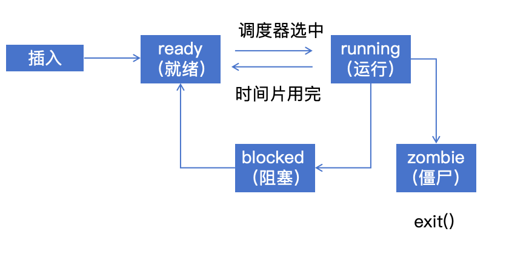

# 6.1.3 进程状态枚举

## 本节新增文件

```
os/src/process/
├── mod.rs          # 进程管理模块入口（已存在）
├── pid.rs          # PID分配器（已完成）
└── pcb.rs          # 进程控制块和状态枚举（新建）
```

---

## 回顾：进程的生命周期

在 6.1.1 节，我们了解到进程有**4种状态**：



现在我们要用 Rust 代码来精确地表示这些状态。

---

## 步骤1：创建pcb.rs文件

### 1.1 创建文件

```bash
touch os/src/process/pcb.rs
```

### 1.2 在 `os/src/process/mod.rs` 中注册

```rust
//! 进程管理模块

pub mod pid;
pub mod pcb;     // ← 新增这一行

// 重新导出常用类型
pub use pid::ProcessId;
pub use pcb::ProcessState;  // ← 新增这一行
```

---

## 步骤2：定义ProcessState枚举

### 2.1 基本定义

在 `os/src/process/pcb.rs` 中创建：

```rust
/// 进程状态枚举
#[derive(Debug, Clone, Copy, PartialEq, Eq)]
pub enum ProcessState {
    /// 就绪态：在就绪队列中等待调度
    Ready,

    /// 运行态：正在CPU上执行
    Running,

    /// 阻塞态：等待I/O或其他事件
    Blocked,

    /// 僵尸态：已退出但PCB未被回收
    Zombie,
}
```

### 2.2 为什么用枚举而不是整数？

对比两种方式：

**方式1：用整数常量（C语言风格）**

```rust
const STATE_READY: u8 = 0;
const STATE_RUNNING: u8 = 1;
const STATE_BLOCKED: u8 = 2;
const STATE_ZOMBIE: u8 = 3;

fn set_state(state: u8) {
    // 问题：state可以是任意值！
    // 如：set_state(255) 编译通过，但语义错误
}
```

**方式2：用枚举（Rust风格）**

```rust
fn set_state(state: ProcessState) {
    // 编译器保证state只能是这4种之一
}

// set_state(255);  // 编译错误！
```

**枚举的好处**：

| 优势 | 说明 |
|------|------|
| **类型安全** | 编译器确保只能使用定义的状态 |
| **完整性检查** | `match` 语句必须处理所有状态 |
| **可读性** | `ProcessState::Ready` 比 `0` 清楚 |
| **无效值防护** | 不会出现 `state = 255` 这种错误 |

---

## 步骤3：理解派生trait

```rust
#[derive(Debug, Clone, Copy, PartialEq, Eq)]
```

每个trait的作用：

### 3.1 Debug - 调试输出

```rust
let state = ProcessState::Ready;
println!("{:?}", state);  // 输出：Ready
```

### 3.2 Clone - 显式复制

```rust
let state1 = ProcessState::Ready;
let state2 = state1.clone();  // 显式复制
```

### 3.3 Copy - 自动复制

```rust
let state1 = ProcessState::Ready;
let state2 = state1;  // 自动复制，state1仍然有效

// 对比：如果没有Copy
let vec1 = vec![1, 2, 3];
let vec2 = vec1;  // vec1被移动，不再有效
```

**为什么ProcessState可以Copy？**

因为它只是一个简单的枚举值（没有堆分配），复制成本极低。

### 3.4 PartialEq & Eq - 比较相等

```rust
let state1 = ProcessState::Ready;
let state2 = ProcessState::Running;

if state1 == state2 {  // 使用PartialEq
    println!("状态相同");
}
```

**PartialEq vs Eq**：
- `PartialEq` - 部分相等（如浮点数：`NaN != NaN`）
- `Eq` - 完全相等（进程状态总是可以比较的）

---

## 步骤4：添加状态转换方法

### 4.1 判断是否可以转换

添加一个方法，检查状态转换是否合法：

```rust
impl ProcessState {
    /// 检查是否可以转换到目标状态
    pub fn can_transition_to(self, target: ProcessState) -> bool {
        use ProcessState::*;

        match (self, target) {
            // Ready可以转换到Running
            (Ready, Running) => true,

            // Running可以转换到Ready、Blocked、Zombie
            (Running, Ready) => true,
            (Running, Blocked) => true,
            (Running, Zombie) => true,

            // Blocked可以转换回Ready
            (Blocked, Ready) => true,

            // Zombie是终态，不能转换
            (Zombie, _) => false,

            // 其他转换都非法
            _ => false,
        }
    }
}
```

**为什么需要这个方法？**

防止错误的状态转换，如：
- Ready → Zombie（没经过Running就退出？）
- Zombie → Running（僵尸进程复活？）

### 4.2 获取状态描述

```rust
impl ProcessState {
    /// 获取状态的中文描述
    pub fn description(self) -> &'static str {
        match self {
            ProcessState::Ready => "就绪",
            ProcessState::Running => "运行",
            ProcessState::Blocked => "阻塞",
            ProcessState::Zombie => "僵尸",
        }
    }
}
```

---

## 步骤5：实现Display trait

为了方便打印，实现 `Display` trait：

```rust
use core::fmt;

impl fmt::Display for ProcessState {
    fn fmt(&self, f: &mut fmt::Formatter) -> fmt::Result {
        let s = match self {
            ProcessState::Ready => "Ready",
            ProcessState::Running => "Running",
            ProcessState::Blocked => "Blocked",
            ProcessState::Zombie => "Zombie",
        };
        write!(f, "{}", s)
    }
}
```

现在可以直接用 `{}` 打印：

```rust
let state = ProcessState::Running;
println!("当前状态：{}", state);  // 输出：当前状态：Running
```

---

## 步骤6：实现代码

### 任务点7-10: 进程状态枚举实现 (总分: 13分)

**文件位置**: `os/src/process/pcb.rs`

#### 任务点清单

| ID | 任务描述 |   检查方法 |
|----|:-------:|:-------:|
| 7 | ProcessState枚举定义 |枚举变体检查 |
| 8 | can_schedule()方法 | Ready/Running判断 |
| 9 | can_transition_to()方法 |   状态转换规则验证 |
| 10 | Display trait |   输出格式检查 |

#### 实现要求

请在 `os/src/process/pcb.rs` 中完成以下实现:

1. **ProcessState枚举定义** (任务点7)
   - 定义4种状态: Ready, Running, Blocked, Zombie
   - 添加必要的derive宏: Debug, Clone, Copy, PartialEq, Eq
   - 为每个状态添加文档注释

2. **can_schedule()方法** (任务点8)
   - 判断进程是否可以被调度
   - Ready状态返回true
   - Running状态返回true (时间片轮转)
   - Blocked和Zombie返回false

3. **can_transition_to()方法** (任务点9)
   - 实现状态转换规则检查
   - 合法转换:
     - Ready → Running (被调度)
     - Running → Ready (时间片用完)
     - Running → Blocked (等待I/O)
     - Running → Zombie (进程退出)
     - Blocked → Ready (I/O完成)
   - 非法转换返回false

4. **Display trait** (任务点10)
   - 实现fmt::Display
   - 输出格式: "Ready", "Running", "Blocked", "Zombie"

**提示代码**:
```rust
// 枚举定义
#[derive(Debug, Clone, Copy, PartialEq, Eq)]
pub enum ProcessState {
    /// 就绪态：在就绪队列中等待调度
    Ready,
    /// 运行态：正在CPU上执行
    Running,
    /// 阻塞态：等待I/O或其他事件
    Blocked,
    /// 僵尸态：已退出但PCB未被回收
    Zombie,
}

// 状态转换检查
impl ProcessState {
    pub fn can_transition_to(self, target: ProcessState) -> bool {
        use ProcessState::*;
        match (self, target) {
            (Ready, Running) => true,
            (Running, Ready) => true,
            (Running, Blocked) => true,
            (Running, Zombie) => true,
            (Blocked, Ready) => true,
            (Zombie, _) => false,
            _ => false,
        }
    }
}
```

#### 验证方法

**编译验证**:
```bash
cd os
cargo build
```

**运行判题**:
```bash
cargo run --release
# 系统会自动运行判题系统，显示任务点完成情况
```

**手动测试**:
```rust
let state = ProcessState::Ready;
println!("当前状态: {}", state);  // 预期输出: Ready
assert!(state.can_transition_to(ProcessState::Running));
assert!(!state.can_transition_to(ProcessState::Zombie));
```

#### 预期输出

如果实现正确，判题系统会显示:
```
========================================
     Chapter 6 Grading Report
========================================

[PASS] Task 7: ProcessState enum definition (3分)
[PASS] Task 8: can_schedule() method (3分)
[PASS] Task 9: can_transition_to() method (5分)
[PASS] Task 10: Display trait (2分)
========================================
Process State Score: 13/13
```

#### 常见错误

| 错误现象 | 可能原因 | 解决方法 |
|---------|---------|---------|
| 编译错误: "cannot find type ProcessState" | 枚举未定义 | 检查枚举定义语法 |
| 状态转换测试失败 | 转换规则错误 | 检查match模式匹配 |
| Ready不能转Zombie失败 | 缺少非法转换判断 | 添加默认分支 _ => false |
| Display输出格式错误 | 字符串大小写错误 | 确保首字母大写 |

---

## 步骤7：测试状态枚举

### 7.1 基本使用测试

在 `os/src/main.rs` 中添加测试代码（临时）：

```rust
use os::process::ProcessState;

println!("\n测试进程状态枚举...");

// 创建状态
let state = ProcessState::Ready;
println!("初始状态：{}", state);
println!("中文描述：{}", state.description());

// 测试状态转换
assert!(state.can_transition_to(ProcessState::Running));
println!("✓ Ready可以转换到Running");

assert!(!state.can_transition_to(ProcessState::Zombie));
println!("✓ Ready不能直接转换到Zombie");
```

### 7.2 模式匹配测试

```rust
fn handle_state(state: ProcessState) {
    match state {
        ProcessState::Ready => {
            println!("进程就绪，等待调度");
        }
        ProcessState::Running => {
            println!("进程正在运行");
        }
        ProcessState::Blocked => {
            println!("进程被阻塞");
        }
        ProcessState::Zombie => {
            println!("进程已退出");
        }
    }
}

handle_state(ProcessState::Ready);
handle_state(ProcessState::Running);
```

### 7.3 运行验证

```bash
cd os
cargo run
```

---

## 状态转换规则详解

### 合法的转换路径

```
[1] 进程创建
    系统创建PCB → Ready

[2] 进程被调度
    Ready → Running

[3] 时间片用完
    Running → Ready

[4] 等待I/O
    Running → Blocked

[5] I/O完成
    Blocked → Ready

[6] 进程退出
    Running → Zombie

[7] 父进程回收
    Zombie → （PCB被销毁）
```

### 非法的转换（会被`can_transition_to`拒绝）

| 转换 | 为什么非法 |
|------|-----------|
| Ready → Blocked | 还没运行怎么阻塞？ |
| Ready → Zombie | 还没运行就退出？ |
| Blocked → Running | 必须先回到Ready队列 |
| Zombie → 任何状态 | 僵尸进程不能复活 |

---

## 知识点总结

### 设计决策

| 决策 | 理由 |
|------|------|
| 用枚举不用整数 | 类型安全，防止无效状态 |
| 4种状态 | 足够描述进程生命周期 |
| 添加`can_transition_to` | 防止非法状态转换 |
| 实现Display | 方便调试和日志输出 |

### 核心概念

1. **Ready**：进程准备好了，等CPU空闲
2. **Running**：进程正在CPU上执行
3. **Blocked**：进程等待某个事件（如I/O）
4. **Zombie**：进程退出了，但PCB还在（保存退出码）

### 常见问题

**Q1: 为什么需要Zombie状态？**

父进程需要知道子进程的退出码（exit code）。如果直接删除PCB，父进程就拿不到这个信息了。

**Q2: Blocked状态什么时候用？**

典型场景：
- 等待磁盘读写完成
- 等待网络数据到达
- 等待用户输入（如`read()`系统调用）

**Q3: 为什么Running不能直接转到Zombie？**

可以！进程调用`exit()`时就是：Running → Zombie。`can_transition_to`是允许这个转换的。

---

## 下一步

我们已经有了：
- PID分配器（6.1.2）
- 进程状态枚举（6.1.3）

下一节（6.1.4）将实现完整的**进程控制块（PCB）结构**，把这些组件整合起来。

---

## 练习题

### 练习1：添加新状态

尝试添加一个 `Suspended`（挂起）状态，表示进程被暂时挂起到磁盘。

<details>
<summary>提示</summary>

1. 在枚举中添加 `Suspended` 变体
2. 更新 `can_transition_to` 方法
3. 更新 `Display` 和 `description`

</details>

### 练习2：状态转换日志

实现一个函数，记录每次状态转换：

```rust
fn log_transition(from: ProcessState, to: ProcessState) {
    println!("[状态转换] {} → {}", from, to);
}
```

### 练习3：状态机验证

实现一个模拟器，验证状态转换的正确性：

<details>
<summary>提示</summary>

```rust
struct ProcessSimulator {
    state: ProcessState,
}

impl ProcessSimulator {
    fn transition(&mut self, target: ProcessState) -> Result<(), &'static str> {
        if self.state.can_transition_to(target) {
            self.state = target;
            Ok(())
        } else {
            Err("非法状态转换")
        }
    }
}
```

</details>
