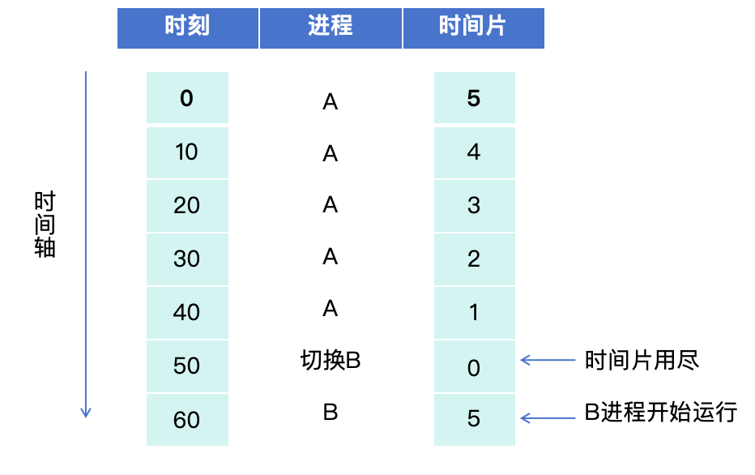

# 6.1.5 PCB完整实现

## 本节目标

- 理解PCB的完整结构设计
- 整合前面所有组件(PID、状态、上下文)
- 实现PCB的创建和管理方法
- 掌握Arc<Mutex<>>的使用模式

---

## 本节新增文件

```
os/src/process/
└── pcb.rs            # 完善:PCB完整实现
```

---

## 前置要求

- 已完成 6.1.2 节的 PID分配器
- 已完成 6.1.3 节的进程状态枚举
- 已完成 6.1.4 节的进程上下文

---

## 步骤1:理解PCB的作用

### 1.1 什么是PCB?

**PCB(Process Control Block,进程控制块)** 是操作系统用来管理进程的核心数据结构,相当于进程的"身份证+档案"。

**类比理解**:


### 1.2 为什么需要PCB?

操作系统同时管理数百个进程,必须记录每个进程的所有信息:

**典型场景**:

1. **进程切换时**:
   - 保存当前进程的CPU状态到PCB
   - 从下一个进程的PCB恢复CPU状态
   - PCB是切换的"备忘录"

2. **进程调度时**:
   - 根据PCB的状态决定谁能运行
   - 根据时间片决定何时切换
   - 根据优先级决定先后顺序

3. **进程管理时**:
   - 查询进程的父子关系
   - 获取进程的退出码
   - 统计进程的运行时间

**设计意图**:PCB集中管理进程的所有信息,让操作系统能高效地控制和调度进程。如果没有PCB,进程信息会分散各处,管理将非常混乱。

---

## 步骤2:设计PCB结构

### 2.1 PCB应该包含哪些信息?

根据进程管理的需求,我们将PCB的字段分为5大类:

**字段分类表**:

| 类别 | 字段 | 类型 | 用途 |
|------|------|------|------|
| **身份信息** | pid | ProcessId | 进程的全局唯一标识 |
| | name | &'static str | 进程名称(用于调试) |
| **状态信息** | state | ProcessState | 当前状态(Ready/Running/Blocked/Zombie) |
| | exit_code | Option<i32> | 退出码(进程结束时设置) |
| **关系信息** | parent_pid | Option<ProcessId> | 父进程ID |
| | children | Vec<ProcessId> | 子进程列表 |
| **执行上下文** | context | ProcessContext | CPU寄存器状态 |
| **调度信息** | time_slice | usize | 剩余时间片 |
| | priority | usize | 优先级(数字越大优先级越高) |

### 2.2 为什么这样分类?

**设计考虑**:

1. **为什么需要name字段?**
   - 调试时打印进程信息更直观
   - 用户空间程序通常有名称(如"bash"、"ls")
   - 内核日志更易读:`[PID 5: init] 状态切换`

2. **为什么exit_code用Option包装?**
   - 运行中的进程没有退出码,用`None`表示
   - 只有进程结束时才设置为`Some(code)`
   - 避免用魔数(如-1)表示"未退出"

3. **为什么需要children列表?**
   - 父进程需要知道有哪些子进程
   - 父进程退出时要处理孤儿进程
   - 实现waitpid系统调用时需要查询子进程

4. **为什么需要parent_pid?**
   - 子进程需要知道父进程是谁
   - 信号传递(如SIGCHLD)需要找到父进程
   - 进程树的构建和遍历

5. **为什么time_slice和priority都需要?**
   - `time_slice`:轮转调度的基础,控制每次运行多久
   - `priority`:优先级调度的基础,控制谁先运行
   - 两者配合可以实现复杂的调度算法

### 2.3 字段顺序的考虑

```rust
// 推荐顺序(按访问频率和逻辑分组):
pub struct ProcessControlBlock {
    // 1. 身份(最常访问)
    pid: ProcessId,
    name: &'static str,

    // 2. 状态(频繁检查)
    state: ProcessState,
    exit_code: Option<i32>,

    // 3. 关系(中等频率)
    parent_pid: Option<ProcessId>,
    children: Vec<ProcessId>,

    // 4. 上下文(切换时访问)
    context: ProcessContext,

    // 5. 调度(每次tick访问)
    time_slice: usize,
    priority: usize,
}
```

**为什么这样排序?**
- CPU缓存友好:常访问的字段放前面,提高缓存命中率
- 逻辑清晰:相关字段放一起,代码可读性更好
- 对齐优化:编译器可能优化内存布局

---

## 步骤3:实现PCB结构体

### 3.1 Task 15 - 定义PCB结构体(5分)

> **任务要求**:
>
> 在 `os/src/process/pcb.rs` 中定义完整的PCB结构体,包含所有必需字段。

**代码位置**:`os/src/process/pcb.rs`

**实现框架**:

```rust
//! Process Control Block (PCB)
//!
//! PCB是进程管理的核心数据结构,记录进程的所有信息

use super::pid::ProcessId;
use super::context::ProcessContext;
use alloc::vec::Vec;

/// 进程状态枚举(已在6.1.3定义,这里使用)
#[derive(Debug, Clone, Copy, PartialEq, Eq)]
pub enum ProcessState {
    Ready,
    Running,
    Blocked,
    Zombie,
}

// TODO: Task 15 - 定义PCB结构体 (5 points)
/// 进程控制块
///
/// 记录进程的完整信息,包括身份、状态、关系、上下文和调度信息
pub struct ProcessControlBlock {
    // 【步骤1】定义身份信息字段:
    // - pid: ProcessId类型,进程的唯一标识
    // - name: &'static str类型,进程名称(用于调试)
    // 提示:这两个字段最常访问,放在最前面

    // 【步骤2】定义状态信息字段:
    // - state: ProcessState类型,当前进程状态
    // - exit_code: Option<i32>类型,退出码(运行中为None,结束后为Some)
    // 提示:状态信息需要频繁检查

    // 【步骤3】定义关系信息字段:
    // - parent_pid: Option<ProcessId>类型,父进程ID(init进程为None)
    // - children: Vec<ProcessId>类型,子进程列表
    // 提示:用于构建进程树结构

    // 【步骤4】定义执行上下文字段:
    // - context: ProcessContext类型,保存CPU寄存器状态
    // 提示:进程切换时需要保存和恢复

    // 【步骤5】定义调度信息字段:
    // - time_slice: usize类型,剩余时间片(每tick递减)
    // - priority: usize类型,优先级(数字越大越优先)
    // 提示:用于调度器决策
}
```

**设计要点说明**:

1. **为什么所有字段都不是pub?**
   - 封装原则:外部通过方法访问,避免直接修改
   - 可以在setter中添加检查逻辑(如状态转换合法性)
   - 未来修改内部实现不影响外部代码

2. **为什么不包含地址空间(AddressSpace)?**
   - 当前阶段暂不涉及虚拟内存
   - 后续章节会添加页表和地址空间
   - 保持结构简单,循序渐进

3. **为什么children用Vec而不是HashSet?**
   - 子进程数量通常较少(< 10个)
   - Vec的遍历比HashSet快
   - 不需要去重(每个子进程只添加一次)

**验证方法**:

完成后执行:
```bash
cd os
cargo check
```

应该能通过编译(可能有unused warnings)。

---

## 步骤4:实现构造函数

### 4.1 为什么需要构造函数?

**问题**:如果直接用字段初始化语法创建PCB:

```rust
// 繁琐且容易出错
let pcb = ProcessControlBlock {
    pid: ProcessId::new(),
    name: "test",
    state: ProcessState::Ready,
    exit_code: None,
    parent_pid: None,
    children: Vec::new(),
    context: ProcessContext::new(),
    time_slice: 5,
    priority: 1,
};
```

**问题分析**:
- 每次创建都要写9个字段,容易遗漏
- 默认值(如time_slice=5)散落各处,不便统一修改
- 某些字段的初始化有依赖关系(如state和exit_code)

**解决方案**:用构造函数封装初始化逻辑。

### 4.2 Task 16 - 实现new()方法(5分)

> **任务要求**:
>
> 实现PCB的构造函数,自动设置默认值。

**代码位置**:`os/src/process/pcb.rs`

**实现框架**:

```rust
// TODO: Task 16 - 实现new()方法 (5 points)
impl ProcessControlBlock {
    /// 创建新进程的PCB
    ///
    /// # 参数
    /// - pid: 进程ID(由PID分配器生成)
    /// - name: 进程名称(用于调试,如"init"、"shell")
    /// - parent_pid: 父进程ID(init进程传None)
    ///
    /// # 返回
    /// - 初始化完成的PCB,状态为Ready
    pub fn new(
        pid: ProcessId,
        name: &'static str,
        parent_pid: Option<ProcessId>,
    ) -> Self {
        // 【步骤1】创建ProcessControlBlock实例,初始化所有字段:
        // - pid: 使用传入的参数
        // - name: 使用传入的参数
        // - state: 设置为ProcessState::Ready(新进程初始状态)
        // - exit_code: 设置为None(运行中的进程没有退出码)
        // - parent_pid: 使用传入的参数
        // - children: 使用Vec::new()创建空列表
        // - context: 使用ProcessContext::new()创建新上下文
        // - time_slice: 设置为5(默认时间片)
        // - priority: 设置为1(默认优先级)
        // 提示:使用结构体字面量语法 ProcessControlBlock { ... }
    }
}
```

**设计要点说明**:

1. **为什么初始状态是Ready而不是Running?**
   - 新创建的进程需要先加入就绪队列
   - 调度器会在合适的时机将其切换为Running
   - 符合进程状态转换规则:创建→Ready→Running

2. **为什么time_slice默认为5?**
   - 假设时钟中断频率为100Hz(10ms一次)
   - 5个tick = 50ms,对交互式程序响应足够快
   - 太小(如1):切换开销大,吞吐量低
   - 太大(如100):响应慢,用户感觉卡顿

3. **为什么priority默认为1而不是0?**
   - 预留0作为"最低优先级"(如idle进程)
   - 普通进程从1开始,便于扩展
   - 实时进程可以用更高的值(如10、100)

4. **为什么不需要初始化地址空间?**
   - 当前阶段所有进程共享内核地址空间
   - 第8章引入虚拟内存后会添加页表字段
   - 保持简单,先实现核心功能

**验证方法**:

在`os/src/main.rs`中测试:
```rust
use os::process::{ProcessId, ProcessControlBlock};

let pid = ProcessId::new();
let pcb = ProcessControlBlock::new(pid, "test", None);
serial_println!("创建进程: PID={}, 状态={:?}", pcb.pid(), pcb.state());
```

预期输出:`创建进程: PID=1, 状态=Ready`

---

## 步骤5:实现访问器方法(Getters)

### 5.1 为什么需要访问器?

由于所有字段都是私有的(非pub),外部代码无法直接访问`pcb.pid`。必须提供公开的getter方法。

**两种访问方式对比**:

```rust
// 方式1:公开字段(不推荐)
pub struct PCB {
    pub pid: ProcessId,  // 任何人都能改
}
let pid = pcb.pid;  // 直接访问

// 方式2:私有字段+getter(推荐)
pub struct PCB {
    pid: ProcessId,  // 只能通过方法访问
}
let pid = pcb.pid();  // 通过方法访问
```

**方式2的优势**:
- 封装性:可以控制哪些字段可读、可写
- 未来兼容:修改内部实现不影响外部API
- 添加逻辑:可以在getter中添加检查或日志

### 5.2 实现身份信息访问器

**参考代码**:(这部分直接给出,学生可以模仿)

```rust
impl ProcessControlBlock {
    /// 获取进程ID
    pub fn pid(&self) -> ProcessId {
        self.pid
    }

    /// 获取进程名称
    pub fn name(&self) -> &'static str {
        self.name
    }
}
```

**设计要点**:
- `pid()`返回值而不是引用,因为ProcessId是Copy类型
- `name()`返回引用,因为字符串不是Copy类型

---

## 步骤6:实现状态管理方法

### 6.1 为什么状态管理如此重要?

进程的状态转换是操作系统调度的核心:

```
状态转换图:
创建 → Ready → Running → Zombie
         ↑        ↓
         └── Blocked
```

**典型场景**:
- 调度器选中进程:Ready → Running
- 时间片用完:Running → Ready
- 等待I/O:Running → Blocked
- I/O完成:Blocked → Ready
- 进程退出:Running → Zombie

### 6.2 Task 18 - 实现状态管理方法(5分)

> **任务要求**:
>
> 实现状态的读取、设置、判断和退出码处理。

**代码位置**:`os/src/process/pcb.rs`

**实现框架**:

```rust
// TODO: Task 18 - 实现状态管理方法 (5 points)
impl ProcessControlBlock {
    /// 获取当前进程状态
    ///
    /// # 返回
    /// - 当前的ProcessState枚举值
    pub fn state(&self) -> ProcessState {
        // 【步骤1】返回self.state字段
        // 提示:ProcessState是Copy类型,直接返回值
    }

    /// 设置进程状态
    ///
    /// # 参数
    /// - state: 新的进程状态
    pub fn set_state(&mut self, state: ProcessState) {
        // 【步骤1】将传入的state赋值给self.state
    }

    /// 判断进程是否可运行
    ///
    /// # 返回
    /// - true: 进程在就绪队列中,可以被调度
    /// - false: 进程正在运行、阻塞或已终止
    pub fn is_runnable(&self) -> bool {
        // 【步骤1】检查self.state是否等于ProcessState::Ready
        // 提示:使用相等运算符 ==
        // 只有Ready状态的进程才能被调度器选中
    }

    /// 设置退出码并转为Zombie状态
    ///
    /// # 参数
    /// - code: 退出码(0表示正常,非0表示异常)
    ///
    /// # 说明
    /// 进程调用exit系统调用时会调用此方法
    pub fn set_exit_code(&mut self, code: i32) {
        // 【步骤1】将self.exit_code设置为Some(code)
        // 提示:使用Some包装退出码

        // 【步骤2】将self.state设置为ProcessState::Zombie
        // 提示:进程结束后变为僵尸状态,等待父进程回收
    }

    /// 获取退出码
    ///
    /// # 返回
    /// - Some(code): 进程已退出,返回退出码
    /// - None: 进程仍在运行
    pub fn exit_code(&self) -> Option<i32> {
        // 【步骤1】返回self.exit_code
        // 提示:Option是Copy类型,直接返回
    }
}
```

**设计要点说明**:

1. **为什么is_runnable只检查Ready状态?**
   - Running:已经在运行,不需要调度
   - Blocked:等待事件,不能运行
   - Zombie:已终止,不能运行
   - 只有Ready状态可以被pick_next选中

2. **为什么set_exit_code要同时设置state?**
   - 避免状态不一致:有退出码但state仍是Running
   - 原子操作:一次调用完成两个字段的更新
   - 简化调用者:不用分两次调用

3. **为什么不检查状态转换的合法性?**
   - 简化实现:教学阶段不强制检查
   - 信任调用者:调度器和系统调用应保证合法性
   - 生产系统应该添加检查:
   ```rust
   pub fn set_state(&mut self, new_state: ProcessState) {
       match (self.state, new_state) {
           (ProcessState::Ready, ProcessState::Running) => {},  // 合法
           (ProcessState::Running, ProcessState::Ready) => {},   // 合法
           // ... 其他合法转换
           _ => panic!("非法状态转换"),
       }
       self.state = new_state;
   }
   ```

**验证方法**:

```rust
let mut pcb = ProcessControlBlock::new(pid, "test", None);
assert_eq!(pcb.state(), ProcessState::Ready);
assert_eq!(pcb.is_runnable(), true);

pcb.set_state(ProcessState::Running);
assert_eq!(pcb.is_runnable(), false);

pcb.set_exit_code(0);
assert_eq!(pcb.state(), ProcessState::Zombie);
assert_eq!(pcb.exit_code(), Some(0));
```

---

## 步骤7:实现父子关系管理

### 7.1 为什么需要维护进程树?

Unix/Linux的进程组织成树形结构:

```
进程树示例:
init (PID 1)
├── systemd (PID 100)
│   ├── sshd (PID 200)
│   └── cron (PID 201)
└── bash (PID 150)
    ├── ls (PID 300)
    └── grep (PID 301)
```

**父子关系的用途**:

1. **资源继承**:子进程继承父进程的文件描述符、环境变量
2. **信号传递**:子进程退出时向父进程发送SIGCHLD信号
3. **孤儿处理**:父进程退出时,子进程变为孤儿,由init收养
4. **进程等待**:父进程调用wait回收子进程的资源

### 7.2 Task 17 - 实现父子关系方法(3分)

> **任务要求**:
>
> 实现添加子进程、移除子进程、查询子进程列表的方法。

**代码位置**:`os/src/process/pcb.rs`

**实现框架**:

```rust
// TODO: Task 17 - 实现父子关系方法 (3 points)
impl ProcessControlBlock {
    /// 添加子进程
    ///
    /// # 参数
    /// - pid: 子进程的PID
    ///
    /// # 说明
    /// fork系统调用创建子进程时调用此方法
    pub fn add_child(&mut self, pid: ProcessId) {
        // 【步骤1】将pid添加到self.children向量的末尾
        // 提示:使用Vec的push方法
    }

    /// 移除子进程
    ///
    /// # 参数
    /// - pid: 要移除的子进程PID
    ///
    /// # 说明
    /// 父进程回收子进程(wait系统调用)时调用此方法
    pub fn remove_child(&mut self, pid: ProcessId) {
        // 【步骤1】从self.children中移除指定的pid
        // 提示:使用Vec的retain方法,保留所有不等于pid的元素
        // retain的参数是一个闭包:|&p| p != pid
    }

    /// 获取子进程列表
    ///
    /// # 返回
    /// - 子进程PID的切片引用
    pub fn children(&self) -> &[ProcessId] {
        // 【步骤1】返回self.children的切片引用
        // 提示:Vec可以自动转换为切片&[T]
    }

    /// 获取父进程ID
    ///
    /// # 返回
    /// - Some(pid): 有父进程
    /// - None: 没有父进程(如init进程)
    pub fn parent_pid(&self) -> Option<ProcessId> {
        // 【步骤1】返回self.parent_pid
        // 提示:Option<ProcessId>是Copy类型,直接返回
    }
}
```

**设计要点说明**:

1. **为什么用retain而不是remove?**
   ```rust
   // remove需要知道索引
   if let Some(pos) = children.iter().position(|&p| p == pid) {
       children.remove(pos);
   }
   
   // retain更简洁
   children.retain(|&p| p != pid);
   ```

2. **为什么children返回切片而不是Vec的引用?**
   - 切片`&[T]`是通用接口,适用于所有连续数据
   - 调用者不需要知道内部用Vec实现
   - 未来可以改用其他数据结构(如固定数组)

3. **为什么不提供set_parent方法?**
   - 父进程在创建时确定,之后不应改变
   - 避免破坏进程树的一致性
   - 如需修改(如孤儿进程收养),应该通过专门的方法

**验证方法**:

```rust
let mut parent = ProcessControlBlock::new(pid1, "parent", None);
let child_pid = ProcessId::new();

parent.add_child(child_pid);
assert_eq!(parent.children().len(), 1);
assert_eq!(parent.children()[0], child_pid);

parent.remove_child(child_pid);
assert_eq!(parent.children().len(), 0);
```

---

## 步骤8:实现上下文访问方法

### 8.1 为什么需要访问上下文?

**进程切换的核心操作**就是保存和恢复上下文:

```rust
// 伪代码:进程切换
fn switch(old_pcb: &mut PCB, new_pcb: &PCB) {
    // 1. 保存旧进程的寄存器到old_pcb.context
    save_registers_to(old_pcb.context_mut());

    // 2. 恢复新进程的寄存器从new_pcb.context
    restore_registers_from(new_pcb.context());
}
```

### 8.2 Task 19 - 实现上下文访问方法(2分)

> **任务要求**:
>
> 实现获取上下文的可变引用和不可变引用。

**代码位置**:`os/src/process/pcb.rs`

**实现框架**:

```rust
// TODO: Task 19 - 实现上下文访问方法 (2 points)
impl ProcessControlBlock {
    /// 获取可变上下文引用
    ///
    /// # 返回
    /// - ProcessContext的可变引用
    ///
    /// # 用途
    /// 进程切换时保存寄存器状态
    pub fn context_mut(&mut self) -> &mut ProcessContext {
        // 【步骤1】返回self.context的可变引用
        // 提示:使用 &mut self.context
    }

    /// 获取不可变上下文引用
    ///
    /// # 返回
    /// - ProcessContext的不可变引用
    ///
    /// # 用途
    /// 读取上下文信息(如查看寄存器值)
    pub fn context(&self) -> &ProcessContext {
        // 【步骤1】返回self.context的不可变引用
        // 提示:使用 &self.context
    }
}
```

**设计要点说明**:

1. **为什么需要两个方法?**
   - `context_mut`:用于修改上下文(保存寄存器)
   - `context`:用于读取上下文(不修改)
   - Rust的借用规则:可变引用和不可变引用不能同时存在

2. **为什么返回引用而不是值?**
   - ProcessContext包含32个寄存器,复制开销大
   - 引用允许原地修改,避免不必要的拷贝
   - 符合Rust的零成本抽象原则

**验证方法**:

```rust
let mut pcb = ProcessControlBlock::new(pid, "test", None);

// 修改上下文
pcb.context_mut().set_ra(0x8020_0000);

// 读取上下文
let ra = pcb.context().ra();
assert_eq!(ra, 0x8020_0000);
```

---

## 步骤9:实现时间片管理

### 9.1 什么是时间片?

**时间片(Time Slice)** 是分时系统的核心概念:



**设计意图**:
- 每个进程获得公平的CPU时间
- 防止某个进程独占CPU
- 实现并发执行的幻觉

### 9.2 实现时间片方法

**参考代码**:(这部分给出完整实现,学生可以学习)

```rust
impl ProcessControlBlock {
    /// 消耗一个时间片
    ///
    /// # 返回
    /// - true: 时间片用完,需要调度
    /// - false: 还有剩余时间片,继续运行
    ///
    /// # 说明
    /// 时钟中断处理函数每次tick都会调用此方法
    pub fn tick(&mut self) -> bool {
        if self.time_slice > 0 {
            self.time_slice -= 1;
        }
        self.time_slice == 0
    }

    /// 重置时间片
    ///
    /// # 说明
    /// - 进程被调度运行时调用
    /// - 进程放回就绪队列时调用
    pub fn reset_time_slice(&mut self) {
        self.time_slice = 5;  // 恢复默认值
    }

    /// 获取剩余时间片
    pub fn time_slice(&self) -> usize {
        self.time_slice
    }
}
```

**关键点说明**:

1. **tick()为什么返回bool?**
   - 返回true:提示调度器"该换人了"
   - 返回false:可以继续运行
   - 简化调用者的判断逻辑

2. **为什么需要reset_time_slice?**
   - 进程重新获得CPU时需要完整时间片
   - 保证公平:每个进程都获得相同的运行机会

**使用示例**:

```rust
// 时钟中断处理
fn timer_interrupt_handler() {
    if let Some(current) = SCHEDULER.lock().current() {
        if current.lock().tick() {
            // 时间片用完,触发调度
            schedule();
        }
    }
}
```

---

## 步骤10:实现优先级管理

### 10.1 为什么需要优先级?

虽然本章实现轮转调度(不使用优先级),但PCB应该为未来的优先级调度做准备。

**优先级的用途**:
- 实时任务优先于普通任务
- 交互式程序优先于批处理
- 系统服务优先于用户程序

### 10.2 实现优先级方法

**参考代码**:

```rust
impl ProcessControlBlock {
    /// 设置优先级
    ///
    /// # 参数
    /// - priority: 优先级值(数字越大越优先)
    pub fn set_priority(&mut self, priority: usize) {
        self.priority = priority;
    }

    /// 获取优先级
    pub fn priority(&self) -> usize {
        self.priority
    }
}
```

---

## 步骤11:Arc<Mutex<>>包装

### 11.1 为什么需要共享所有权?

**问题场景**:

```
调度器需要持有进程:
scheduler.current = process;

父进程需要持有子进程:
parent.children.push(child_pid);

如果没有共享所有权:
- 调度器持有process后,父进程无法访问
- 所有权转移导致原持有者失去访问权
```

**解决方案**:使用Arc(Atomic Reference Counting)

### 11.2 为什么需要互斥锁?

**问题场景**:

```
CPU1: 读取 process.state
CPU2: 修改 process.state

没有锁 → 数据竞争 → 未定义行为
```

**解决方案**:使用Mutex(Mutual Exclusion)

### 11.3 Arc<Mutex<>>的组合

**设计意图**:


**定义ProcessHandle类型**:

```rust
use alloc::sync::Arc;
use spin::Mutex;

/// 进程句柄(共享所有权的PCB)
///
/// 多个地方可以持有同一个进程:
/// - 调度器的就绪队列
/// - 调度器的current字段
/// - 父进程的children列表
/// - 进程表(PID到PCB的映射)
pub type ProcessHandle = Arc<Mutex<ProcessControlBlock>>;
```

### 11.4 创建辅助函数

**参考代码**:

```rust
/// 创建进程句柄
///
/// # 参数
/// - name: 进程名称
/// - parent_pid: 父进程ID(init传None)
///
/// # 返回
/// - 包装好的进程句柄
///
/// # 说明
/// 此函数封装了PID分配、PCB创建、Arc/Mutex包装的过程
pub fn create_process_handle(
    name: &'static str,
    parent_pid: Option<ProcessId>,
) -> ProcessHandle {
    // 1. 分配PID
    let pid = ProcessId::new();

    // 2. 创建PCB
    let pcb = ProcessControlBlock::new(pid, name, parent_pid);

    // 3. 包装为Arc<Mutex<>>
    Arc::new(Mutex::new(pcb))
}
```

**使用示例**:

```rust
// 创建init进程
let init = create_process_handle("init", None);

// 访问PCB(自动加锁)
{
    let mut pcb = init.lock();  // 获取Mutex守卫
    pcb.set_state(ProcessState::Running);
}  // 守卫离开作用域,自动解锁

// 克隆句柄(共享同一个PCB)
let init_clone = Arc::clone(&init);
assert_eq!(init.lock().pid(), init_clone.lock().pid());  // 同一个进程
```

**关键点说明**:

1. **lock()的返回值是什么?**
   - 返回`MutexGuard<ProcessControlBlock>`
   - 类似于智能指针,可以通过它访问PCB
   - 离开作用域时自动解锁

2. **为什么要用Arc::clone而不是直接赋值?**
   ```rust
   let a = init;        // 移动所有权,init失效
   let b = Arc::clone(&init);  // 增加引用计数,init仍可用
   ```

3. **Arc的引用计数如何工作?**
   ```rust
   let p1 = create_process_handle("test", None);  // 计数=1
   let p2 = Arc::clone(&p1);                      // 计数=2
   drop(p1);                                      // 计数=1
   drop(p2);                                      // 计数=0,释放内存
   ```

---

## 步骤12:更新模块导出

**代码位置**:`os/src/process/mod.rs`

**修改内容**:

```rust
// os/src/process/mod.rs
pub mod pid;
pub mod pcb;
pub mod context;

pub use pid::ProcessId;
pub use pcb::{
    ProcessState,
    ProcessControlBlock,
    ProcessHandle,
    create_process_handle,
};
pub use context::ProcessContext;
```

---

## 完整测试

### 测试代码

在`os/src/main.rs`中添加:

```rust
println!("\n=== 测试PCB ===");

// 1. 创建init进程
let init = os::process::create_process_handle("init", None);
serial_println!("创建进程: PID={}, 名称={}",
    init.lock().pid(), init.lock().name());

// 2. 测试状态转换
init.lock().set_state(os::process::ProcessState::Running);
serial_println!("状态: {:?}", init.lock().state());

// 3. 测试时间片
serial_println!("\n时间片测试:");
for i in 1..=6 {
    let should_schedule = init.lock().tick();
    serial_println!("  Tick {}: 剩余时间片={}, 需要调度={}",
        i, init.lock().time_slice(), should_schedule);
}

// 4. 测试父子关系
let child = os::process::create_process_handle("child", Some(init.lock().pid()));
init.lock().add_child(child.lock().pid());
serial_println!("\n父进程子进程列表: {:?}", init.lock().children());

// 5. 测试退出
child.lock().set_exit_code(0);
serial_println!("子进程状态: {:?}, 退出码: {:?}",
    child.lock().state(), child.lock().exit_code());
```

### 预期输出

```text
=== 测试PCB ===
创建进程: PID=1, 名称=init
状态: Running

时间片测试:
  Tick 1: 剩余时间片=4, 需要调度=false
  Tick 2: 剩余时间片=3, 需要调度=false
  Tick 3: 剩余时间片=2, 需要调度=false
  Tick 4: 剩余时间片=1, 需要调度=false
  Tick 5: 剩余时间片=0, 需要调度=true
  Tick 6: 剩余时间片=0, 需要调度=true

父进程子进程列表: [ProcessId(2)]
子进程状态: Zombie, 退出码: Some(0)
```

---

## 知识点总结

### PCB设计要点

| 考虑点 | 说明 |
|--------|------|
| **字段分类** | 身份、状态、关系、上下文、调度信息 |
| **封装性** | 私有字段+公开方法 |
| **默认值** | 构造函数统一初始化 |
| **原子操作** | set_exit_code同时修改state |

### Arc<Mutex<>>使用模式

```rust
// 创建
let process = Arc::new(Mutex::new(pcb));

// 访问
let pid = process.lock().pid();

// 修改
process.lock().set_state(ProcessState::Running);

// 共享
let clone = Arc::clone(&process);
```

### 常见错误

1. **忘记解锁**:
   ```rust
   // 错误:守卫一直持有
   let guard = process.lock();
   // ... 很长的代码 ...
   drop(guard);  // 应该尽早释放
   ```

2. **死锁**:
   ```rust
   let g1 = process.lock();
   let g2 = process.lock();  // 死锁!同一线程重复加锁
   ```

3. **跨await持有锁**:
   ```rust
   let guard = process.lock();
   some_async_fn().await;  // 错误!async函数中不能持有锁
   ```

---

## 下一步

6.1节完成!现在我们有了完整的PCB实现。

**下一步(6.2节)**将实现**上下文切换**,真正让多个进程切换执行。

---

## 练习题

1. 为什么time_slice设为5而不是1或100?
2. 如果两个线程同时调用`process.lock()`,会发生什么?
3. Arc的引用计数何时归零?

<details>
<summary>答案提示</summary>

1. 权衡:太小切换开销大,太大响应慢。5个tick(约50ms)对交互式程序足够
2. 一个线程获得锁,另一个阻塞等待,直到第一个线程释放锁
3. 所有Arc克隆都被drop后,计数归零,释放内存

</details>
