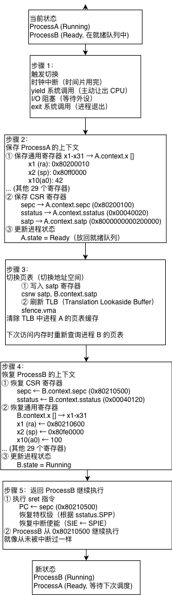
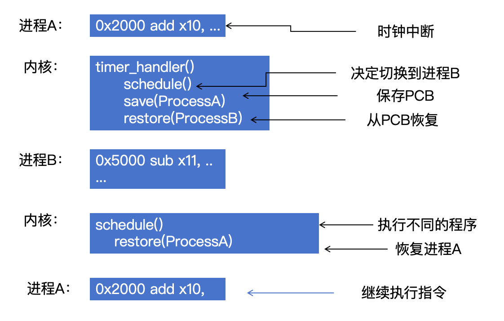

# 6.2.1 上下文切换（上）- 机制讲解

## 本节目标

- 理解为什么需要上下文切换
- 掌握上下文切换的完整流程
- 理解RISC-V寄存器保存与恢复机制
- 理解页表切换和TLB刷新
- 为下一节的汇编实现做准备

---

## 本节说明

本节**不新增代码文件**，纯理论讲解。下一节（6.2.2）将实现核心的汇编代码 `__switch`。

本节的重点是理解**为什么**和**怎么做**，而不是**如何写代码**。

---

## 步骤1：理解上下文切换的必要性

### 1.1 为什么需要上下文切换？

**问题场景**：单核CPU如何"同时"运行多个程序？

假设你的电脑只有一个CPU核心，正在运行三个进程：

```
进程A：视频播放器（需要持续计算）
进程B：文件下载器（等待网络I/O）
进程C：文本编辑器（等待用户输入）
```

**如果没有上下文切换**：

```
时间线（没有切换）：
0ms:  进程A运行（解码视频帧）
10ms: 进程A运行（解码视频帧）
20ms: 进程A运行（解码视频帧）
30ms: 进程A运行（解码视频帧）
...
进程B和进程C永远无法运行！
```

**典型问题**：
- 进程A独占CPU，其他进程"饿死"
- 进程B等待网络数据时，CPU空闲浪费
- 用户在进程C中输入文字，毫无响应

### 1.2 上下文切换的解决方案

**设计意图**：让CPU在多个进程间快速切换，给用户"同时运行"的假象。

```
时间线（有切换）：
0ms:   进程A运行（解码1帧）          ← 10ms时间片
10ms:  切换到进程B                   ← 保存A的状态
11ms:  进程B运行（检查网络数据）      ← 10ms时间片
21ms:  切换到进程C                   ← 保存B的状态
22ms:  进程C运行（等待键盘输入）      ← 10ms时间片
32ms:  切换回进程A                   ← 恢复A的状态
33ms:  进程A继续运行（解码下一帧）
```

**关键效果**：

- CPU利用率接近100%（不再空闲等待I/O）
- 每个进程都有机会运行（公平性）
- 响应速度快（10-50ms内就能响应用户操作）

### 1.3 上下文切换的成本

虽然上下文切换能提高CPU利用率，但它本身也有开销：

**时间开销**：
- 保存当前进程的寄存器：~50 CPU cycles
- 切换页表：~10 cycles
- 刷新TLB：~100 cycles
- 恢复新进程的寄存器：~50 cycles
- **总计：~210 cycles**（约0.02ms @ 10GHz）

**隐性开销**：
- Cache失效：新进程访问的内存不在缓存中
- 流水线停顿：CPU需要重新填充指令流水线
- 分支预测失效：新进程的跳转模式与旧进程不同

**设计权衡**：
- 时间片太小（如0.1ms）：切换频繁，开销占比大
- 时间片太大（如1秒）：响应慢，用户感觉卡顿
- 典型值：5-10ms（Linux默认约4-10ms）

---

## 步骤2：理解上下文的含义

### 2.1 什么是"上下文"？

**上下文（Context）** = 进程运行所需的所有CPU状态信息。

**类比：阅读一本书**

```
你正在读书时的"上下文"包括：
1. 书签：记录读到第几页（对应PC寄存器）
2. 笔记：记录临时想法（对应通用寄存器）
3. 书桌状态：书、笔、笔记本的摆放（对应栈）
4. 阅读习惯：是否开灯、音量等（对应sstatus）
```

如果你要去接电话：
1. **夹书签**（保存page number → sepc）
2. **放下笔记本**（保存临时数据 → 通用寄存器）
3. **离开书桌**
4. 接完电话回来，**打开书签**（恢复sepc），**拿起笔记**（恢复寄存器），继续阅读

### 2.2 RISC-V的上下文包含什么？

回顾6.1.4节定义的 `ProcessContext`：

```rust
#[repr(C)]
pub struct ProcessContext {
    pub x: [usize; 31],     // x1-x31通用寄存器
    pub sepc: usize,        // 异常返回地址
    pub sstatus: usize,     // 处理器状态寄存器
    pub satp: usize,        // 页表基址寄存器
}
```

**为什么是这些字段？**

| 字段 | RISC-V寄存器 | 用途 | 为什么必须保存？ |
|------|-------------|------|-----------------|
| `x[0..31]` | x1-x31 | 通用寄存器 | 存储临时变量、函数参数、返回值 |
| `sepc` | sepc | 异常返回地址 | 记录进程被中断时执行到哪条指令 |
| `sstatus` | sstatus | 处理器状态 | 记录中断使能位、特权级等状态 |
| `satp` | satp | 页表基址 | 记录进程的虚拟地址空间 |

**为什么不保存x0？**
- RISC-V规定：x0寄存器硬件固定为0
- 读取x0永远返回0，写入x0无效
- 无需保存，恢复时自动为0

### 2.3 字段详解

#### 1. 通用寄存器 x1-x31

**RISC-V寄存器约定**：

```
x0  (zero)：硬件固定为0
x1  (ra)  ：函数返回地址
x2  (sp)  ：栈指针（非常重要！）
x3  (gp)  ：全局指针
x4  (tp)  ：线程指针
x5-x7 (t0-t2)：临时寄存器
x8  (s0/fp)：保存寄存器/帧指针
x9  (s1)  ：保存寄存器
x10-x11 (a0-a1)：函数参数/返回值
x12-x17 (a2-a7)：函数参数
x18-x27 (s2-s11)：保存寄存器
x28-x31 (t3-t6)：临时寄存器
```

**为什么都要保存？**

假设进程A正在执行这段代码：

```rust
fn compute() {
    let a = 10;  // 存在x10
    let b = 20;  // 存在x11
    let sum = a + b;  // 结果在x10
}
```

如果此时发生时钟中断切换到进程B：
- 不保存x10/x11 → 进程B会覆盖这些值
- 切换回进程A时，a和b的值丢失 → 计算错误！

#### 2. sepc（Supervisor Exception PC）

**作用**：记录进程被中断时的指令地址。

**典型场景**：

```assembly
进程A正在执行：
0x80200000: addi x10, x10, 1
0x80200004: addi x11, x11, 2  ← 时钟中断发生在这里
0x80200008: add x12, x10, x11

中断发生时：
1. 硬件自动设置 sepc = 0x80200004
2. 跳转到中断处理程序

上下文切换：
1. 保存 sepc 到 ProcessA.context.sepc
2. 运行进程B...

切换回进程A：
1. 恢复 sepc = ProcessA.context.sepc (0x80200004)
2. 执行 sret
3. PC ← sepc，继续执行 0x80200004
```

**关键点**：sepc确保进程能从被中断的位置继续执行，不会丢失任何指令。

#### 3. sstatus（Supervisor Status）

**作用**：保存处理器的状态信息。

**重要位字段**：

```
sstatus寄存器布局（64位）：
bit 0 (UIE) ：用户态中断使能（本实验未用）
bit 1 (SIE) ：Supervisor态中断使能
bit 4 (UPIE)：中断前的UIE
bit 5 (SPIE)：中断前的SIE
bit 8 (SPP) ：中断前的特权级(0=User, 1=Supervisor)
```

**为什么要保存sstatus？**

**场景1：中断使能状态**

```
进程A运行：
- SIE=1（允许中断）

时钟中断发生：
- 硬件自动设置 SPIE=SIE(1), SIE=0
- 中断处理期间禁止再次中断

恢复进程A：
- 从context.sstatus恢复
- sret指令自动设置 SIE=SPIE(1)
- 进程A重新允许中断
```

**场景2：特权级切换**

```
进程A在用户态运行：
- SPP=0（User mode）

系统调用/中断：
- 硬件自动设置 SPP=当前模式(0)
- 切换到Supervisor模式

恢复进程A：
- sret根据SPP=0，返回到用户态
```

#### 4. satp（Supervisor Address Translation and Protection）

**作用**：记录进程的页表基址，实现虚拟内存隔离。

**satp寄存器布局（Sv39）**：

```
bit 0-43 (PPN) ：物理页号（页表的物理地址/4096）
bit 44-59      ：保留
bit 60-63 (MODE)：地址转换模式（8=Sv39, 0=Bare）
```

**为什么要保存satp？**

**典型场景**：进程隔离

```
进程A的地址空间：
虚拟地址 0x1000 → 物理地址 0x80001000
satp_A = 0x8000000000200000（页表A的地址）

进程B的地址空间：
虚拟地址 0x1000 → 物理地址 0x80005000
satp_B = 0x8000000000300000（页表B的地址）

切换到进程B：
1. csrw satp, satp_B  （切换页表）
2. sfence.vma         （刷新TLB）

此时访问虚拟地址0x1000：
- 使用页表B查找
- 得到物理地址0x80005000
- 进程A和B的数据完全隔离！
```

**重要性**：如果不切换satp，进程B会访问到进程A的内存，造成数据混乱或安全漏洞！

---

## 步骤3：理解上下文切换的完整流程

### 3.1 流程概览

上下文切换就像两个人轮流使用同一台电脑：

```
人A使用电脑 → 保存A的工作（保存上下文）
            → 恢复B的工作（恢复上下文）
            → 人B使用电脑
```

**完整流程图**：




### 3.2 关键步骤详解

#### 步骤1：触发切换的时机

**4种典型触发场景**：

1. **时间片耗尽（最常见）**

```rust
// 时钟中断处理函数
fn timer_interrupt_handler() {
    let current = get_current_process();

    // 消耗一个时间片
    if current.tick() {
        // 时间片用完，触发调度
        schedule();  // 这里会调用__switch
    } else {
        // 还有剩余时间片，继续运行
        set_next_timer();
    }
}
```

2. **进程主动让出CPU**

```rust
// yield系统调用
pub fn sys_yield() -> isize {
    // 当前进程主动放弃CPU
    schedule();  // 立即切换到其他进程
    0
}
```

3. **进程等待I/O**

```rust
// read系统调用
pub fn sys_read(fd: usize, buf: usize, len: usize) -> isize {
    let file = get_file(fd);

    if !file.is_ready() {
        // 数据未就绪，进程阻塞
        current_process().set_state(Blocked);
        schedule();  // 切换到其他进程
    }

    // I/O完成后被唤醒，继续执行
    file.read(buf, len)
}
```

4. **进程退出**

```rust
// exit系统调用
pub fn sys_exit(exit_code: i32) -> ! {
    let current = get_current_process();
    current.set_exit_code(exit_code);  // state = Zombie
    schedule();  // 切换到其他进程
    unreachable!()
}
```

#### 步骤2：保存当前进程上下文

**关键问题**：在哪里保存？

**答案**：保存到 `ProcessA.context` 字段。

**伪代码示意**（实际必须用汇编）：

```rust
fn save_context(process: &mut ProcessControlBlock) {
    // 保存通用寄存器（必须用汇编实现）
    process.context.x[0] = read_x1();   // ra
    process.context.x[1] = read_x2();   // sp
    process.context.x[9] = read_x10();  // a0
    // ... 保存其他28个寄存器

    // 保存CSR寄存器（可以用Rust的asm宏）
    unsafe {
        asm!(
            "csrr {}, sepc",
            out(reg) process.context.sepc
        );
        asm!(
            "csrr {}, sstatus",
            out(reg) process.context.sstatus
        );
        asm!(
            "csrr {}, satp",
            out(reg) process.context.satp
        );
    }
}
```

**为什么必须用汇编？**

Rust无法直接访问所有通用寄存器：

```rust
// 错误：Rust没有这样的API
let ra = read_register_x1();  // 不存在这个函数
let sp = read_register_x2();
```

必须用汇编指令：

```assembly
sd x1, 0(a0)    # 保存x1到内存[a0+0]
sd x2, 8(a0)    # 保存x2到内存[a0+8]
sd x3, 16(a0)   # 保存x3到内存[a0+16]
# ...
```

#### 步骤3：切换页表

**为什么需要切换页表？**

每个进程有独立的虚拟地址空间，虚拟地址到物理地址的映射不同：

```
进程A的视角：
虚拟地址 0x1000 → 页表A查询 → 物理地址 0x80001000
虚拟地址 0x2000 → 页表A查询 → 物理地址 0x80002000

进程B的视角：
虚拟地址 0x1000 → 页表B查询 → 物理地址 0x80005000
虚拟地址 0x2000 → 页表B查询 → 物理地址 0x80006000

注意：两个进程的虚拟地址0x1000指向不同的物理内存！
```

**切换页表的代码**：

```rust
unsafe {
    // 1. 写入新的页表基址
    asm!(
        "csrw satp, {0}",
        in(reg) next_process.context.satp
    );

    // 2. 刷新TLB
    asm!("sfence.vma");
}
```

**sfence.vma的作用**：

TLB（Translation Lookaside Buffer）是页表的硬件缓存：

```
没有TLB：
访问虚拟地址 → 查询页表（3-4次内存访问）→ 得到物理地址

有TLB：
访问虚拟地址 → 查询TLB缓存（1次，极快）→ 得到物理地址
```

切换页表后必须刷新TLB：

```
进程A运行：
TLB缓存：{0x1000 → 0x80001000, 0x2000 → 0x80002000}

切换到进程B（satp已改为页表B）：
如果不刷新TLB：
  访问虚拟地址0x1000 → TLB命中 → 返回0x80001000
   错误！应该访问进程B的物理地址0x80005000

执行sfence.vma后：
  TLB被清空 → 重新查询页表B → 正确返回0x80005000
```

#### 步骤4：恢复目标进程上下文

从 `ProcessB.context` 读取保存的值，恢复到CPU寄存器：

```rust
fn restore_context(process: &ProcessControlBlock) {
    // 恢复CSR寄存器
    unsafe {
        asm!(
            "csrw sepc, {0}",
            in(reg) process.context.sepc
        );
        asm!(
            "csrw sstatus, {0}",
            in(reg) process.context.sstatus
        );
    }

    // 恢复通用寄存器（必须用汇编）
    // x1 ← process.context.x[0]
    // x2 ← process.context.x[1]
    // ...
}
```

#### 步骤5：返回目标进程

使用 `sret` 指令返回：

```assembly
sret
```

**sret指令的行为**：

1. **恢复PC**：`PC ← sepc`
   - 跳转到保存的指令地址
   - 进程从被中断的位置继续执行

2. **恢复特权级**：根据 `sstatus.SPP`
   - SPP=0 → 返回User模式
   - SPP=1 → 返回Supervisor模式

3. **恢复中断使能**：`SIE ← SPIE`
   - 如果进程被中断前允许中断，恢复后继续允许

**完整示例**：

```
ProcessB之前执行到这里：
0x80210500: addi x10, x10, 5  ← sepc保存的地址
0x80210504: addi x11, x11, 10
...

执行sret后：
1. PC ← 0x80210500
2. 开始执行 addi x10, x10, 5
3. ProcessB继续运行，就像从未被打断
```

---

## 步骤4：理解栈的切换

### 4.1 为什么需要切换栈？

每个进程有独立的栈空间：

```
进程A的栈：
  栈底: 0x80ff0000
  栈顶: 0x80feffc0  ← sp (x2寄存器)
  内容: [局部变量][返回地址][...]

进程B的栈：
  栈底: 0x80fe0000
  栈顶: 0x80fdffa0  ← sp
  内容: [局部变量][返回地址][...]
```

如果不切换栈指针：
- 进程B会使用进程A的栈
- 函数调用会破坏进程A的数据
- 栈溢出或数据混乱

### 4.2 栈指针如何切换？

**关键**：栈指针sp就是x2寄存器！

```
保存进程A：
  A.context.x[1] = x2  // 保存sp

恢复进程B：
  x2 = B.context.x[1]  // 恢复sp
```

**完整流程**：

```
进程A运行：
  sp (x2) = 0x80feffc0

上下文切换（保存A）：
  A.context.x[1] = sp  // 保存为0x80feffc0

上下文切换（恢复B）：
  sp = B.context.x[1]  // 恢复为0x80fdffa0

进程B运行：
  sp (x2) = 0x80fdffa0

函数调用：
  addi sp, sp, -16     // 在进程B的栈上分配空间
  sd ra, 8(sp)         // 保存返回地址到进程B的栈
```

---

## 步骤5：理解新进程的初始化

### 5.1 第一次调度的特殊情况

**问题**：新创建的进程没有上下文怎么办？

新进程从未运行过，`context`字段全是0：

```rust
let process = ProcessControlBlock::new(pid, "new_process", None);
// process.context.sepc = 0
// process.context.x[1] (sp) = 0
// 如果直接调度，会跳转到地址0并崩溃！
```

**解决方案**：手动构造初始上下文。

### 5.2 构造初始上下文

**关键字段**：

1. **sepc**：进程入口地址
2. **sp (x[1])**：用户栈顶地址
3. **sstatus**：初始处理器状态

**示例代码**（将在后续章节使用）：

```rust
impl ProcessContext {
    /// 为新进程创建初始上下文
    ///
    /// # 参数
    /// - entry_point: 进程入口函数地址（如main或_start）
    /// - user_stack: 用户栈顶地址
    ///
    /// # 返回
    /// - 初始化好的上下文，可以直接被调度
    pub fn new_user_context(
        entry_point: usize,
        user_stack: usize,
    ) -> Self {
        let mut context = ProcessContext::new();

        // 1. 设置入口地址
        context.sepc = entry_point;

        // 2. 设置栈指针
        context.x[1] = user_stack;  // sp = x2

        // 3. 设置sstatus
        // bit 5 (SPIE) = 1: 返回后允许中断
        // bit 8 (SPP)  = 0: 返回到用户态
        context.sstatus = 0x00040020;

        // 4. 设置页表（如果有虚拟内存）
        // context.satp = ...;

        context
    }
}
```

**sstatus的值解析**：

```
0x00040020 的二进制：
bit 5 (SPIE) = 1  → sret后 SIE=1（允许中断）
bit 8 (SPP)  = 0  → sret后返回User模式
其他位 = 0
```

**使用示例**：

```rust
// 创建新进程
let entry = 0x80200000;  // 用户程序入口
let stack = 0x80ff0000;  // 用户栈顶

let context = ProcessContext::new_user_context(entry, stack);
let process = create_process_with_context(context);

// 第一次调度这个进程
schedule_to(process);
// ↓
// 恢复context → sret
// ↓
// 跳转到0x80200000开始执行用户程序
```

---

## 步骤6：理解与异常处理的区别

很多同学会混淆"异常处理"和"上下文切换"，这里明确两者的区别：

### 6.1 异常处理（Trap Handler）

**场景**：用户程序发生异常或系统调用


**特点**：

- **保存位置**：临时保存到内核栈
- **恢复时机**：立即恢复（异常处理完后）
- **返回地址**：原程序的下一条指令
- **目的**：处理事件，然后回到原进程

### 6.2 上下文切换（Context Switch）

**场景**：进程调度，切换到不同的进程



**特点**：

- **保存位置**：永久保存到PCB.context
- **恢复时机**：可能很久以后（几ms到几分钟）
- **返回地址**：可能是完全不同的程序
- **目的**：多进程并发执行

### 6.3 对比表

| 维度 | 异常处理 | 上下文切换 |
|------|---------|-----------|
| 保存到 | 内核栈 | PCB.context |
| 生命周期 | 毫秒级 | 秒级甚至更久 |
| 返回 | 同一个进程 | 可能是其他进程 |
| 寄存器保存 | 部分（callee-saved） | 全部（31个+CSR） |
| 页表切换 | 不切换 | 切换satp |
| 触发原因 | 异常/中断/系统调用 | 调度决策 |

---

## 知识点总结

### 上下文切换的5个步骤

```
1. 触发 → 2. 保存 → 3. 切换页表 → 4. 恢复 → 5. 返回
```

### 必须保存的寄存器

| 寄存器 | 数量 | 原因 |
|--------|------|------|
| x1-x31 | 31个 | 通用寄存器，存储进程的计算状态 |
| sepc | 1个 | 记录被中断的指令地址 |
| sstatus | 1个 | 记录中断使能、特权级等状态 |
| satp | 1个 | 记录进程的页表基址 |

### 关键RISC-V指令

| 指令 | 作用 |
|------|------|
| `sd xN, offset(a0)` | 保存寄存器xN到内存 |
| `ld xN, offset(a0)` | 从内存恢复寄存器xN |
| `csrw satp, xN` | 写入页表基址寄存器 |
| `sfence.vma` | 刷新TLB |
| `sret` | 返回到sepc指定的地址 |

---

## 下一步

本节我们理解了上下文切换的**原理**和**流程**。

**6.2.2节**将动手实现：
- 用RISC-V汇编编写 `__switch` 函数
- 精确保存和恢复31个通用寄存器
- 处理栈帧布局
- 完成可运行的上下文切换代码

---

## 练习题

1. 为什么必须用汇编实现上下文保存/恢复？
2. 如果忘记执行`sfence.vma`会有什么后果？
3. 新创建的进程第一次被调度时，sepc应该设置为什么值？
4. 为什么上下文切换需要保存31个寄存器，而函数调用只需保存部分寄存器？

<details>
<summary>答案提示</summary>

1. Rust无法直接访问所有通用寄存器（x1-x31），必须用汇编的sd/ld指令逐个保存/恢复

2. TLB可能缓存旧进程的页表映射，导致新进程访问到旧进程的物理内存，造成数据混乱或段错误

3. 进程的入口地址（entry_point），例如用户程序的main函数或_start符号的地址

4. 函数调用遵守calling convention，caller-saved由调用者保存，callee-saved由被调用者保存；但上下文切换不是函数调用，必须保存所有寄存器以完整恢复进程状态

</details>
