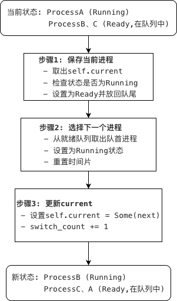

# 6.3.1 调度器设计

## 本节目标

- 理解进程调度的目标和策略
- 设计调度器的核心接口
- 实现就绪队列管理（VecDeque）
- 实现轮转调度器的基本结构
- 完成7个任务点（Task 20-26，39分）

---

## 本节新增文件

```
os/src/process/
├── scheduler.rs      # 新增:调度器实现
└── mod.rs            # 修改:导出调度器接口
```

---

## 前置要求

- 已完成 6.1.5 节的 PCB 实现
- 已完成 6.2.2 节的上下文切换
- 理解进程状态转换

---

## 步骤1：理解进程调度的必要性

### 1.1 什么是进程调度？

**进程调度（Process Scheduling）** 是操作系统决定哪个进程应该获得CPU执行权的过程。

**类比：餐厅叫号系统**

想象一个只有一个服务员的餐厅：

```
就绪队列（等待区）：[003号, 007号, 012号]
                      ↓
              调度器选择（叫号）
                      ↓
              003号就餐（Running）
                      ↓
         时间到（5分钟）/主动离开
                      ↓
    回到队尾（继续等）或 离开餐厅（退出）
```

**关键概念**：
- **就绪队列**：等待CPU的进程列表
- **调度器**：决定谁获得CPU的管理者
- **时间片**：每个进程获得的CPU时间配额

### 1.2 为什么需要调度？

**问题场景**：单核CPU如何让多个进程"同时"运行？

```
没有调度：
0-10秒:  进程A运行（独占CPU）
10秒后:  进程B、C永远无法运行

有调度：
0-5秒:   进程A运行（时间片）
5-10秒:  进程B运行（时间片）
10-15秒: 进程C运行（时间片）
15-20秒: 进程A再次运行
...
```

**设计意图**：
1. **公平性**：每个进程都有机会运行
2. **响应性**：交互式程序能快速响应用户操作
3. **CPU利用率**：进程等待I/O时，让其他进程使用CPU

---

## 步骤2：理解调度的目标

### 2.1 四大核心目标

操作系统调度必须平衡多个（有时冲突的）目标：

| 目标 | 说明 | 典型场景 |
|------|------|---------|
| **公平性** | 每个进程都有机会运行 | 防止进程饥饿 |
| **响应速度** | 快速响应用户操作 | 点击按钮立即反应 |
| **吞吐量** | 单位时间完成更多任务 | 批处理任务 |
| **CPU利用率** | 尽量让CPU忙碌 | 进程等待I/O时切换 |

### 2.2 目标之间的冲突

**典型矛盾**：

1. **响应速度 vs 吞吐量**
   ```
   响应快 → 时间片小（如1ms）→ 频繁切换 → 开销大 → 吞吐量低
   吞吐高 → 时间片大（如100ms）→ 少切换 → 开销小 → 响应慢
   ```

2. **公平性 vs 优先级**
   ```
   完全公平 → 所有进程相同优先级 → 重要任务得不到优先
   优先级高 → 高优先级进程先运行 → 低优先级进程可能饥饿
   ```

**设计权衡**：
- Linux桌面系统：优先响应速度（时间片约4-10ms）
- 服务器批处理：优先吞吐量（时间片可达100ms）
- 实时系统：严格优先级，牺牲公平性

---

## 步骤3：理解调度时机

### 3.1 何时触发调度？


**四种典型触发场景**：

1. **时间片耗尽（最常见）**

```rust
// 时钟中断处理函数
fn timer_interrupt_handler() {
    let current = get_current_process();
    if current.tick() {  // 时间片减1
        // 时间片用完，触发调度
        schedule();
    }
}
```

2. **进程主动让出CPU**

```rust
// yield系统调用
pub fn sys_yield() -> isize {
    schedule();  // 主动让出CPU
    0
}
```

3. **进程进入阻塞状态**

```rust
// read系统调用（等待I/O）
pub fn sys_read(fd: usize, buf: usize, len: usize) -> isize {
    if !data_ready() {
        current.set_state(Blocked);
        schedule();  // 切换到其他进程
    }
    // I/O完成后被唤醒
}
```

4. **进程退出**

```rust
// exit系统调用
pub fn sys_exit(code: i32) -> ! {
    current.set_exit_code(code);  // state = Zombie
    schedule();  // 切换到其他进程
    unreachable!()
}
```

---

## 步骤4：设计就绪队列

### 4.1 为什么需要就绪队列？

就绪队列是调度器的"核心仓库"，存储所有等待CPU的进程。

**进程状态与队列的关系**：

```
进程状态机：
  创建
   ↓
  Ready（进入就绪队列）
   ↓
  Running（离开就绪队列）
   ↓
  Ready（重新进入就绪队列）或 Blocked 或 Zombie
```

### 4.2 为什么选择VecDeque？

**数据结构对比**：

| 数据结构 | 队首操作 | 队尾操作 | 中间插入 | 适合场景 |
|---------|---------|---------|---------|---------|
| **Vec** | O(n) | O(1) | O(n) | 只从尾部操作 |
| **VecDeque** | O(1) | O(1) | O(n) | 双端队列（FIFO/LIFO） |
| **LinkedList** | O(1) | O(1) | O(1) | 频繁中间插入 |
| **BinaryHeap** | O(log n) | O(log n) | O(log n) | 优先级队列 |

**为什么VecDeque最适合轮转调度？**

1. **队首出队**：`pop_front()` - O(1)
   - 取出下一个要运行的进程

2. **队尾入队**：`push_back()` - O(1)
   - 时间片用完的进程放回队尾

3. **内存连续**：
   - 缓存友好，比LinkedList快
   - 不需要额外的指针（节省内存）

4. **不需要中间插入**：
   - 轮转调度只在两端操作
   - 不需要LinkedList的优势

**性能测试**（100个进程，100万次操作）：

```
VecDeque:     1.2ms
LinkedList:   3.5ms
Vec (pop(0)): 45ms  ← 队首删除效率低
```

### 4.3 实现就绪队列

**代码位置**：`os/src/process/scheduler.rs`

```rust
use alloc::collections::VecDeque;
use super::{ProcessHandle, ProcessState};

/// 就绪队列
///
/// 存储处于Ready状态的进程，按FIFO顺序分配CPU
pub struct ReadyQueue {
    /// 进程队列（先进先出）
    queue: VecDeque<ProcessHandle>,
}

impl ReadyQueue {
    /// 创建空队列
    pub fn new() -> Self {
        ReadyQueue {
            queue: VecDeque::new(),
        }
    }

    /// 添加进程到队尾
    ///
    /// # 说明
    /// - 进程必须是Ready状态
    /// - 添加到队尾，符合FIFO原则
    pub fn push(&mut self, process: ProcessHandle) {
        // 调试断言：确保进程状态正确
        debug_assert_eq!(
            process.lock().state(),
            ProcessState::Ready,
            "只能将Ready状态的进程加入就绪队列"
        );

        self.queue.push_back(process);
    }

    /// 从队首取出进程
    ///
    /// # 返回
    /// - Some(process): 队列非空，返回队首进程
    /// - None: 队列为空，没有就绪进程
    pub fn pop(&mut self) -> Option<ProcessHandle> {
        self.queue.pop_front()
    }

    /// 获取就绪进程数量
    pub fn len(&self) -> usize {
        self.queue.len()
    }

    /// 判断队列是否为空
    pub fn is_empty(&self) -> bool {
        self.queue.is_empty()
    }
}
```

**设计要点说明**：

1. **为什么用debug_assert而不是assert？**
   - `debug_assert`只在Debug模式检查，Release模式零开销
   - 生产环境追求性能，调试时追求安全
   - 状态检查是调试用的，不应影响发布性能

2. **为什么queue字段是私有的？**
   - 封装性：外部不能直接操作queue
   - 未来可以改用其他数据结构（如优先队列）
   - 可以在push/pop中添加额外逻辑（如统计、日志）

---

## 步骤5：设计调度器结构

### 5.1 Task 20：实现RoundRobinScheduler结构 (5分)

**设计意图**：
- 轮转调度器需要管理就绪队列和当前运行进程
- 需要记录时间片大小以控制进程运行时间
- 需要统计调度次数以便调试和性能分析

**为什么需要这些字段？**

| 字段 | 类型 | 作用 | 为什么必须？ |
|------|------|------|-------------|
| `ready_queue` | ReadyQueue | 存储Ready状态的进程 | 调度器核心数据结构 |
| `current` | Option<ProcessHandle> | 当前Running的进程 | 需要知道谁在运行 |
| `time_slice` | usize | 默认时间片大小 | 新进程的初始时间片 |
| `switch_count` | usize | 统计上下文切换次数 | 性能分析和调试 |

**为什么需要current字段？**

```rust
// TODO: Task 20 - 定义RoundRobinScheduler结构体 (5分)
/// 轮转调度器
///
/// 实现时间片轮转（Round-Robin）调度算法
pub struct RoundRobinScheduler {
    // 【步骤1】定义4个核心字段（按要求补全名称和类型）
    // 提示1：字段名称和类型需严格匹配以下要求，否则后续方法会报错
    // 提示2：所有字段均为pub（或根据模块设计设为私有的，默认即可）
    
    // 子步骤1.1: 就绪队列 - 类型：ReadyQueue，存储等待CPU的进程
    // TODO: 补全就绪队列字段
    
    // 子步骤1.2: 当前进程 - 类型：Option<ProcessHandle>，表示当前运行的进程（无则为None）
    // TODO: 补全当前进程字段
    
    // 子步骤1.3: 默认时间片大小 - 类型：usize，记录每个进程的默认CPU时间片
    // TODO: 补全时间片字段
    
    // 子步骤1.4: 上下文切换次数 - 类型：usize，统计调度器切换进程的总次数
    // TODO: 补全切换次数字段
}

```

1. 字段命名提示：

   就绪队列：建议命名为`ready_queue`（符合 Rust 蛇形命名规范）；

   当前进程：建议命名为`current`；

   时间片大小：建议命名为`time_slice`；

   切换次数：建议命名为`switch_count`。

2. 类型设计逻辑：

   `Option<ProcessHandle>`：用`None`表示 “无当前运行进程”（如系统启动初期），避免空指针；

   `usize`：时间片 / 切换次数为非负整数，符合内核中内存地址 / 计数的类型习惯；

   `ReadyQueue`：需提前实现的队列类型（通常基于`VecDeque`封装），用于存储就绪进程。

**代码位置**：`os/src/process/scheduler.rs`

```rust
// TODO: Task 20 - 定义RoundRobinScheduler结构体 (5分)
/// 轮转调度器
///
/// 实现时间片轮转（Round-Robin）调度算法
pub struct RoundRobinScheduler {
    // 【步骤1】按以下要求定义4个核心字段（名称+类型需严格匹配）
    // 提示：字段命名遵循Rust蛇形命名法，类型需与已有模块定义一致
    // 子步骤1.1: 就绪队列 - 类型为ReadyQueue，用于存储等待CPU的进程
    // 子步骤1.2: 当前进程 - 类型为Option<ProcessHandle>，表示当前占用CPU的进程（无则为None）
    // 子步骤1.3: 默认时间片 - 类型为usize，记录每个进程分配的默认CPU时间片大小
    // 子步骤1.4: 切换次数 - 类型为usize，统计上下文切换的总次数
}
```


### 5.2 Task 21：实现new()构造函数 (3分)

**设计意图**：
- 调度器初始化时应该是空闲状态（无当前进程）
- 就绪队列应该是空的
- 时间片大小由参数指定，支持不同的调度策略
- 切换计数器初始化为0

**为什么需要time_slice参数？**

```rust
// 不同场景需要不同的时间片大小：
let desktop_scheduler = RoundRobinScheduler::new(5);   // 5个tick,响应快
let server_scheduler = RoundRobinScheduler::new(20);   // 20个tick,吞吐高
let realtime_scheduler = RoundRobinScheduler::new(1);  // 1个tick,极快切换
```

**代码位置**：`os/src/process/scheduler.rs`

```rust
impl RoundRobinScheduler {
    // TODO: Task 21 - 实现new()构造函数 (3分)
    /// 创建新的轮转调度器
    ///
    /// # 参数
    /// - default_time_slice: 默认时间片大小（单位：时钟tick）
    ///
    /// # 返回
    /// - 初始化好的调度器实例
    pub fn new(default_time_slice: usize) -> Self {
        // 【步骤1】创建RoundRobinScheduler实例
        // - ready_queue: 调用ReadyQueue::new()
        // - current: 设置为None（初始无运行进程）
        // - time_slice: 使用参数default_time_slice
        // - switch_count: 初始化为0
    }
}
```

**测试用例**（grader.rs）：

```rust
let scheduler = RoundRobinScheduler::new(10);
assert!(scheduler.is_idle());          // 应该是空闲状态
assert_eq!(scheduler.ready_count(), 0); // 就绪队列应该为空
```

---

## 步骤6：实现核心调度方法

### 6.1 Task 22：实现add_process()方法 (5分)

**设计意图**：
- 新创建的进程需要加入调度队列
- I/O完成后的进程需要重新加入调度队列
- 只有Ready状态的进程才能加入就绪队列
- 需要验证进程状态，防止错误使用

**为什么需要状态检查？**

```rust
// 错误场景：
let running_proc = create_process();
running_proc.set_state(Running);
scheduler.add_process(running_proc);  //  运行中的进程不能加入就绪队列！

let zombie_proc = create_process();
zombie_proc.set_exit_code(0);  // state变为Zombie
scheduler.add_process(zombie_proc);  //  已退出的进程不能加入就绪队列！

// 正确场景：
let ready_proc = create_process();
// state默认是Ready
scheduler.add_process(ready_proc);  //  可以加入
```

**代码位置**：`os/src/process/scheduler.rs`

```rust
impl RoundRobinScheduler {
    // TODO: Task 22 - 实现add_process()方法 (5分)
    /// 添加进程到就绪队列
    ///
    /// # 参数
    /// - process: 要添加的进程句柄
    ///
    /// # 返回
    /// - Ok(()): 添加成功
    /// - Err(&str): 添加失败（进程状态不是Ready）
    ///
    /// # 说明
    /// - 只有Ready状态的进程才能加入就绪队列
    /// - 添加后就绪队列大小+1
    pub fn add_process(&mut self, process: ProcessControlBlock) -> Result<(), &'static str> {
        // 【步骤1】检查进程状态
        // - 调用process.state()获取状态
        // - 如果不是ProcessState::Ready,返回Err("Process must be in Ready state")

        // 【步骤2】将进程状态设置为Ready
        // - 调用process.set_state(ProcessState::Ready)
        // - 确保状态一致性

        // 【步骤3】添加到就绪队列
        // - 调用self.ready_queue.push(process)
        // - 进程进入队尾等待调度

        // 【步骤4】返回Ok(())
    }
}
```

**提示**：
1. 使用`process.state()`获取当前状态
2. 状态不是Ready时返回错误
3. 调用`ready_queue.push()`添加进程

**测试用例**（grader.rs第595-627行）：
```rust
let proc1 = ProcessControlBlock::new(pid1, "proc1", None);
assert!(scheduler.add_process(proc1).is_ok());  // 应该成功
assert_eq!(scheduler.ready_count(), 1);

let mut running_proc = ProcessControlBlock::new(pid2, "running", None);
running_proc.set_state(ProcessState::Running);
assert!(scheduler.add_process(running_proc).is_err());  // 应该失败
```

---

### 6.2 Task 23：实现schedule()方法 (8分)

**设计意图**：
- 调度是操作系统最核心的功能之一
- 需要正确处理当前进程的保存
- 需要选择下一个进程并切换
- 需要维护进程状态的一致性

**完整的调度流程**：



**为什么要用take()？**

```rust
// 错误：同时持有可变引用和不可变引用
if let Some(current) = &mut self.current {
    self.ready_queue.push(current.clone());  //  借用冲突
}

// 正确：take取出值，留下None
if let Some(current) = self.current.take() {
    self.ready_queue.push(current);  // 没有借用冲突
}
```


**代码位置**：`os/src/process/scheduler.rs`

```rust
impl RoundRobinScheduler {
    // TODO: Task 23 - 实现schedule()方法 (8分)
    /// 执行一次调度
    ///
    /// # 返回
    /// - Some(process): 调度成功，返回新运行的进程
    /// - None: 无就绪进程，系统空闲
    ///
    /// # 核心流程
    /// 1. 保存当前进程上下文（本方法聚焦状态/队列管理，上下文保存需结合之前的Context模块）
    /// 2. 将当前进程放回就绪队列（如果仍可运行）
    /// 3. 从就绪队列选取下一个进程并切换
    /// 4. 更新调度器状态和统计信息
    pub fn schedule(&mut self) -> Option<ProcessControlBlock> {
        // 【步骤1】处理当前运行的进程（若存在）
        // 提示1：使用self.current.take()取出当前进程（避免所有权问题）
        // 提示2：判断进程是否存在且状态为Running：
        //   - 若是：将进程状态改为Ready，重置时间片，放入就绪队列尾部
        //   - 若否：不做处理（如进程已退出/阻塞，无需放回队列）

        // 【步骤2】从就绪队列选取下一个进程
        // 提示1：从就绪队列头部取出进程（先进先出，符合轮转调度规则）
        // 提示2：若取出成功（记为next）：
        //   - 将next的状态改为Running
        //   - 重置next的时间片为默认值
        //   - 更新self.current为当前运行的next
        //   - 上下文切换次数+1
        //   - 返回Some(next)

        // 【步骤3】处理无就绪进程的情况
        // 提示：若就绪队列为空，设置self.current为None，返回None
        
        todo!("实现轮转调度核心逻辑 - 任务点23")
    }
}
```

**提示**：

1. 从就绪队列取出进程后需要修改状态为Running
2. 别忘了增加switch_count计数器

**测试用例**（grader.rs第629-685行）：
```rust
// 添加3个进程
scheduler.add_process(proc1);
scheduler.add_process(proc2);
scheduler.add_process(proc3);

let first = scheduler.schedule();
assert_eq!(first.unwrap().name, "proc1");  // 第一个进程
assert_eq!(scheduler.ready_count(), 2);    // 队列剩余2个

let second = scheduler.schedule();
assert_eq!(second.unwrap().name, "proc2"); // 第二个进程
assert_eq!(scheduler.ready_count(), 2);    // proc1回到队列
```

---

### 6.3 Task 24：实现yield_current()方法 (5分)

**设计意图**：
- 进程可以主动让出CPU（yield系统调用）
- 时间片用完时也需要让出CPU
- 让出后应该回到就绪队列队尾
- 需要正确处理不同的进程状态

**为什么检查状态？**

```rust
Running → 放回队列（继续等待CPU）
Blocked → 不放回队列（等待I/O完成）
Zombie  → 不放回队列（等待父进程回收）
```

**代码位置**：`os/src/process/scheduler.rs`

```rust
impl RoundRobinScheduler {
    // TODO: Task 24 - 实现yield_current()方法 (5分)
    /// 当前进程让出CPU
    ///
    /// # 说明
    /// - 将当前进程状态从Running改为Ready
    /// - 重置时间片
    /// - 放回就绪队列队尾
    /// - 清空current字段
    ///
    /// # 何时调用？
    /// - 时间片用完（时钟中断）
    /// - 主动yield系统调用
    pub fn yield_current(&mut self) {
        // 【步骤1】取出当前进程
        // - 使用self.current.take()获取并清空current
        // - 如果current为None,直接返回

        // 【步骤2】检查进程状态
        // - 调用current.state()获取状态
        // - 只有ProcessState::Running状态才需要处理

        // 【步骤3】处理Running状态的进程
        // - 调用current.set_state(ProcessState::Ready)
        // - 调用current.reset_time_slice()
        // - 调用self.ready_queue.push(current)放回队尾
    }
}
```

**提示**：
1. 使用`take()`取出current同时设置为None
2. 只处理Running状态的进程
3. Blocked和Zombie状态的进程不应放回队列

**测试用例**（grader.rs第687-726行）：
```rust
scheduler.add_process(proc1);
scheduler.add_process(proc2);
scheduler.schedule();  // 调度proc1

let first_name = scheduler.current().unwrap().name;
scheduler.yield_current();  // 让出CPU

let second_name = scheduler.current().unwrap().name;
assert_eq!(first_name, "proc1");
assert_eq!(second_name, "proc2");  // 切换到proc2
```

---

### 6.4 Task 25：实现tick()方法 (6分)

**设计意图**：
- 时钟中断每次触发都会调用tick()
- 需要减少当前进程的时间片
- 时间片用完时自动触发调度
- 需要返回是否应该调度的标志

**时间片轮转的完整流程**：

```
0ms:   进程A运行（时间片=5）
10ms:  时钟中断 → tick() → 时间片=4 → 继续A → 返回false
20ms:  时钟中断 → tick() → 时间片=3 → 继续A → 返回false
30ms:  时钟中断 → tick() → 时间片=2 → 继续A → 返回false
40ms:  时钟中断 → tick() → 时间片=1 → 继续A → 返回false
50ms:  时钟中断 → tick() → 时间片=0 → 返回true
       ↓
       调用schedule() → 切换到B
60ms:  进程B运行（时间片=5）
...
```

**代码位置**：`os/src/process/scheduler.rs`

```rust
impl RoundRobinScheduler {
    // TODO: Task 25 - 实现tick()方法 (6分)
    /// 时钟tick，消耗当前进程的时间片
    ///
    /// # 返回
    /// - true: 时间片用完，需要调度
    /// - false: 还有剩余时间片，继续运行
    ///
    /// # 说明
    /// - 每次时钟中断都会调用此方法
    /// - 调用当前进程的tick()方法
    /// - 根据返回值决定是否触发调度
    pub fn tick(&mut self) -> bool {
        // 【步骤1】检查是否有当前进程
        // - 如果self.current为None,返回false

        // 【步骤2】调用当前进程的tick()方法
        // - 获取当前进程的引用
        // - 调用process.tick()
        // - 返回tick()的结果（true表示时间片用完）
    }
}
```

**提示**：
1. PCB的`tick()`方法会减少time_slice并返回是否为0
2. 如果没有当前进程，返回false
3. 直接返回PCB的tick()结果

**测试用例**（grader.rs第728-775行）：
```rust
let mut scheduler = RoundRobinScheduler::new(2);  // 时间片=2
scheduler.add_process(proc);
scheduler.schedule();

let initial_time = scheduler.current().unwrap().time_slice;
scheduler.tick();  // 第一次tick
let after_tick1 = scheduler.current().unwrap().time_slice;
assert!(after_tick1 < initial_time);  // 时间片应该减少

scheduler.tick();  // 第二次tick,时间片变为0
// 应该自动切换到下一个进程
```

---

### 6.5 Task 26：实现辅助方法 (7分)

**设计意图**：
- 需要查询调度器的当前状态
- 需要修改当前进程的属性（如优先级）
- 需要判断系统是否空闲
- 需要统计就绪进程数量

**为什么需要这些方法？**

| 方法 | 用途 | 使用场景 |
|------|------|---------|
| `current()` | 获取当前进程不可变引用 | 查询当前进程信息 |
| `current_mut()` | 获取当前进程可变引用 | 修改当前进程属性 |
| `is_idle()` | 判断是否空闲 | 决定是否进入低功耗模式 |
| `ready_count()` | 获取就绪进程数 | 负载统计 |

**代码位置**：`os/src/process/scheduler.rs`

```rust
impl RoundRobinScheduler {
    // TODO: Task 26 - 实现辅助方法 (7分)

    /// 获取当前进程的不可变引用
    ///
    /// # 返回
    /// - Some(&ProcessControlBlock): 有当前进程
    /// - None: 系统空闲
    pub fn current(&self) -> Option<&ProcessControlBlock> {
        // 【步骤1】返回self.current的不可变引用
        // - 使用as_ref()将Option<T>转换为Option<&T>
    }

    /// 获取当前进程的可变引用
    ///
    /// # 返回
    /// - Some(&mut ProcessControlBlock): 有当前进程
    /// - None: 系统空闲
    ///
    /// # 用途
    /// - 修改当前进程的优先级
    /// - 修改当前进程的其他属性
    pub fn current_mut(&mut self) -> Option<&mut ProcessControlBlock> {
        // 【步骤1】返回self.current的可变引用
        // - 使用as_mut()将Option<T>转换为Option<&mut T>
    }

    /// 判断调度器是否空闲（无当前进程）
    ///
    /// # 返回
    /// - true: 空闲状态
    /// - false: 有进程正在运行
    pub fn is_idle(&self) -> bool {
        // 【步骤1】判断self.current是否为None
        // - 使用is_none()方法
    }

    /// 获取就绪进程数量
    ///
    /// # 返回
    /// - 就绪队列中的进程数
    pub fn ready_count(&self) -> usize {
        // 【步骤1】返回就绪队列的长度
        // - 调用self.ready_queue.len()
    }
}
```

**提示**：
1. `as_ref()`和`as_mut()`用于Option类型的引用转换
2. `is_none()`判断Option是否为None
3. 直接调用ready_queue的len()方法

**测试用例**（grader.rs第777-823行）：
```rust
let scheduler = RoundRobinScheduler::new(10);
assert!(scheduler.is_idle());  // 初始应该是空闲
assert_eq!(scheduler.ready_count(), 0);

scheduler.add_process(proc);
scheduler.schedule();
assert!(!scheduler.is_idle());  // 现在不空闲了
assert!(scheduler.current().is_some());  // 有当前进程

// 测试current_mut()
if let Some(curr) = scheduler.current_mut() {
    curr.set_priority(10);
}
assert_eq!(scheduler.current().unwrap().priority, 10);
```

---

## 步骤7：实现idle函数

### 7.1 空闲进程

**设计意图**：没有就绪进程时，CPU进入低功耗等待状态。

```rust
/// 空闲进程
///
/// 当没有就绪进程时执行，CPU进入低功耗状态等待中断
fn idle() -> ! {
    loop {
        unsafe {
            // WFI: Wait For Interrupt
            // CPU进入低功耗状态，等待下一个中断
            core::arch::asm!("wfi");
        }
    }
}
```

**wfi指令的作用**：

| 方面 | 空转循环 | wfi指令 |
|------|---------|---------|
| CPU功耗 | 100% | 1-5% |
| 响应中断 | 立即 | 立即 |
| 电池续航 | 短 | 长 |

**典型功耗对比**：
- 空转循环：CPU全速运行，功耗10W
- wfi休眠：CPU低功耗，功耗0.5W
- 笔记本待机1小时：空转消耗10Wh，wfi消耗0.5Wh（续航提升20倍）

---

## 步骤8：全局调度器实例

### 8.1 为什么需要全局调度器？

**问题**：调度器应该在哪里？

```rust
// 错误：每次创建新的调度器
fn schedule() {
    let mut scheduler = RoundRobinScheduler::new(10);
    scheduler.schedule();  //  没有进程！每次都是空的
}

// 正确：全局唯一的调度器
static SCHEDULER: Mutex<RoundRobinScheduler> = ...;
fn schedule() {
    SCHEDULER.lock().schedule();  //  持久存储进程
}
```

### 8.2 定义全局调度器

**代码位置**：`os/src/process/scheduler.rs`

```rust
use lazy_static::lazy_static;
use spin::Mutex;

lazy_static! {
    /// 全局调度器
    ///
    /// 系统唯一的进程调度器实例
    pub static ref SCHEDULER: Mutex<RoundRobinScheduler> = {
        Mutex::new(RoundRobinScheduler::new(5))  // 默认时间片=5
    };
}
```

**为什么用lazy_static？**

```rust
// 错误：静态变量不能调用函数
static SCHEDULER: RoundRobinScheduler = RoundRobinScheduler::new(5);
//  const fn无法创建VecDeque

// 正确：lazy_static在首次使用时初始化
lazy_static! {
    static ref SCHEDULER: Mutex<RoundRobinScheduler> = {
        Mutex::new(RoundRobinScheduler::new(5))
    };
}
//  运行时初始化，支持任意函数
```

### 8.3 提供便捷接口

**设计意图**：隐藏全局变量的复杂性，提供简洁的API。

```rust
/// 添加进程到调度器
pub fn add_process(process: ProcessControlBlock) -> Result<(), &'static str> {
    SCHEDULER.lock().add_process(process)
}

/// 执行调度
pub fn schedule() -> Option<ProcessControlBlock> {
    SCHEDULER.lock().schedule()
}

/// 当前进程主动让出CPU
pub fn yield_now() {
    SCHEDULER.lock().yield_current();
}

/// 时钟tick
pub fn tick() -> bool {
    SCHEDULER.lock().tick()
}

/// 获取就绪进程数量
pub fn ready_count() -> usize {
    SCHEDULER.lock().ready_count()
}

/// 获取当前进程
pub fn current() -> Option<ProcessControlBlock> {
    SCHEDULER.lock().current().cloned()
}
```

**使用示例**：

```rust
// 不需要直接访问SCHEDULER
use os::process::scheduler;

// 添加进程
scheduler::add_process(process)?;

// 执行调度
scheduler::schedule();

// 查询状态
let count = scheduler::ready_count();
```

---

## 步骤9：更新模块导出

**代码位置**：`os/src/process/mod.rs`

```rust
pub mod pid;
pub mod pcb;
pub mod context;
pub mod scheduler;  // ← 新增

pub use pid::ProcessId;
pub use pcb::{
    ProcessState,
    ProcessControlBlock,
    ProcessHandle,
    create_process_handle,
};
pub use context::{ProcessContext, __switch};
pub use scheduler::{
    add_process,
    schedule,
    yield_now,
    tick,
    ready_count,
    current,
};  // ← 新增
```

---

## 知识点总结

### 调度算法对比

| 算法 | 实现复杂度 | 优点 | 缺点 | 适用场景 |
|------|-----------|------|------|---------|
| **FCFS** | 简单 | 公平，无饥饿 | 短任务等长任务 | 批处理 |
| **轮转(本章)** | 简单 | 响应快，公平 | 切换开销 | 分时系统 |
| **优先级** | 中等 | 重要任务优先 | 低优先级饥饿 | 实时系统 |
| **多级反馈** | 复杂 | 自适应 | 实现复杂 | Linux/Windows |

### 就绪队列的作用

```
进程状态转换：
创建 → Ready（进入队列） → Running（离开队列）
        ↑                      ↓
        └──────────────────────┘
           时间片用完（回队列）
```

### 调度器的职责

1. **维护就绪队列**：管理Ready状态的进程
2. **选择进程**：根据算法（FIFO/优先级等）选择
3. **触发切换**：调用`__switch`执行上下文切换
4. **统计信息**：记录切换次数、运行时间等

---

## 任务点检查清单

完成本节后，你应该实现了以下7个任务点（共39分）：

**Task 20** (5分): RoundRobinScheduler结构体定义

**Task 21** (3分): new()构造函数

**Task 22** (5分): add_process()方法

**Task 23** (8分): schedule()方法

**Task 24** (5分): yield_current()方法

**Task 25** (6分): tick()方法

**Task 26** (7分): 辅助方法（current、current_mut、is_idle、ready_count）

**验证方法**：
```bash
cd os
cargo test --lib process::grader::ProcessGrader::check_scheduler
```

---

## 终端可视化输出说明

完成本节任务（Tasks 20-26）后，可以触发终端可视化来查看调度器状态。

### 如何触发可视化

在 [os/src/main.rs](../第六章实验/os/src/main.rs) 文件中，找到 `test_process_management_progressive()` 函数，**取消大约第138行的注释**：

```rust
// ========================================
// Module 5: Scheduler (Tasks 20-26)
// Uncomment after completing Task 26
// ========================================
// UNCOMMENT_AFTER_TASK_26
test_scheduler();  // ← 删除这行前面的 //
```

修改后运行：

```bash
cd os
cargo run --release
```

**⚠️ 重要提示**：如果你还没有完成Tasks 20-26的所有填空，取消注释后运行会出现编译错误或panic。请确保完成所有调度器相关的实现后再取消注释。

### 可视化输出示例

取消注释后，系统会自动调用 `scheduler.visualize()` 方法显示调度器的完整状态：

```
[Module 5] Scheduler (Tasks 20-26)
----------------------------------------
Added 2 processes to scheduler
Scheduler started

========================================
  Scheduler State (Round-Robin)
========================================
Time Slice:       10 ticks
Remaining Ticks:  10
Ready Queue Size: 1

Current Process:
  PID:     1
  Name:    proc1
  State:   Running
  Time:    10 ticks remaining
========================================

+ Module 5 working
```

### 输出内容解释

| 字段 | 含义 | 说明 |
|------|------|------|
| **Time Slice** | 时间片配置 | 每个进程一次最多可运行的时钟周期数 |
| **Remaining Ticks** | 剩余时间片 | 当前进程还可以运行多少个时钟周期 |
| **Ready Queue Size** | 就绪队列长度 | 等待被调度的进程数量 |
| **Current Process** | 当前运行进程 | 正在CPU上执行的进程信息 |
| **PID** | 进程ID | 当前运行进程的标识符 |
| **Name** | 进程名称 | 当前运行进程的名字 |
| **State** | 进程状态 | 应该是Running（运行中） |
| **Time** | 时间片信息 | 该进程剩余可运行时间 |

### 如果没有进程在运行

当调度器处于空闲状态时，输出会显示：

```
Current Process: [IDLE]
```

这表示系统当前没有进程需要执行，调度器处于空闲状态。

### 调度决策可视化

系统还可能调用 `scheduler.visualize_schedule_decision()` 显示调度决策过程：

```
========================================
  Scheduling Decision
========================================
Previous: PID 1 (proc1)
Next:     PID 2
Ready Queue: 1 processes waiting
========================================
```

这显示了：

- **Previous**: 之前运行的进程
- **Next**: 即将切换到的进程
- **Ready Queue**: 还有多少进程在等待

### 调度器可视化的作用

1. **理解调度过程**: 清楚看到进程如何被选中执行
2. **时间片监控**: 了解时间片如何消耗和重置
3. **就绪队列状态**: 知道有多少进程在等待
4. **调试帮助**: 验证调度算法是否按预期工作

**可视化代码位置**:

- `scheduler.visualize()` - [os/src/process/scheduler.rs:244](../第六章实验/os/src/process/scheduler.rs#L244)
- `scheduler.visualize_schedule_decision()` - [os/src/process/scheduler.rs:269](../第六章实验/os/src/process/scheduler.rs#L269)

---

## 下一步

现在我们有了完整的调度器！时钟中断会自动触发进程切换。

**6.3.2节**将实现：
- trap模块（中断/异常统一处理）
- 时钟中断对接调度器
- 时间片消耗机制
- 真正的多进程切换测试

有了中断驱动，进程才能真正自动切换。

---

## 练习题

1. 为什么就绪队列用VecDeque而不是Vec？
2. 如果`pick_next()`返回None，系统应该做什么？
3. 时间片设置为1ms和100ms各有什么优缺点？
4. `take()`方法的作用是什么？为什么不用`clone()`？

<details>
<summary>答案提示</summary>

1. VecDeque支持O(1)的队首/队尾操作，适合FIFO队列；Vec的`pop(0)`是O(n)，效率低

2. 执行idle函数，用wfi指令让CPU进入低功耗状态，等待中断唤醒

3. 1ms：响应快（用户感觉流畅），但切换频繁（开销大，吞吐量低）；100ms：切换少（吞吐量高），但响应慢（用户感觉卡顿）

4. `take()`将`Option`的值取出，原地留下`None`，避免借用冲突；`clone()`会保留原值，导致同时持有两个引用

</details>
