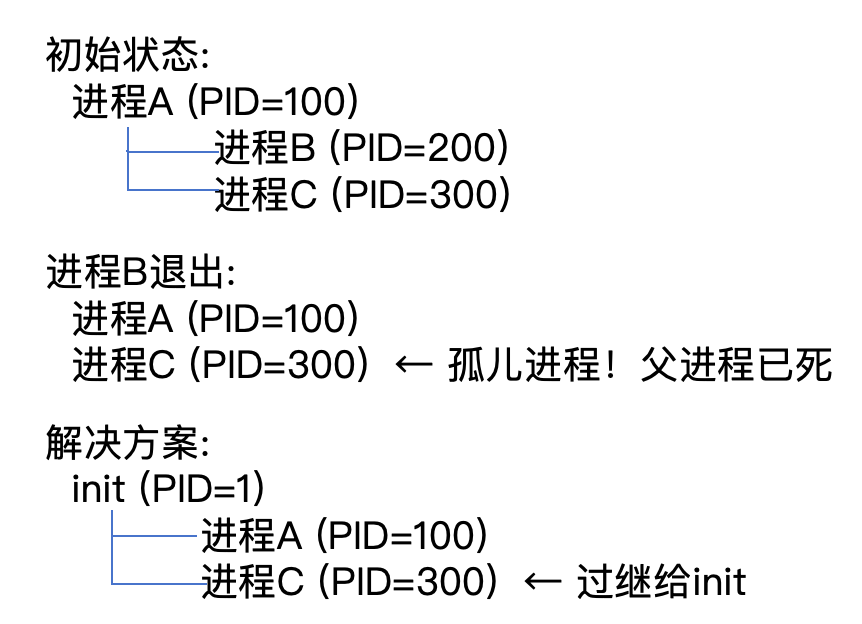
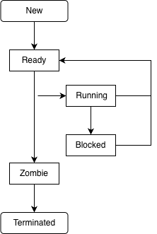

# 6.4.3 进程退出（exit）

## 本节目标

- 理解exit系统调用的原理
- 实现exit系统调用
- 转换进程为Zombie状态
- 保存退出码
- 处理孤儿进程

---

## 前置要求

**重要**：本节使用了6.4.1中添加的PCB内存管理字段（`address_space`等）。如果你按顺序学习，这些字段已在6.4.1的"步骤0"中添加。

---

## 本节修改文件

```
os/src/
├── syscall/
│   ├── mod.rs              # 已有Exit系统调用号
│   └── syscall_impl.rs     # 实现sys_exit（修改）
├── process/
│   ├── pcb.rs              # 添加exit方法（修改）
│   └── scheduler.rs        # 处理退出进程（修改）
└── main.rs                 # 添加测试代码（修改）
```

---

## 什么是exit？

**exit** 是进程正常退出的系统调用。

### exit的特点

```
进程运行中:
  state = Running
  exit_code = None

exit(0)调用:
  释放资源
  保存退出码
  通知父进程

退出后:
  state = Zombie
  exit_code = Some(0)
  等待父进程回收
```

**类比**：就像考试交卷
- 做题（进程运行）
- 交卷（调用exit）
- 分数写在卷子上（退出码）
- 等老师收卷（等待父进程wait）

### 为什么需要Zombie状态？

**问题**：如果进程退出后立即清理，父进程如何获取退出码？

**解决方案**：Zombie（僵尸）状态
```
进程退出 -> 转为Zombie -> 保留PCB -> 父进程wait -> 清理PCB
```

**Zombie进程特点**：
- 已经结束运行
- 不占用CPU时间
- 只保留PCB（很小的内存）
- 保存退出码
- 等待父进程回收

---

## 知识补充：退出码的含义

### 标准退出码

| 退出码 | 含义 | 示例 |
|-------|------|------|
| 0 | 成功 | `return 0;` |
| 1 | 一般错误 | 文件未找到 |
| 2 | 参数错误 | 参数格式不对 |
| 126 | 不可执行 | 文件没有执行权限 |
| 127 | 命令未找到 | 程序不存在 |
| 128+N | 信号终止 | 被信号N终止 |

### 在Shell中使用

```bash
$ ls /nonexistent
ls: cannot access '/nonexistent': No such file or directory
$ echo $?
2

$ true
$ echo $?
0

$ false
$ echo $?
1
```

**$?** 存储上一个命令的退出码

### 在C程序中

```c
int main() {
    if (error) {
        exit(1);  // 错误退出
    }
    return 0;     // 成功退出
}
```

**exit()和return的区别**：
- `return`：从main返回
- `exit()`：立即终止程序（可在任何函数调用）

---

## 知识补充：exit的执行流程

```
用户态:
  exit(42)
    ↓
    将42放入a0寄存器
    ↓
    ecall
    ↓
内核态:
  sys_exit(42)
    ↓
  1. 保存退出码到PCB
  2. 释放资源：
     - 关闭所有打开的文件
     - 释放内存
     - 清理定时器
  3. 转为Zombie状态
  4. 唤醒父进程（如果在wait）
  5. 将子进程过继给init
  6. 调度下一个进程
    ↓
  永不返回（进程已结束）
```

**关键点**：
- exit永不返回
- 进程变为Zombie
- 父进程负责最终清理

---

## 步骤1：实现PCB的exit方法

在 `os/src/process/pcb.rs` 中添加：

```rust
impl ProcessControlBlock {
    /// Exit process with exit code
    ///
    /// Process will transition to Zombie state and wait for parent to reap.
    ///
    /// # Parameters
    /// - `exit_code`: Exit status code
    ///
    /// # Notes
    /// This function does not return - process is terminated
    pub fn exit(&mut self, exit_code: i32) {
        use crate::serial_println;

        serial_println!("[EXIT] Process {} exiting with code {}",
            self.pid, exit_code);

        // 1. Save exit code
        self.exit_code = Some(exit_code);

        // 2. Change state to Zombie
        self.state = ProcessState::Zombie;

        // 3. Close all file descriptors (if we had FD table)
        // self.close_all_files();

        // 4. Free memory resources
        self.address_space = None;

        // 5. Reparent children to init process (PID 1)
        self.reparent_children();

        // 6. Wake up parent if waiting
        // (Will implement in wait section)

        serial_println!("[EXIT] Process {} is now zombie", self.pid);

        // Note: Scheduler will remove this process from running
        // and select next process
    }

    /// Reparent all children to init process
    fn reparent_children(&mut self) {
        use crate::serial_println;

        if self.children.is_empty() {
            return;
        }

        serial_println!("[EXIT] Reparenting {} children to init",
            self.children.len());

        // For each child, set parent to init (PID 1)
        for child_pid in &self.children {
            // In a full implementation, we would:
            // 1. Find child PCB
            // 2. Set child.parent_pid = Some(ProcessId::from_usize(1))
            // 3. Add child to init's children list

            serial_println!("[EXIT] Reparenting child {} to init", child_pid);
        }

        // Clear children list
        self.children.clear();
    }
}
```

**关键点解析**：

| 步骤 | 说明 | 原因 |
|------|------|------|
| 保存退出码 | `exit_code = Some(42)` | 父进程wait时需要 |
| 转为Zombie | `state = Zombie` | 等待父进程回收 |
| 释放资源 | `address_space = None` | 避免内存泄漏 |
| 过继子进程 | `reparent_children()` | 避免孤儿进程 |

---

## 知识补充：孤儿进程

### 什么是孤儿进程？



**为什么要过继给init？**
- 每个进程必须有父进程
- init进程是所有进程的祖先
- init负责回收孤儿进程

### init进程的特殊职责

```rust
// init进程的主循环
loop {
    // 1. 等待任何子进程退出
    let pid = wait(-1);

    // 2. 如果是孤儿进程
    if is_orphan(pid) {
        // 3. 清理资源
        cleanup(pid);
    }
}
```

**init进程（PID 1）**：
- 系统启动后第一个进程
- 永不退出
- 收养所有孤儿进程
- 系统关机时最后退出

---

## 步骤2：实现sys_exit系统调用

在 `os/src/syscall/syscall_impl.rs` 中修改：

```rust
/// sys_exit - Terminate process
///
/// # Parameters
/// - exit_code: Exit status code
///
/// # Notes
/// This function never returns
pub fn sys_exit(exit_code: i32) -> isize {
    use crate::process::scheduler::{current_process, schedule};
    use crate::serial_println;

    serial_println!("[SYSCALL] sys_exit called with code {}", exit_code);

    // 1. Get current process
    let current = match current_process() {
        Some(p) => p,
        None => {
            serial_println!("[SYSCALL] sys_exit: no current process");
            panic!("sys_exit: no current process");
        }
    };

    // 2. Exit process
    {
        let mut pcb = current.lock();
        pcb.exit(exit_code);
    }

    // 3. Schedule next process
    // Current process is now Zombie, scheduler will not select it
    serial_println!("[SYSCALL] sys_exit: scheduling next process");
    schedule();

    // 4. Should never reach here
    panic!("sys_exit: returned from schedule");
}
```

**执行流程**：
1. 获取当前进程
2. 调用exit方法（转为Zombie）
3. 调用调度器（选择下一个进程）
4. 永不返回

---

## 步骤3：修改调度器跳过Zombie进程

在 `os/src/process/scheduler.rs` 中修改：

```rust
impl RoundRobinScheduler {
    /// Pick next process to run
    ///
    /// Skips Zombie processes
    pub fn pick_next(&mut self) -> Option<ProcessHandle> {
        loop {
            // Get next process from queue
            let next = self.ready_queue.pop()?;

            let state = next.lock().state();

            // Skip zombie processes
            if state == ProcessState::Zombie {
                serial_println!("[Scheduler] Skipping zombie process");
                continue;
            }

            // Found a runnable process
            next.lock().set_state(ProcessState::Running);
            next.lock().reset_time_slice();
            return Some(next);
        }
    }
}
```

**为什么跳过Zombie？**
- Zombie进程已经结束
- 不应该被调度运行
- 只保留PCB等待回收

---

## 步骤4：更新系统调用分发器

在 `os/src/syscall/mod.rs` 中确认：

```rust
pub fn syscall_dispatcher(context: &SyscallContext) -> isize {
    let syscall_id = SyscallId::from(context.syscall_number);

    match syscall_id {
        SyscallId::Exit => {
            sys_exit(context.arg0 as i32);
            // Never returns
            unreachable!()
        }
        SyscallId::Fork => {
            sys_fork()
        }
        SyscallId::Exec => {
            sys_exec(context.arg0 as *const u8)
        }
        // ... other syscalls
    }
}
```

**注意**：
- Exit后添加`unreachable!()`
- 提示编译器这里永不返回

---

## 测试exit

### 测试代码

```rust
// In os/src/main.rs
fn test_exit() {
    println!("Testing exit...");

    // Fork a child
    let pid = unsafe { syscall(220, 0, 0, 0) };  // fork

    if pid == 0 {
        // Child process
        println!("[Child] Running...");
        println!("[Child] Exiting with code 42");
        unsafe { syscall(93, 42, 0, 0) };  // exit(42)
        println!("[Child] This should not print!");
    } else {
        // Parent process
        println!("[Parent] Child PID = {}", pid);
        println!("[Parent] Child should be zombie now");

        // Sleep a bit to let child run
        for _ in 0..1000000 {
            unsafe { core::arch::asm!("nop"); }
        }

        println!("[Parent] Continuing...");
    }
}

unsafe fn syscall(id: usize, arg0: usize, arg1: usize, arg2: usize) -> isize {
    let ret: isize;
    core::arch::asm!(
        "ecall",
        in("a7") id,
        in("a0") arg0,
        lateout("a0") ret,
    );
    ret
}
```

### 预期输出

```
Testing exit...
[SYSCALL] sys_fork called
[FORK] Creating child process, parent=1, child=2
[Parent] Child PID = 2
[Parent] Child should be zombie now
[Scheduler] Switching to process 2
[Child] Running...
[Child] Exiting with code 42
[SYSCALL] sys_exit called with code 42
[EXIT] Process 2 exiting with code 42
[EXIT] Process 2 is now zombie
[SYSCALL] sys_exit: scheduling next process
[Scheduler] Switching to process 1
[Parent] Continuing...
```

---

## 知识补充：僵尸进程问题

### 什么是僵尸进程堆积？

```
父进程不调用wait:
  子进程1 -> Zombie (保留PCB)
  子进程2 -> Zombie (保留PCB)
  子进程3 -> Zombie (保留PCB)
  ...
  PCB耗尽！
```

**危害**：
- 占用PCB槽位
- 浪费内存
- 达到进程数上限

### 如何避免？

**方法1**：父进程调用wait
```c
int pid = fork();
if (pid == 0) {
    // child
    exit(0);
} else {
    // parent
    wait(&status);  // 回收子进程
}
```

**方法2**：忽略SIGCHLD信号
```c
signal(SIGCHLD, SIG_IGN);  // 子进程自动回收
```

**方法3**：二次fork
```c
if (fork() == 0) {
    if (fork() == 0) {
        // 孙进程做实际工作
        work();
        exit(0);
    }
    exit(0);  // 子进程立即退出
}
wait(NULL);  // 回收子进程
// 孙进程变为孤儿，由init回收
```

---

## 知识补充：进程状态完整转换图



**状态说明**：

| 状态 | 含义 | 转换条件 |
|------|------|---------|
| New | 正在创建 | fork后 → Ready |
| Ready | 就绪队列 | 调度 → Running |
| Running | 正在运行 | 时间片用完 → Ready |
| Running | 正在运行 | 等待I/O → Blocked |
| Blocked | 等待事件 | I/O完成 → Ready |
| Running | 正在运行 | exit → Zombie |
| Zombie | 等待回收 | wait → Terminated |

---

## 完整代码：PCB的exit方法

<details>
<summary>点击展开：完整的exit实现</summary>

```rust
// os/src/process/pcb.rs

impl ProcessControlBlock {
    /// Exit process with exit code
    ///
    /// # Process Termination Steps
    /// 1. Save exit code
    /// 2. Transition to Zombie state
    /// 3. Release resources (memory, files, etc.)
    /// 4. Reparent children to init process
    /// 5. Notify parent (wake if waiting)
    /// 6. Yield CPU to scheduler
    ///
    /// # Notes
    /// - This function never returns
    /// - Process PCB remains until parent calls wait()
    /// - If parent already exited, init will reap this process
    pub fn exit(&mut self, exit_code: i32) {
        use crate::serial_println;

        serial_println!("[EXIT] Process {} exiting with code {}",
            self.pid, exit_code);

        // 1. Save exit code
        self.exit_code = Some(exit_code);

        // 2. Transition to Zombie state
        self.state = ProcessState::Zombie;

        // 3. Release memory resources
        if self.address_space.is_some() {
            serial_println!("[EXIT] Releasing address space");
            self.address_space = None;
        }

        // 4. Close all file descriptors
        // (Will implement when we have FD table)

        // 5. Release other resources
        self.heap_bottom = 0;
        self.heap_top = 0;

        // 6. Reparent children to init
        if !self.children.is_empty() {
            self.reparent_children();
        }

        // 7. Notify parent
        // (Will implement with wait/signal mechanism)

        serial_println!("[EXIT] Process {} is now zombie, waiting for reaping",
            self.pid);

        // Scheduler will pick next process
        // This process will never run again
    }

    /// Reparent all children to init process (PID 1)
    ///
    /// When a process exits, its children become orphans.
    /// The init process adopts all orphans and is responsible
    /// for reaping them when they exit.
    fn reparent_children(&mut self) {
        use crate::serial_println;

        let num_children = self.children.len();
        serial_println!("[EXIT] Reparenting {} children to init", num_children);

        // In a complete implementation:
        // for child_pid in &self.children {
        //     let child = find_process(*child_pid);
        //     child.lock().parent_pid = Some(ProcessId::from_usize(1));
        //
        //     let init = find_process(ProcessId::from_usize(1));
        //     init.lock().children.push(*child_pid);
        // }

        self.children.clear();

        serial_println!("[EXIT] Children reparented successfully");
    }
}
```

</details>

---

## 常见问题

**Q1: 为什么需要Zombie状态？**

保留退出码给父进程。如果立即清理，父进程无法获取退出状态。

**Q2: Zombie进程占用多少资源？**

只占用一个PCB（几百字节），不占用CPU、内存等资源。

**Q3: 如果父进程先退出怎么办？**

子进程变为孤儿，由init进程（PID 1）收养并回收。

**Q4: exit和_exit的区别？**

- `exit()`：调用清理函数（atexit），刷新缓冲区
- `_exit()`：直接终止，不做清理

**Q5: 如何查看系统中的僵尸进程？**

```bash
ps aux | grep Z
# 或
top
# 查看 zombie 列
```

---

## 知识点总结

### 核心概念

| 概念 | 说明 | 作用 |
|------|------|------|
| **exit** | 进程正常退出 | 释放资源并保存退出码 |
| **Zombie** | 僵尸状态 | 等待父进程回收 |
| **孤儿进程** | 父进程已退出 | 由init收养 |
| **退出码** | 进程执行结果 | 0=成功，非0=错误 |

### 设计决策

| 决策 | 原因 |
|------|------|
| 为什么需要Zombie？ | 保留退出码给父进程 |
| 为什么过继给init？ | 确保每个进程都有父进程 |
| 为什么exit不返回？ | 进程已终止，无处可返回 |

---

## 下一步

现在已经实现了fork、exec、exit，下一节将实现**wait系统调用**，允许父进程回收子进程。

---

## 练习题

1. 实现atexit机制，在exit时调用注册的清理函数
2. 添加进程资源统计（运行时间、CPU使用率）
3. 思考：如果没有Zombie状态，如何实现wait？
